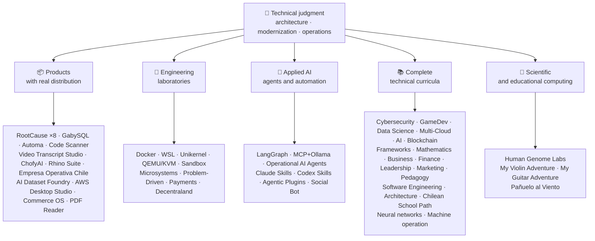

<div align="center">

# 👋 Vladimir Acuña

## **Solution Architect · Legacy Modernization · Senior Full-Stack · AI Automation**

**16+ years building and operating software in real environments. I design, build, and run production systems with a focus on reliability, performance, continuous delivery, and independent technical judgment — all verifiable in this GitHub account.**

[](https://vladimiracunadev-create.github.io/)
[](https://www.linkedin.com/in/vladimir-acu%C3%B1a-valdebenito-11924a29/)
[](mailto:vladimir.acuna.dev@gmail.com)

[](#-professional-scope)
[](#-products-with-real-distribution)
[](#-complete-technical-curricula)

<!-- STATS:START -->
[](https://github.com/vladimiracunadev-create?tab=repositories)
[](https://github.com/vladimiracunadev-create?tab=repositories)
[](#-ecosystem-at-a-glance)
[](#-complete-technical-curricula)
[](https://github.com/vladimiracunadev-create?tab=repositories)
<!-- STATS:END -->

[](https://github.com/vladimiracunadev-create?tab=repositories)
[](https://github.com/vladimiracunadev-create?tab=followers)

[🌐 Portfolio (6 languages)](https://vladimiracunadev-create.github.io/) ·
[🧩 Ecosystem](#-ecosystem-at-a-glance) ·
[⚡ Evaluate me in 10 minutes](#-if-you-have-10-minutes-to-evaluate-me) ·
[✅ Professional scope](#-professional-scope) ·
[📬 Contact](#-contact)

**Languages:** [ES](README.md) · [EN](README.en.md) · [PT](README.pt.md) · [IT](README.it.md) · [FR](README.fr.md) · [ZH](README.zh.md)

**Technical core:**
PHP 8 · Python · Rust · Go · Node/TS · Java 21 · .NET 8 · Dart/Flutter · WASM
· AWS · Terraform · Kubernetes · Docker · n8n · LangGraph/MCP · CI/CD · FinOps · Observability

</div>

---

> [!NOTE]
> This profile is not a wish list. Every claim below is backed by an executable repository and evidence. Where something is **not** finished, it is stated as such.

## 🎯 What You Will Find Here

This is not “one repo”: it is an ecosystem with shared standards.

- 🔁 **Reproducible demos** — clone, run, validate.
- 🧰 **Standardized tooling** — Makefiles, Hub CLI, `doctor`, and `smoke` per repository.
- 🛡️ **Defense in depth** — secret scanning, policies, and explicitly forbidden practices.
- 📈 **Observability** — `/health`, `/ready`, `/metrics`, dashboards, and traceability.
- 📚 **Audience-aware documentation** — recruiter, beginner, DevOps, or security, depending on the repository.
- 📦 **Product distribution** — downloadable releases, checksums, and build evidence; commercial/store signatures declared as pending when applicable.
- 🌍 **Internationalization** — portfolio in 6 languages (ES · EN · PT · IT · FR · ZH).
- 🧭 **Technical honesty** — every case labeled `OPERATIONAL`, `DOCUMENTED/SCAFFOLD`, or `PLANNED`.

## ✅ Verifiable Status

| Surface | Concrete evidence |
|---|---|
| 🧪 **Test coverage** | GabySQL **828 tests** + fuzzing over **503.8M queries** (0 panics) · Empresa Operativa Chile **158 tests** · Automa **150 pytest** · multi-OS CI |
| 🤖 **Production-grade agents** | LangGraph RealWorld **25/25 operational backends** (cases 01–25, 100% coverage) · Operational AI Agents **13 agents** with **39 deterministic evals** |
| 🔗 **Polyglot integration** | **20 cases** sender→n8n→receiver —**19 operational**, individually audited with Docker— · **18+ DB engines** · **20+ containers** · 11 patterns |
| 📦 **Distribution** | **151 releases** across an ecosystem of **63 owned public repositories** · installers and artifacts `.exe` · `.msi` · `.dmg` · `.apk` with checksums and build evidence; commercial/store signatures in progress where applicable |
| 🛡️ **Supply chain** | CodeQL · Semgrep · Bandit · Trivy · Grype · Gitleaks · TruffleHog · CycloneDX SBOM · Scorecard |
| 📚 **Curricula** | **14,379 classes** verifiable across 21 programs, counted by [a workflow](.github/workflows/stats.yml) from real repository structure or a verifiable source declared in the repository —not written by hand— · every program declares its editorial status and limitations |
| 🌐 **Portfolio** | Installable PWA · **6 languages** · **36 PDFs** generated by pipeline · CV Data API · Capacitor Android · Lighthouse 100 |
| 🔒 **Telemetry** | Zero telemetry in forensic products and Empresa Operativa Chile — verified in every build (no Android `INTERNET` permission) |
| 🌐 **Published sites** | **55 GitHub Pages sites** —54 landings, one per product or program, plus the portfolio— each deployed from its own repository · all 55 verified with HTTP `200` |

## 🗺️ Ecosystem At A Glance



## 📦 Products With Real Distribution

Software that is downloaded, installed, and used — not only cloned.

| Product | What it is | Stack | Delivery |
|---|---|---|---|
| [🔍 **RootCause Windows**](https://github.com/vladimiracunadev-create/rootcause-windows-inspector) | Cybersecurity forensics: every anomalous resource distortion may be the first sign of a threat. Diagnose first, intervene later | Rust 🦀 · ETW/WPR | **v0.19.0** · **16 releases** · **5 editions**: GUI · Portable · CLI · PowerShell · VS Code · [landing](https://vladimiracunadev-create.github.io/rootcause-windows-inspector/) |
| [📱 **RootCause Mobile**](https://github.com/vladimiracunadev-create/rootcause-mobile-inspector) | The mobile sibling: a forensic sensor that compares each app against itself, flags stalkerware, and separates granted permissions from merely requested ones | Flutter · Kotlin · Swift | **v0.8.0** · verifiable Android APK · 5 languages · **zero telemetry** · [landing](https://vladimiracunadev-create.github.io/rootcause-mobile-inspector/) |
| [🍎 **RootCause macOS**](https://github.com/vladimiracunadev-create/rootcause-macos-inspector) | macOS edition: `launchd` persistence, Gatekeeper, SIP, FileVault, XProtect, TCC permissions, signed processes, and network neighbors — every surface checked against a known-good state | Rust 🦀 · macOS 13+ | **v0.1.0** · first published release · Apache-2.0 · [landing](https://vladimiracunadev-create.github.io/rootcause-macos-inspector/) |
| [🖥️ **RootCause Server**](https://github.com/vladimiracunadev-create/rootcause-server) | The server sibling: correlates what no single log sees together — exposed surface, access-attempt bursts, a session granted to that same address, critical file integrity, and sensor silence — and turns it into one actionable sentence | Rust 🦀 · Windows · Linux · macOS | **v0.2.0** · **18 rules** with evidence and runbook · never executes actions on its own · local console without web dependencies · **no published release yet** · [landing](https://vladimiracunadev-create.github.io/rootcause-server/) |
| [🌐 **RootCause Web**](https://github.com/vladimiracunadev-create/rootcause-web-inspector) | Browser forensic sensor: cookies, email sessions, extensions, downloads, permissions, and pages that imitate a real window | JavaScript · MV3 extension | **v0.2.0** · no published release yet · panel on `127.0.0.1` · zero dependencies · zero telemetry verified in CI · [landing](https://vladimiracunadev-create.github.io/rootcause-web-inspector/) |
| [₿ **RootCause Bitcoin Defense**](https://github.com/vladimiracunadev-create/rootcause-bitcoin-defense) | Watch-only defense for Bitcoin custody: inventories the origin of each key, cross-checks it with published warnings, and explains root cause with evidence | JavaScript · Windows app · local panel | **v0.3.0** · **2 releases** · zero dependencies · never asks for seeds · verified in CI · [landing](https://vladimiracunadev-create.github.io/rootcause-bitcoin-defense/) |
| [⛓️ **RootCause Blockchain Security**](https://github.com/vladimiracunadev-create/rootcause-blockchain-security) | Multi-chain watch-only console: inventories contracts, proxies, oracles, bridges, governance, and dependencies, and generates root-cause runbooks | JavaScript · Windows app · local panel | **v0.3.0** in the repository · published release: `v0.1.0` · zero dependencies · never asks for private keys · verified in CI · [landing](https://vladimiracunadev-create.github.io/rootcause-blockchain-security/) |
| [📷 **RootCause QR Inspector**](https://github.com/vladimiracunadev-create/rootcause-qr-inspector) | Local Android app for inspecting QR codes before acting: explains 26 signals, separates facts from hypotheses, and exports redacted evidence | Flutter · Dart | **v0.1.4** · **5 releases** · **107 tests** · published Android APK · verifiable SHA-256 · technical APK package signature; commercial/store signatures in progress · zero telemetry · [landing](https://vladimiracunadev-create.github.io/rootcause-qr-inspector/) |
| [🏢 **Empresa Operativa Chile**](https://github.com/vladimiracunadev-create/empresa-operativa-chile) | Guides a SpA from before incorporation to each monthly close: incorporation with evidence, VAT carry-forward, F29 draft, immutable close, and audit log. Every rule points to its official source | JavaScript · Rust · PWA | **v1.5.0** · Android · Windows · browser · **158 tests** · **0 production dependencies** · zero telemetry · [landing](https://vladimiracunadev-create.github.io/empresa-operativa-chile/) |
| [🔍 **Universal Code Scanner**](https://github.com/vladimiracunadev-create/universal-code-scanner) | QR and barcode reader that **interprets before acting**: 16 local URL risk signals and explicit confirmation | Flutter · Dart | **v1.1.0** · Android · iOS · macOS · PWA · encrypted history **AES-256-GCM** · [landing](https://vladimiracunadev-create.github.io/universal-code-scanner/) |
| [🗄️ **GabySQL**](https://github.com/vladimiracunadev-create/gabysql) | Embedded database: single `.db` file, WAL, cost-based optimizer, HTTP/JSON API | Rust 🦀 | Windows · macOS · Linux · [landing](https://vladimiracunadev-create.github.io/gabysql/) |
| [🤖 **Automa PC**](https://github.com/vladimiracunadev-create/automa-pc) | Local orchestrator: JSON flows that open real windows, interact with the DOM, and leave evidence | Python · Playwright · pywebview | **v0.3.0** · **27 flows** · published and verifiable installer · [landing](https://vladimiracunadev-create.github.io/automa-pc/) |
| [🏭 **AI Dataset Foundry**](https://github.com/vladimiracunadev-create/ai-dataset-foundry) | Local-first factory that turns PDF, Word, web, Git, JSON, and CSV into auditable datasets for pretraining, fine-tuning, RAG, and evaluation | Python | **v0.2.0** · Windows + offline Android · first published release · [landing](https://vladimiracunadev-create.github.io/ai-dataset-foundry/) |
| [☁️ **AWS Desktop Studio**](https://github.com/vladimiracunadev-create/aws-desktop-studio) | Local-first app to explore 16 AWS services with CLI/SSO, read-only by default, and explicit EC2 controls | JavaScript · Windows | **v0.1.1** · first published release · [landing](https://vladimiracunadev-create.github.io/aws-desktop-studio/) |
| [🧭 **Commerce OS**](https://github.com/vladimiracunadev-create/commerce-operating-system) | Guided conceptual demo of commercial operations: catalog, stock, CRM, orders, mock payments, and traceability | JavaScript · Web · Windows · Android | **v0.3.0** · **2 releases** · no real money or Chilean tax authority integration · [landing](https://vladimiracunadev-create.github.io/commerce-operating-system/) |
| [📄 **PDF Reader**](https://github.com/vladimiracunadev-create/pdf-reader-windows-android) | Android-first local read-only reader, with no-crop zoom, reopenable history, WhatsApp sharing, and default-reader selection | HTML · Web · Android · Windows | **v0.3.3** · signed APK · no accounts, sensitive permissions, or telemetry · [landing](https://vladimiracunadev-create.github.io/pdf-reader-windows-android/) |
| [🎙️ **Video Transcript Studio**](https://github.com/vladimiracunadev-create/video-transcript-studio) | One video, playlist, or **entire YouTube channel** to text with timestamps. It does not rely on existing subtitles: Whisper recognizes audio **on your machine**, with no API, account, or key to configure | Python · PySide6 · FastAPI · faster-whisper | **v0.2.0** · Windows desktop + local panel on `127.0.0.1` + CLI, **sharing the same queue** · MD · PDF · TXT · SRT · VTT · JSON · MP3 · OGG · **89 tests** · bundled FFmpeg · zero telemetry · [landing](https://vladimiracunadev-create.github.io/video-transcript-studio/) |
| [🎨 **ChofyAI Studio**](https://github.com/vladimiracunadev-create/chofyai-studio) | Local creative AI launcher: orchestrates Qwen3-TTS, whisper.cpp, FaceFusion, AceForge, and ComfyUI | Tauri 2 · Rust · React | v0.5.1 · **5/5 tools with real inference** · macOS Apple Silicon · experimental Windows · **no published release yet** · [site](https://vladimiracunadev-create.github.io/chofyai-studio/) |
| [🦏 **Rhino Suite**](https://github.com/vladimiracunadev-create/rhino-suite) | Office suite from scratch: document rules do not depend on the DOM — HTML is only a projection | Rust/WASM · Go · React 19 | Evolutionary monorepo by phases · [landing](https://vladimiracunadev-create.github.io/rhino-suite/) |
| [🎻 **My Violin Adventure**](https://github.com/vladimiracunadev-create/violin-adventure) | Educational app for children: chromatic tuner, audio-clock-accurate metronome, songs with real violin | Tauri 2 · React · TS | **v1.3.0** · Windows · Android · Linux · macOS · PWA · [landing](https://vladimiracunadev-create.github.io/violin-adventure/) |
| [🎸 **My Guitar Adventure**](https://github.com/vladimiracunadev-create/guitarra-adventure) | The plucked-string sibling: 24 lessons in 6 worlds, 6-string tuner, drift-free metronome, and 11 real guitar notes | Tauri 2 · React · TS | **v1.0.0** · Windows · Android · Linux · macOS · iOS · PWA · no accounts, ads, or online dependency · [landing](https://vladimiracunadev-create.github.io/guitarra-adventure/) |
| [🧣 **Pañuelo al Viento**](https://github.com/vladimiracunadev-create/panuelo-al-viento-cueca-app) | Cueca from age 10: 24 classes in 8 levels, 72 activities, six-pulse lab (3+3 and 2+2+2), and accessible floor diagrams. It states that it **complements, not replaces**, teachers and culture bearers | Flutter · Dart | **v0.2.0** · Android 7+ · Windows 10/11 · APK · EXE · MSI · portable · **29 tests + 2 validators** · no camera, microphone, account, ads, or internet · [landing](https://vladimiracunadev-create.github.io/panuelo-al-viento-cueca-app/) |

## 🧪 Engineering Laboratories

| Repo | What it demonstrates |
|---|---|
| [🐳 **Problem-Driven Systems Lab**](https://github.com/vladimiracunadev-create/problem-driven-systems-lab) | **20 real problems** (latency under load, N+1, retry storms, leaks, monoliths, cache stampede, backpressure, zero-downtime migration, forgotten DLQ) with high-fidelity injected failures, solved in **7 stacks**: PHP 8 · Python · Node.js · Java 21 · .NET 8 · **Go 1.23** · **Rust 1.83** · [landing](https://vladimiracunadev-create.github.io/problem-driven-systems-lab/) |
| [📆 **Social Bot Scheduler**](https://github.com/vladimiracunadev-create/social-bot-scheduler) | **v4.10.0** · **20 cases** source→n8n→receiver over **18+ DB engines** —**19 operational**, individually audited with Docker— **8-layer** audit, idempotency guardrails, circuit breaker, and DLQ · [landing](https://vladimiracunadev-create.github.io/social-bot-scheduler/) |
| [🧰 **Microsistemas**](https://github.com/vladimiracunadev-create/microsistemas) | **12 diagnostic and modernization microapps** for PHP · local read-only MCP server · hardening in 3 phases · [landing](https://vladimiracunadev-create.github.io/microsistemas/) |
| [🧪 **Docker Labs**](https://github.com/vladimiracunadev-create/docker-labs) | **13 labs** on a 4-service platform + automated `.exe` installer with launcher · [landing](https://vladimiracunadev-create.github.io/docker-labs/) |
| [🐳 **WSL Labs**](https://github.com/vladimiracunadev-create/wsl-labs) | **12 cases** on `wslc`, the native WSL container engine — **without Docker Desktop** · [landing](https://vladimiracunadev-create.github.io/wsl-labs/) |
| [⚡ **Unikernel Labs**](https://github.com/vladimiracunadev-create/unikernel-labs) | “Docker Desktop for unikernels”: Windows control over Unikraft with WSL2 backend, `kraft` + QEMU/KVM · [landing](https://vladimiracunadev-create.github.io/unikernel-labs/) |
| [🧰 **QEMU/KVM Labs**](https://github.com/vladimiracunadev-create/qemu-kvm-labs) | **12 labs** of real virtualization with QEMU, KVM, libvirt, cloud-init, and `vm-manager` on Linux and WSL2 · [landing](https://vladimiracunadev-create.github.io/qemu-kvm-labs/) |
| [🛡️ **Sandbox Labs**](https://github.com/vladimiracunadev-create/sandbox-labs) | Linux isolation: runs third-party code, files, and business models under declared policies and **emits signed evidence of which controls actually applied** · **36 cases** in two families —15 technical and 21 capital-markets— · declared experimental and educational, *not a security product* · [landing](https://vladimiracunadev-create.github.io/sandbox-labs/) |
| [💳 **Universal Payments Engineering Lab**](https://github.com/vladimiracunadev-create/universal-payments-engineering-lab) | **28 payment families** in a local self-explaining demo: states, ledger, reconciliation, security, and implementation guides · [landing](https://vladimiracunadev-create.github.io/universal-payments-engineering-lab/) |
| [🕹️ **Decentraland Social Arcade**](https://github.com/vladimiracunadev-create/decentraland-social-arcade) | Native Decentraland social 3D experience: one MVP and a multi-game architecture with SDK7, ECS, and TypeScript · Spanish documentation · no payments or telemetry |
| [☁️ **AWS Projects**](https://github.com/vladimiracunadev-create/proyectos-aws) | Progressive cases where each one adds one AWS service **and** a new GitHub Actions capability · SAA-C03 · DVA-C02 · SOA-C02 coverage |

## 🤖 Applied AI

| Repo | What it demonstrates |
|---|---|
| [🤖 **LangGraph RealWorld**](https://github.com/vladimiracunadev-create/langgraph-realworld) | **25/25 operational backends** — typed state, conditional routes, NDJSON streaming, DEMO/LIVE mode, 8 security layers, SHA-256 chain of custody |
| [🧭 **Operational AI Agents**](https://github.com/vladimiracunadev-create/operational-ai-agents) | **13 operational agents** for Claude Code and compatible runtimes: each receives a complete mission —repository evolution, legacy modernization, curriculum design, portfolio publishing, security remediation, incident analysis— under a declared contract, human gates, and verifiable evidence · **39 deterministic evals** · 34 tests · zero-deps (stdlib only) · Linux · macOS · Windows · [site](https://vladimiracunadev-create.github.io/operational-ai-agents/) |
| [🧠 **MCP + Ollama Local**](https://github.com/vladimiracunadev-create/mcp-ollama-local) | Local-first AI with MCP tools in a sandbox · `127.0.0.1` bind · multilayer trust profile · honest about its limits |
| [🧩 **Agentic Plugins Toolkit**](https://github.com/vladimiracunadev-create/agentic-plugins-toolkit) | **6 agentic plugins** installable in Claude Code, OpenAI/Codex, Copilot, Gemini, and MCP from one source: `repository-engineering`, `legacy-modernization`, `learning-program-studio`, `product-evolution`, `portfolio-governance`, and `rootcause-response` · **69 generated views without drift** —each runtime receives its format from the same contract— · zero-deps · Linux · macOS · Windows · [site](https://vladimiracunadev-create.github.io/agentic-plugins-toolkit/) |
| [🧰 **Claude Skills Toolkit**](https://github.com/vladimiracunadev-create/claude-skills-toolkit) | **15 agentic skills** for Claude Code · **security**: 12-layer `security-audit` (OSV · KEV · EPSS · SAST · container · secrets) and 14-stage `bitcoin-custody-audit` · **repo gates**: `pre-commit-guard`, `pre-push-guard`, `yaml-control`, `md-lint-fix`, `python-lint-guard` · **coherence**: `repo-coherence-audit`, `version-bump`, `python-version-control`, `python-deps-pinning` · **Docker**: `docker-cleanup`, `docker-compose-doctor` · **docs**: `md-to-doc` · zero-deps · cross-platform |
| [🧰 **Codex Skills Toolkit**](https://github.com/vladimiracunadev-create/codex-skills-toolkit) | **19 agentic skills** for Codex: security and supply chain, preflight, functional flows, resilience and state, release evidence, Python/YAML/Markdown gates, versioning, dependencies, Docker, and documents · Python-first · `pnpm` · Linux · macOS · Windows · [site](https://vladimiracunadev-create.github.io/codex-skills-toolkit/) |

## 📚 Complete Technical Curricula

Sequential programs in Spanish, with status and scope declared by each repository. The 21 programs add up to **14,379 classes**, counted by [a workflow](.github/workflows/stats.yml) from real repository structure or a verifiable source declared in the repository; the badge refreshes weekly and is not written by hand.

| Program | Classes | Scope |
|---|---:|---|
| [🔢 **Computational Mathematics**](https://github.com/vladimiracunadev-create/computational-mathematics-program) | 360 | From counting on fingers to reproducing a paper · **360 deterministic demonstrations verified in CI** · 1,080 notebooks · 489-term glossary · [site](https://vladimiracunadev-create.github.io/computational-mathematics-program/) |
| [🏦 **Finance and Banking**](https://github.com/vladimiracunadev-create/finance-and-banking-evolution-program) | 356 | 534 h · financial mathematics and IFRS → credit, risk, Basel III, open finance, DLT, stablecoins, and MiCA · **27 cases** · **298 tests** · [site](https://vladimiracunadev-create.github.io/finance-and-banking-evolution-program/) |
| [🎮 **GameDev**](https://github.com/vladimiracunadev-create/modern-gamedev-program) | 352 | Mathematics and C#/C++/GDScript → shaders, AI, multiplayer, VR/AR · Godot · Unity · Unreal · **10 Godot labs verified in CI** (301 checks) · [site](https://vladimiracunadev-create.github.io/modern-gamedev-program/) |
| [🛡️ **Cybersecurity**](https://github.com/vladimiracunadev-create/modern-cybersecurity-program) | 360 | **v1.3.0** · 20 parts · foundations → Red Team, DFIR, cloud security, exploit dev, CTF, and game security · mapped to **7 certifications** · offline Android/web app · PDF manual · CI, Security, and Pages verified · [site](https://vladimiracunadev-create.github.io/modern-cybersecurity-program/) |
| [📈 **Marketing, Sales, and Growth**](https://github.com/vladimiracunadev-create/marketing-sales-growth-evolution-program) | 336 | 24 parts with operational definitions, measurement sheets, verifiable bibliography, and Chilean regulatory context · **v1.6.0** · 1.29M words · 17 role-based paths · [site](https://vladimiracunadev-create.github.io/marketing-sales-growth-evolution-program/) |
| [🏢 **Business Creation**](https://github.com/vladimiracunadev-create/modern-business-creation-program) | 336 | Create and operate a real company in Chile: from idea to incorporation, tax authority, operations, crisis, and exit · 360 diagrams · 1,251-term glossary · 1,548-page manual · [site](https://vladimiracunadev-create.github.io/modern-business-creation-program/) |
| [🏛️ **Architecture and Built Environment**](https://github.com/vladimiracunadev-create/architecture-built-environment-learning-program) | 680 | 68 parts in 2 phases · 12 paths · 622 traced sources · Markdown, offline reader, and GitHub Pages · [site](https://vladimiracunadev-create.github.io/architecture-built-environment-learning-program/) |
| [🇨🇱 **Chilean School Learning Path**](https://github.com/vladimiracunadev-create/chilean-school-learning-path) | 8,841 | Grades 1–12 · **4,156 integrated cross-curricular experiences** · **2,823 learning objectives** · MINEDUC sources · no pending proposals and specialized human review still pending · [site](https://vladimiracunadev-create.github.io/chilean-school-learning-path/) |
| [🧭 **Modern Software Engineering**](https://github.com/vladimiracunadev-create/software-engineering-learning-suite) | 480 | 40 parts · foundations → product, architecture, security, DevOps, SRE, SPEC, AI, and multi-agent systems · **0 approved classes**: 360 structural drafts and 120 scaffolds, as declared by the repository · [site](https://vladimiracunadev-create.github.io/software-engineering-learning-suite/) |
| [🎓 **Pedagogy and Learning Sciences**](https://github.com/vladimiracunadev-create/education-pedagogy-learning-sciences-program) | 300 | From how a person learns to how teachers are trained · 25 parts · **each class declares its evidence state and limits** · early literacy, comparative methods, specific educational needs, coexistence, cultural diversity, and international evidence · 1,097-term glossary, 325 diagrams, and a 60-activity classroom bank · 14 career paths by role · LMS-exportable · **v2.1.0** · [site](https://vladimiracunadev-create.github.io/education-pedagogy-learning-sciences-program/) |
| [☁️ **Multi-Cloud**](https://github.com/vladimiracunadev-create/multi-cloud-engineering-program) | 288 | AWS · Azure · GCP · Kubernetes · Terraform · SRE · FinOps · **1,288 hours** · 288 labs with JSON evidence · 1,032 traced sources · 2,884-page PDF manual · [site](https://vladimiracunadev-create.github.io/multi-cloud-engineering-program/) |
| [🎖️ **Executive Leadership**](https://github.com/vladimiracunadev-create/executive-leadership-founder-program) | 288 | From owning your first outcome to leading a company and founding your own: teams, KPI/OKR, finance, product, risk, board, and M&A · 24 cases, 96 labs, and 39 templates · [site](https://vladimiracunadev-create.github.io/executive-leadership-founder-program/) |
| [🐍 **Python Data Science**](https://github.com/vladimiracunadev-create/python-data-science-program) | 232 | Polars, ML+Optuna/SHAP, PyTorch/LLMs/LoRA, MLOps · native Windows app + Android APK · [site](https://vladimiracunadev-create.github.io/python-data-science-program/) |
| [🧠 **AI Evolution**](https://github.com/vladimiracunadev-create/artificial-intelligence-evolution-program) | 183 | Symbolic → probabilistic → deep learning → LLMs, RAG, agents, safety, and frontier · **v0.17.0** · **705 notebooks** · axis of **148 foundational papers** linked from 171 classes, bridged to 5 mathematical appendices · offline Windows, Android, and PWA apps · [site](https://vladimiracunadev-create.github.io/artificial-intelligence-evolution-program/) |
| [🌐 **Comparative Programming**](https://github.com/vladimiracunadev-create/polyglot-programming-labs) | 176 | One concept, **10 languages** verified in CI — **1,360 implementations** — plus **1,632 programs** in still-living languages (COBOL, Fortran, Ada, RPG, MUMPS…) and an atlas of **60 cards in 15 families** · v1.1.0 · [site](https://vladimiracunadev-create.github.io/polyglot-programming-labs/) |
| [🧩 **Frameworks Compared**](https://github.com/vladimiracunadev-create/framework-ecosystems-labs) | 149 | One executable contract, without adapters, against Express, FastAPI, Spring Boot, ASP.NET, Django, Rails, Laravel, React, Vue, Svelte, and more · 12 parts · 180 h · **113 built classes and 36 scaffolded, declared in the repository itself** · **205 verified sources** · atlas of **138 technologies** · [site](https://vladimiracunadev-create.github.io/framework-ecosystems-labs/) |
| [🗄️ **Databases**](https://github.com/vladimiracunadev-create/database-systems-labs) | 74 | **v3.0.0** · database engineering in 15 parts · 230 hours · **the verifiable source for every claim**: 120 sources with ISBN, DOI, or standard · same case solved in 27 engines · 306-term glossary · 150 pytest · [site](https://vladimiracunadev-create.github.io/database-systems-labs/) |
| [📐 **Psychometrics and Assessment**](https://github.com/vladimiracunadev-create/psychometrics-and-assessment-program) | 40 | How a measurement instrument is built, scored, validated, and audited · 8 parts · executable engine with **5 instruments and 344 items, 276 public-domain** |
| [⛓️ **Blockchain**](https://github.com/vladimiracunadev-create/blockchain-learning-path) | 66 | **v0.14.0** · from zero to programmable financial infrastructure and on-chain analytics · **91 practices** and **356 tests** · contracts with Foundry (fuzzing and invariants) and Slither static analysis in CI · offline apps verified by opening the binary and counting its contents · [site](https://vladimiracunadev-create.github.io/blockchain-learning-path/) |
| [🧠 **Neural Network Training Labs**](https://github.com/vladimiracunadev-create/neural-network-training-labs) | 31 | 7 modules · ≈214 hours · **93 notebooks** —31 classes, 31 student versions, and 31 solutions— · questions, visual maps, practices, and assessment with real public data · PyTorch · [study site](https://vladimiracunadev-create.github.io/neural-network-training-labs/) |
| [🕹️ **Machine Operator**](https://github.com/vladimiracunadev-create/machine-operator-program) | 451 | **41 training modules**, one per machine · **502 h 15 min** · systems, controls, physics, safety, and simulation design with sources per class · *no executable simulator yet, and it is declared that way* |

## 🔬 Scientific Computing

| Repo | What it demonstrates |
|---|---|
| [🧬 **Human Genome Labs**](https://github.com/vladimiracunadev-create/human-genome-labs) | Reproducible genomics platform: typed `ScientificResult<T>` contracts, FASTA/GFF3/VCF, modules with **explicit maturity and evidence**. Radical honesty: *it does not perform clinical diagnosis* · [site](https://vladimiracunadev-create.github.io/human-genome-labs/) |

## ⚡ If You Have 10 Minutes To Evaluate Me

The idea is not just to look at code: it is to see **how I think**, how I document, and how I make everything executable.

**Route A — Real observability and orchestration** *(my favorite)*

```bash
git clone https://github.com/vladimiracunadev-create/social-bot-scheduler.git
```

You will see workflows, metrics, dashboards, and guardrails across 19 cases and 18+ DB engines.

**Route B — Reproducible infrastructure in minutes**

```bash
git clone https://github.com/vladimiracunadev-create/docker-labs.git
```

**Route C — Agents with typed state**

```bash
git clone https://github.com/vladimiracunadev-create/langgraph-realworld.git
```

**Route D — Rust forensic product, without cloning**

Download the installer or CLI binary from [RootCause releases](https://github.com/vladimiracunadev-create/rootcause-windows-inspector/releases) and verify `SHA256SUMS`.

## 🧠 Standards I Apply Across Repositories

- **DX first** — if it is not easy to run, it is not useful as a demo or as a team base.
- **Observability from day 1** — metrics and traceability, not an afterthought.
- **Security as pipeline** — secret scanning, SBOM per release, explicitly forbidden practices.
- **Real resilience** — idempotency, circuit breaker, and controlled degradation.
- **Polyglot by design** — language and engine chosen by use case, never by fashion.
- **Honesty about status** — one repo was renamed (`Multisimulador` → `machine-operator-program`) to avoid promising software that does not exist yet.
- **Badges are signals, not evidence** — each repo also declares **what it does NOT do**.
- **Model outward** — the domain is designed first; the interface is a projection.
- **External work is declared as external** — of the account’s 67 public repositories, 63 are my own work. The other four, [`Anthropic-Cybersecurity-Skills`](https://github.com/vladimiracunadev-create/Anthropic-Cybersecurity-Skills), [`erpnext`](https://github.com/vladimiracunadev-create/erpnext), [`OpenExecutive`](https://github.com/vladimiracunadev-create/OpenExecutive), and [`security-audit-skill`](https://github.com/vladimiracunadev-create/security-audit-skill), are forks of [mukul975/Anthropic-Cybersecurity-Skills](https://github.com/mukul975/Anthropic-Cybersecurity-Skills), [frappe/erpnext](https://github.com/frappe/erpnext), [SenteLabsAI/OpenExecutive](https://github.com/SenteLabsAI/OpenExecutive), and [cloudflare/security-audit-skill](https://github.com/cloudflare/security-audit-skill), respectively; they are excluded from all profile figures.

## ✅ Professional Scope

### 🎯 Core Identity

| Role | Backing |
|---|---|
| **Solution Architect** | Modular, scalable system design with evolutionary judgment |
| **Legacy Modernization Architect** | Real legacy evolution (PHP 5.x→8.x, incremental refactoring without interrupting operations) |
| **Senior Full-Stack / Tech Lead** | Architecture, execution, and standards on real platforms (+16 years) |
| **AI Automation Architect** | Agentic systems with LangGraph/MCP and n8n flows with guardrails |

### ↗ Natural Expansion

**AI Orchestration Engineer** · **Systems / Rust Engineer** · **Mobile Engineer (Flutter)** · **Solutions Engineer** · **Technical Product Builder** · **Technical Trainer** · **Digital Transformation Consultant** · **Technical Product Operations**

### ⚙️ Complementary Scope

Platform Engineer / IDP · DevOps / CI-CD · Cloud / AWS Engineer · Application SRE · Automation Engineer · Technical-commercial consultant

## 🤖 AI-Assisted Development Flow

| Tool | Main use |
|---|---|
| **Claude Code** | Architectural review, implementation, and technical documentation |
| **ChatGPT Plus** | Analysis, architecture, and iteration (since 2023) |
| **Codex** | Code generation and refactoring |
| **Antigravity** | Acceleration of development and automation flows |
| **VS Code / OpenCode** | Environments with integrated AI assistance |

> I combine my own technical judgment, human validation, and architectural direction. AI amplifies capacity, speed, and reach — it does not replace experience.

## 📌 Availability

**Open to:** Senior Full-Stack · Architecture · Legacy modernization · Platform/IDP · Application SRE · pragmatic DevOps · Automation · AI Automation

**Modality:** remote or hybrid, depending on the project.

## 📬 Contact

[](https://vladimiracunadev-create.github.io/)
[](https://www.linkedin.com/in/vladimir-acu%C3%B1a-valdebenito-11924a29/)
[](https://gitlab.com/vladimir.acuna.dev-group/vladimir.acuna.dev-group)
[](mailto:vladimir.acuna.dev@gmail.com)

---

<div align="center">

[🤝 Contribute](CONTRIBUTING.en.md) ·
[🛡️ Security](SECURITY.en.md) ·
[⚖️ Code of Conduct](CODE_OF_CONDUCT.en.md)

<sub>README synchronized with the verified real state of each public repository —figures read by API, landings checked by HTTP response— · last verification: October 1, 2026.</sub>

</div>
