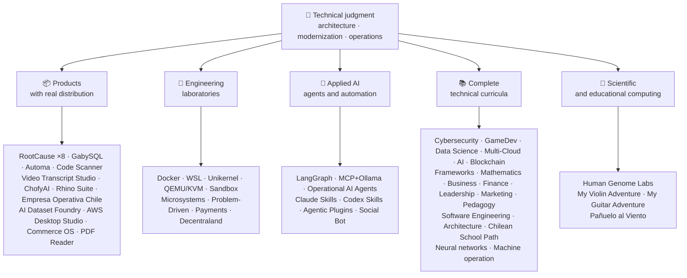

<div align="center">

# 👋 Vladimir Acuña

## **Solution Architect · Senior Full-Stack · Digital Transformation · Management & Operations**

**Professionally trained in Computer Science and Computing Engineering and Business Administration, with 16+ years building and operating software in real environments. I connect business, people, processes, and technology to design, evaluate, deliver, and sustain solutions with technical judgment and an operational view — backed by verifiable evidence in this GitHub account.**

[](https://vladimiracunadev-create.github.io/)
[](https://www.linkedin.com/in/vladimir-acu%C3%B1a-valdebenito-11924a29/)
[](mailto:vladimir.acuna.dev@gmail.com)

[](#-professional-scope)
[](docs/ECOSYSTEM.en.md)
[](#-complete-technical-curricula)

<!-- STATS:START -->
[](https://github.com/vladimiracunadev-create?tab=repositories)
[](https://github.com/vladimiracunadev-create?tab=repositories)
[](#-ecosystem-at-a-glance)
[](#-complete-technical-curricula)
[](https://github.com/vladimiracunadev-create?tab=repositories)
[](docs/ECOSYSTEM.en.md#forks)
[](https://github.com/vladimiracunadev-create?tab=repositories)
[](https://github.com/pulls?q=author%3Avladimiracunadev-create+type%3Apr)
[](https://github.com/issues?q=author%3Avladimiracunadev-create+type%3Aissue)
<!-- STATS:END -->

[](https://github.com/vladimiracunadev-create?tab=repositories)
[](https://github.com/vladimiracunadev-create?tab=followers)

[🌐 Portfolio (22 languages)](https://vladimiracunadev-create.github.io/) ·
[🧩 Ecosystem](#-ecosystem-at-a-glance) ·
[⚡ Evaluate me in 10 minutes](#-if-you-have-10-minutes-to-evaluate-me) ·
[✅ Professional scope](#-professional-scope) ·
[🧭 Non-coding management](#-management-administration-and-non-coding-career-opportunities) ·
[📋 Role matrix](PROFESIONAL_ROLES.md) ·
[📬 Contact](#-contact)

**🌐 Full versions:** [Español](README.md) · [English](README.en.md) · [Português](README.pt.md) · [Italiano](README.it.md) · [Français](README.fr.md) · [简体中文](README.zh.md) · [繁體中文](README.zh-TW.md) · [日本語](README.ja.md) · [한국어](README.ko.md) · [Türkçe](README.tr.md) · [Русский](README.ru.md) · [Tiếng Việt](README.vi.md) · [ไทย](README.th.md) · [Deutsch](README.de.md) · [Українська](README.uk.md) · [Polski](README.pl.md) · [العربية](README.ar.md) · [فارسی](README.fa.md) · [Bahasa Indonesia](README.id.md) · [Nederlands](README.nl.md) · [हिन्दी](README.hi.md) · [Ελληνικά](README.el.md)

**Technical core:**
PHP 8 · Python · Rust · Go · Node/TS · Java 21 · .NET 8 · Dart/Flutter · WASM
· AWS · Terraform · Kubernetes · Docker · n8n · LangGraph/MCP · CI/CD · FinOps · Observability

**Business–technology bridge:**
process and requirements analysis · solution evaluation · delivery coordination · operations and continuity · risk management · product and service · technical education

</div>

---

> [!NOTE]
> This profile does not turn opportunities into experience. Proven technical experience, transferable skills, viable applications, and future development goals are explicitly separated. Linked GitHub evidence is executable or documentary; where something is **not** finished, it is stated as such.

## 🎯 What You Will Find Here

This is not “one repo”: it is an ecosystem with shared standards.

- 🔁 **Reproducible demos** — clone, run, validate.
- 🧰 **Standardized tooling** — Makefiles, Hub CLI, `doctor`, and `smoke` per repository.
- 🛡️ **Defense in depth** — secret scanning, policies, and explicitly forbidden practices.
- 📈 **Observability** — `/health`, `/ready`, `/metrics`, dashboards, and traceability.
- 📚 **Audience-aware documentation** — recruiter, beginner, DevOps, or security, depending on the repository.
- 📦 **Product distribution** — downloadable releases, checksums, and build evidence; commercial/store signatures declared as pending when applicable.
- 🌍 **Internationalization** — this profile is published in 22 languages and the portfolio offers 154 public PDFs (7 families × 22 languages) (ES · EN · PT · IT · FR · ZH · ZH-TW · JA · KO · TR · RU · VI · TH · DE · UK · PL · AR · FA · ID · NL · HI · EL).
- 🧭 **Technical honesty** — every case labeled `OPERATIONAL`, `DOCUMENTED/SCAFFOLD`, or `PLANNED`.

## ✅ Verifiable Status

| Surface | Concrete evidence |
|---|---|
| 🧪 **Test coverage** | GabySQL **828 tests** + fuzzing over **503.8M queries** (0 panics) · Empresa Operativa Chile **217 tests** · Automa **150 pytest** · multi-OS CI |
| 🤖 **Production-grade agents** | LangGraph RealWorld **25/25 operational backends** (cases 01–25, 100% coverage) · Operational AI Agents **13 agents** with **39 deterministic evals** |
| 🔗 **Polyglot integration** | **20 cases** sender→n8n→receiver —**19 operational**, individually audited with Docker— · **18+ DB engines** · **20+ containers** · 11 patterns |
| 📦 **Distribution** | **158 releases** across an ecosystem of **65 owned public repositories** · installers and artifacts `.exe` · `.msi` · `.dmg` · `.apk` with checksums and build evidence; commercial/store signatures in progress where applicable |
| 🛡️ **Supply chain** | CodeQL · Semgrep · Bandit · Trivy · Grype · Gitleaks · TruffleHog · CycloneDX SBOM · Scorecard |
| 📚 **Curricula** | **14,550 classes** verifiable across 21 programs, counted by [a workflow](.github/workflows/stats.yml) from real repository structure or a verifiable source declared in the repository —not written by hand— · every program declares its editorial status and limitations |
| 🌐 **Portfolio** | Installable PWA · **22 languages** · **154 PDFs** generated by pipeline · CV Data API · Capacitor Android · Lighthouse 100 |
| 🔒 **Telemetry** | Zero telemetry in forensic products and Empresa Operativa Chile — verified in every build (no Android `INTERNET` permission) |
| 🌐 **Published sites** | **57 GitHub Pages sites** —56 landings, one per product, program, or ecosystem navigator, plus the portfolio— each deployed from its own repository · all 57 verified with HTTP `200` |

## 🛠️ Technology stack

Technologies detected in the public repositories (manifests, dependencies, containers and code), grouped by area. Appearing in a repository —labs and curricula included— is evidence of use, not a claim of years of production experience.

**Languages**


<sub>Python · JavaScript · TypeScript · Rust · Go · Java · PHP · C# · Dart · Kotlin · Swift · Ruby · Elixir · Zig · Clojure · C · Solidity · Bash · PowerShell · HTML · CSS · WebAssembly · SQL · Erlang · F# · Crystal · GDScript · HCL</sub>

**Frameworks, runtimes and libraries**


<sub>Node.js · Express · React · Vue · Svelte · Astro · Vite · Vitest · FastAPI · Flask · Django · Spring Boot · ASP.NET / .NET · Laravel · Rails · Flutter · Tauri · Electron · Qt / PySide6 · Capacitor · Godot · PyTorch · scikit-learn · Polars · pandas · NumPy · Optuna · SHAP · Transformers · PEFT / LoRA · Playwright · pytest · Jupyter · Streamlit · Pydantic · Tokio · Axum · SQLx · Serde</sub>

**Databases**


<sub>PostgreSQL · MySQL · MariaDB · SQLite · MongoDB · Redis · Neo4j · Cassandra · Elasticsearch · ClickHouse · CockroachDB · InfluxDB · TimescaleDB · DuckDB · SQL Server · Oracle · pgvector · PostgREST · GraphQL · GabySQL (propio · own · Rust)</sub>

**Cloud, containers and DevOps**


<sub>AWS · Terraform · Kubernetes · Docker / Compose · GitHub Actions · Git · GitHub · GitLab · Linux · Nginx · Make · Inno Setup · FinOps · CI/CD</sub>

**Observability and messaging**


<sub>Prometheus · Grafana · OpenTelemetry · Kafka · MQTT (Mosquitto) · Elasticsearch / Kibana · cAdvisor · k6</sub>

**AI, agents, skills and MCP**


<sub>Claude Code · Claude Skills · Codex Skills · Agentic Plugins · MCP · LangGraph · Ollama · n8n · RAG · Whisper · Transformers · PEFT / LoRA · Optuna · SHAP · Polars · PyTorch</sub>

**Security and supply chain**


**Target platforms**


<sub>Windows · macOS · iOS · Linux · Android · Web / PWA</sub>

## 🗺️ Ecosystem At A Glance


```mermaid
flowchart TD
    A["🧠 Technical judgment<br/>architecture · modernization · operations"] --> B["📦 Products<br/>with real distribution"]
    A --> C["🧪 Engineering<br/>laboratories"]
    A --> D["🤖 Applied AI<br/>agents and automation"]
    A --> E["📚 Complete<br/>technical curricula"]
    A --> F["🔬 Scientific<br/>and educational computing"]

    B --> B1["RootCause ×8 · GabySQL · Automa · Code Scanner<br/>Video Transcript Studio · ChofyAI · Rhino Suite · Empresa Operativa Chile<br/>AI Dataset Foundry · AWS Desktop Studio · Commerce OS · PDF Reader"]
    C --> C1["Docker · WSL · Unikernel · QEMU/KVM · Sandbox<br/>Microsystems · Problem-Driven · Payments · Decentraland"]
    D --> D1["LangGraph · MCP+Ollama · Operational AI Agents<br/>Claude Skills · Codex Skills · Agentic Plugins · Social Bot"]
    E --> E1["Cybersecurity · GameDev · Data Science · Multi-Cloud · AI · Blockchain<br/>Frameworks · Mathematics · Business · Finance · Leadership · Marketing · Pedagogy<br/>Software Engineering · Architecture · Chilean School Path<br/>Neural networks · Machine operation"]
    F --> F1["Human Genome Labs<br/>My Violin Adventure · My Guitar Adventure<br/>Pañuelo al Viento"]
```

## 🗂️ Ecosystem: products, labs, applied AI, curricula and scientific computing

The hands-on work of this profile lives in its own document: software you download and install, engineering labs, applied AI and scientific computing, plus a description of every fork of third-party projects kept in the account.

- 📦 **Products With Real Distribution** (22)
- 🧪 **Engineering Laboratories** (11)
- 🤖 **Applied AI** (6)
- 📚 **Complete Technical Curricula** (21)
- 🔬 **Scientific Computing** (1)
- 🍴 **Forks of third-party projects** (52)

👉 **[See the full ecosystem](docs/ECOSYSTEM.en.md)** · [🍴 Forks of third-party projects](docs/ECOSYSTEM.en.md#forks)

## 📚 Complete Technical Curricula

Sequential programs in Spanish, with status and scope declared by each repository. The 21 programs add up to **14,550 classes**, counted by [a workflow](.github/workflows/stats.yml) from real repository structure or a verifiable source declared in the repository; the badge refreshes weekly and is not written by hand.

👉 **[See the 21 complete programs](docs/ECOSYSTEM.en.md#curricula)**

## ⚡ If You Have 10 Minutes To Evaluate Me

The idea is not just to look at code: it is to see **how I think**, how I document, and how I make everything executable.

**Route A — Real observability and orchestration** *(my favorite)*

```bash
git clone https://github.com/vladimiracunadev-create/social-bot-scheduler.git
```

You will see workflows, metrics, dashboards, and guardrails across 19 cases and 18+ DB engines.

**Route B — Reproducible infrastructure in minutes**

```bash
git clone https://github.com/vladimiracunadev-create/docker-labs.git
```

**Route C — Agents with typed state**

```bash
git clone https://github.com/vladimiracunadev-create/langgraph-realworld.git
```

**Route D — Rust forensic product, without cloning**

Download the installer or CLI binary from [RootCause releases](https://github.com/vladimiracunadev-create/rootcause-windows-inspector/releases) and verify `SHA256SUMS`.

## 🧠 Standards I Apply Across Repositories

- **DX first** — if it is not easy to run, it is not useful as a demo or as a team base.
- **Observability from day 1** — metrics and traceability, not an afterthought.
- **Security as pipeline** — secret scanning, SBOM per release, explicitly forbidden practices.
- **Real resilience** — idempotency, circuit breaker, and controlled degradation.
- **Polyglot by design** — language and engine chosen by use case, never by fashion.
- **Honesty about status** — one repo was renamed (`Multisimulador` → `machine-operator-program`) to avoid promising software that does not exist yet.
- **Badges are signals, not evidence** — each repo also declares **what it does NOT do**.
- **Model outward** — the domain is designed first; the interface is a projection.
- **External work is declared as external** — the [52 forks](docs/ECOSYSTEM.en.md#forks) of third-party projects are described one by one and stay out of every own-work figure in this profile.

## ✅ Professional Scope

My dual background —**Computer Science and Computing Engineering + Business Administration**— helps me translate business goals into technical decisions and technical constraints into clear options for operations, product, customers, and leadership.

### 🎯 Core Identity

| Role | Backing |
|---|---|
| **Solution Architect** | Modular, scalable system design with evolutionary judgment |
| **Legacy Modernization Architect** | Real legacy evolution (PHP 5.x→8.x, incremental refactoring without interrupting operations) |
| **Senior Full-Stack / Tech Lead** | Architecture, execution, and standards on real platforms (+16 years) |
| **AI Automation Architect** | Agentic systems with LangGraph/MCP and n8n flows with guardrails |

### ↗ Natural Expansion

**AI Orchestration Engineer** · **Systems / Rust Engineer** · **Mobile Engineer (Flutter)** · **Solutions Engineer** · **Technical Product Builder** · **Technical Trainer** · **Digital Transformation Consultant** · **Business / Functional Analyst** · **Technical Product Operations**

### ⚙️ Complementary Scope

Platform Engineer / IDP · DevOps / CI-CD · Cloud / AWS Engineer · Application SRE · Automation Engineer · Technical-commercial consultant

## 🧭 Management, Administration, and Non-Coding Career Opportunities

Management, administration and business roles where computing and administration contribute without programming being the central task, classified honestly (transferable skill, application possibility or future goal) with the gap for each. Areas covered:

Technology leadership · Project management · Business administration · Strategy and change · Business analysis · Product and service · Cybersecurity management · Commercial and sales · Finance and management control · Quality · Education · Logistics and suppliers · Data and AI governance · Public sector

👉 **[See the full opportunities matrix](docs/MANAGEMENT.en.md)**

## 🤖 AI-Assisted Development Flow

| Tool | Main use |
|---|---|
| **Claude Code** | Architectural review, implementation, and technical documentation |
| **ChatGPT Plus** | Analysis, architecture, and iteration (since 2023) |
| **Codex** | Code generation and refactoring |
| **Antigravity** | Acceleration of development and automation flows |
| **VS Code / OpenCode** | Environments with integrated AI assistance |

> I combine my own technical judgment, human validation, and architectural direction. AI amplifies capacity, speed, and reach — it does not replace experience.

## 📌 Availability

**Open to:** Senior Full-Stack · Architecture · Legacy modernization · Platform/IDP · Application SRE · pragmatic DevOps · Automation · AI Automation · business/functional analysis · IT project coordination · Product Operations · digital transformation · solutions consulting/presales · technical education · quality and continuous improvement · AI adoption and governance

**Evaluated according to each role’s scope:** Product Owner / technical Product Manager · Service Delivery · IT Operations · GRC / technology risk · administration and operations · management control · public-sector modernization. Executive and general-management titles are future development goals, not claimed experience.

**Modality:** remote or hybrid, depending on the project.

## 📬 Contact

[](https://vladimiracunadev-create.github.io/)
[](https://www.linkedin.com/in/vladimir-acu%C3%B1a-valdebenito-11924a29/)
[](https://gitlab.com/vladimir.acuna.dev-group/vladimir.acuna.dev-group)
[](mailto:vladimir.acuna.dev@gmail.com)

---

<div align="center">

[🤝 Contribute](CONTRIBUTING.en.md) ·
[🛡️ Security](SECURITY.en.md) ·
[⚖️ Code of Conduct](CODE_OF_CONDUCT.en.md)

<sub>README synchronized with the verifiable state of the public repositories —figures and changes read through the API— · last verification: October 12, 2026.</sub>

</div>
