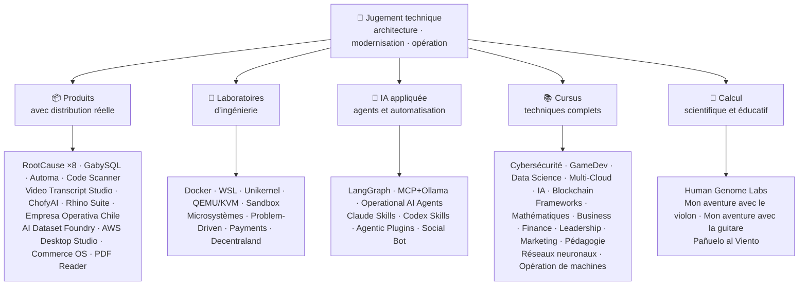

<div align="center">

# 👋 Vladimir Acuña

## **Architecte de Solutions · Modernisation Legacy · Senior Full-Stack · AI Automation**

**Plus de 16 ans à construire et exploiter du logiciel en environnements réels. Je conçois, construis et opère des systèmes de production avec un focus sur la fiabilité, la performance, la livraison continue et un jugement technique propre — tout est vérifiable dans ce GitHub.**

[](https://vladimiracunadev-create.github.io/)
[](https://www.linkedin.com/in/vladimir-acu%C3%B1a-valdebenito-11924a29/)
[](mailto:vladimir.acuna.dev@gmail.com)

[](#-périmètre-professionnel)
[](#-produits-avec-distribution-réelle)
[](#-cursus-techniques-complets)

<!-- STATS:START -->
[](https://github.com/vladimiracunadev-create?tab=repositories)
[](https://github.com/vladimiracunadev-create?tab=repositories)
[](#-lécosystème-en-un-coup-dœil)
[](#-cursus-techniques-complets)
[](https://github.com/vladimiracunadev-create?tab=repositories)
<!-- STATS:END -->

[](https://github.com/vladimiracunadev-create?tab=repositories)
[](https://github.com/vladimiracunadev-create?tab=followers)

[🌐 Portfolio (6 langues)](https://vladimiracunadev-create.github.io/) ·
[🧩 Écosystème](#-lécosystème-en-un-coup-dœil) ·
[⚡ Évaluez-moi en 10 minutes](#-si-vous-avez-10-minutes-pour-mévaluer) ·
[✅ Périmètre professionnel](#-périmètre-professionnel) ·
[📬 Contact](#-contact)

**Langues :** [ES](README.md) · [EN](README.en.md) · [PT](README.pt.md) · [IT](README.it.md) · [FR](README.fr.md) · [ZH](README.zh.md)

**Noyau technique :**
PHP 8 · Python · Rust · Go · Node/TS · Java 21 · .NET 8 · Dart/Flutter · WASM
· AWS · Terraform · Kubernetes · Docker · n8n · LangGraph/MCP · CI/CD · FinOps · Observabilité

</div>

---

> [!NOTE]
> Ce profil n’est pas une liste d’aspirations. Chaque affirmation ci-dessous est soutenue par un dépôt exécutable et des preuves. Quand quelque chose **n’est pas** terminé, c’est déclaré.

## 🎯 Ce Que Vous Trouverez Ici

Ce n’est pas « un repo » : c’est un écosystème avec des standards communs.

- 🔁 **Démos reproductibles** — cloner, exécuter, valider.
- 🧰 **Outillage standardisé** — Makefiles, Hub CLI, `doctor` et `smoke` par dépôt.
- 🛡️ **Défense en profondeur** — secret scanning, politiques et pratiques interdites explicites.
- 📈 **Observabilité** — `/health`, `/ready`, `/metrics`, dashboards et traçabilité.
- 📚 **Documentation par audience** — recruteur, débutant, DevOps ou sécurité selon le dépôt.
- 📦 **Distribution comme produit** — releases téléchargeables, checksums et preuves de build ; signatures commerciales/store indiquées comme en cours quand applicable.
- 🌍 **Internationalisation** — portfolio en 6 langues (ES · EN · PT · IT · FR · ZH).
- 🧭 **Honnêteté technique** — chaque cas marqué `OPÉRATIONNEL`, `DOCUMENTÉ/SCAFFOLD` ou `PLANIFIÉ`.

## ✅ État Vérifiable

| Surface | Preuve concrète |
|---|---|
| 🧪 **Couverture de tests** | GabySQL **828 tests** + fuzz de **503,8 M requêtes** (0 panic) · Empresa Operativa Chile **158 tests** · Automa **150 pytest** · CI multi-OS |
| 🤖 **Agents en production** | LangGraph RealWorld **25/25 backends opérationnels** (cas 01–25, couverture 100 %) · Operational AI Agents **13 agents** avec **39 evals déterministes** |
| 🔗 **Intégration polyglotte** | **20 cas** émetteur→n8n→récepteur —**19 opérationnels**, audités un par un avec Docker— · **18+ moteurs BD** · **20+ conteneurs** · 11 patterns |
| 📦 **Distribution** | **145 releases** publiées dans un écosystème de **60 dépôts publics propres** · installateurs et artefacts `.exe` · `.msi` · `.dmg` · `.apk` avec checksums et preuves de build ; signatures commerciales/store en cours quand applicable |
| 🛡️ **Supply chain** | CodeQL · Semgrep · Bandit · Trivy · Grype · Gitleaks · TruffleHog · SBOM CycloneDX · Scorecard |
| 📚 **Cursus** | **4 378 classes** vérifiables dans 18 programmes, comptées depuis la structure réelle de chaque dépôt par [un workflow](.github/workflows/stats.yml) —pas écrites à la main— · chaque classe avec laboratoire et défi à critères d’acceptation quand applicable |
| 🌐 **Portfolio** | PWA installable · **6 langues** · **36 PDF** par pipeline · CV Data API · Capacitor Android · Lighthouse 100 |
| 🔒 **Télémétrie** | Zéro dans les produits forensiques et Empresa Operativa Chile — vérifié à chaque build (aucune permission Android `INTERNET`) |
| 🌐 **Sites publiés** | **52 sites** GitHub Pages —51 landings, une par produit ou programme, plus le portfolio— chacun déployé depuis son propre dépôt · les 52 vérifiés avec réponse `200` |

## 🗺️ L’Écosystème En Un Coup D’Œil



## 📦 Produits Avec Distribution Réelle

Logiciel qui se télécharge, s’installe et s’utilise — pas seulement du code à cloner.

| Produit | Ce que c’est | Stack | Livraison |
|---|---|---|---|
| [🔍 **RootCause Windows**](https://github.com/vladimiracunadev-create/rootcause-windows-inspector) | Forensique de cybersécurité : toute distorsion anormale des ressources peut être le premier indice d’une menace. Diagnostiquer d’abord, intervenir ensuite | Rust 🦀 · ETW/WPR | **v0.19.0** · **16 releases** · **5 éditions** : GUI · Portable · CLI · PowerShell · VS Code · [landing](https://vladimiracunadev-create.github.io/rootcause-windows-inspector/) |
| [📱 **RootCause Mobile**](https://github.com/vladimiracunadev-create/rootcause-mobile-inspector) | Le frère mobile : capteur forensique qui compare chaque app à elle-même, signale le stalkerware et distingue permissions accordées de permissions seulement demandées | Flutter · Kotlin · Swift | **v0.8.0** · APK Android vérifiable · 5 langues · **télémétrie zéro** · [landing](https://vladimiracunadev-create.github.io/rootcause-mobile-inspector/) |
| [🍎 **RootCause macOS**](https://github.com/vladimiracunadev-create/rootcause-macos-inspector) | Édition macOS : persistance `launchd`, Gatekeeper, SIP, FileVault, XProtect, permissions TCC, processus signés et voisins réseau — chaque surface contre un état connu sain | Rust 🦀 · macOS 13+ | **v0.1.0** · première release publiée · Apache-2.0 · [landing](https://vladimiracunadev-create.github.io/rootcause-macos-inspector/) |
| [🖥️ **RootCause Server**](https://github.com/vladimiracunadev-create/rootcause-server) | Le frère serveur : corrèle surface exposée, rafales d’accès, session accordée à la même adresse, intégrité de fichiers critiques et silence du capteur en une phrase actionnable | Rust 🦀 · Windows · Linux · macOS | **v0.2.0** · **18 règles** avec preuves et runbook · n’exécute rien seul · console locale sans dépendances web · **pas encore de release publiée** · [landing](https://vladimiracunadev-create.github.io/rootcause-server/) |
| [🌐 **RootCause Web**](https://github.com/vladimiracunadev-create/rootcause-web-inspector) | Capteur forensique du navigateur : cookies, sessions mail, extensions, téléchargements, permissions et pages qui imitent une vraie fenêtre | JavaScript · extension MV3 | **v0.2.0** · pas encore de release publiée · panneau sur `127.0.0.1` · zéro dépendance · télémétrie zéro vérifiée en CI · [landing](https://vladimiracunadev-create.github.io/rootcause-web-inspector/) |
| [₿ **RootCause Bitcoin Defense**](https://github.com/vladimiracunadev-create/rootcause-bitcoin-defense) | Défense watch-only pour garde Bitcoin : inventorie l’origine de chaque clé, la croise avec des alertes publiées et explique la cause racine avec preuves | JavaScript · app Windows · panneau local | **v0.3.0** · **2 releases** · zéro dépendance · ne demande jamais de seed · vérifié en CI · [landing](https://vladimiracunadev-create.github.io/rootcause-bitcoin-defense/) |
| [⛓️ **RootCause Blockchain Security**](https://github.com/vladimiracunadev-create/rootcause-blockchain-security) | Console watch-only multi-chain : inventorie contrats, proxies, oracles, bridges, gouvernance et dépendances, puis génère des runbooks de cause racine | JavaScript · app Windows · panneau local | **v0.3.0** dans le dépôt · release publiée : `v0.1.0` · zéro dépendance · ne demande jamais de clés privées · vérifié en CI · [landing](https://vladimiracunadev-create.github.io/rootcause-blockchain-security/) |
| [📷 **RootCause QR Inspector**](https://github.com/vladimiracunadev-create/rootcause-qr-inspector) | App Android locale pour inspecter les QR avant d’agir : explique 26 signaux, sépare faits et hypothèses, exporte une preuve expurgée | Flutter · Dart | **v0.1.3** · **3 releases** · **103 tests** · APK Android publié · SHA-256 vérifiable · signature technique du paquet APK ; signatures commerciales/store en cours · télémétrie zéro · [landing](https://vladimiracunadev-create.github.io/rootcause-qr-inspector/) |
| [🏢 **Empresa Operativa Chile**](https://github.com/vladimiracunadev-create/empresa-operativa-chile) | Accompagne une SpA d’avant sa création à chaque clôture mensuelle : constitution avec preuves, TVA reportée, brouillon F29, clôture immuable et journal d’audit. Chaque règle pointe vers une source officielle | JavaScript · Rust · PWA | **v1.5.0** · Android · Windows · navigateur · **158 tests** · **0 dépendance de production** · télémétrie zéro · [landing](https://vladimiracunadev-create.github.io/empresa-operativa-chile/) |
| [🔍 **Universal Code Scanner**](https://github.com/vladimiracunadev-create/universal-code-scanner) | Lecteur QR et codes-barres qui **interprète avant d’agir** : 16 signaux locaux de risque URL et confirmation explicite | Flutter · Dart | **v1.1.0** · Android · iOS · macOS · PWA · historique chiffré **AES-256-GCM** · [landing](https://vladimiracunadev-create.github.io/universal-code-scanner/) |
| [🗄️ **GabySQL**](https://github.com/vladimiracunadev-create/gabysql) | Base embarquée : fichier unique `.db`, WAL, optimiseur par coûts, API HTTP/JSON | Rust 🦀 | Windows · macOS · Linux · [landing](https://vladimiracunadev-create.github.io/gabysql/) |
| [🤖 **Automa PC**](https://github.com/vladimiracunadev-create/automa-pc) | Orchestrateur local : flows JSON qui ouvrent de vraies fenêtres, interagissent avec le DOM et laissent des preuves | Python · Playwright · pywebview | **v0.3.0** · **27 flows** · installateur publié et vérifiable · [landing](https://vladimiracunadev-create.github.io/automa-pc/) |
| [🏭 **AI Dataset Foundry**](https://github.com/vladimiracunadev-create/ai-dataset-foundry) | Fabrique local-first qui transforme PDF, Word, web, Git, JSON et CSV en datasets auditables pour pretraining, fine-tuning, RAG et évaluation | Python | **v0.2.0** · Windows + Android offline · première release publiée · [landing](https://vladimiracunadev-create.github.io/ai-dataset-foundry/) |
| [☁️ **AWS Desktop Studio**](https://github.com/vladimiracunadev-create/aws-desktop-studio) | App local-first pour explorer 16 services AWS avec CLI/SSO, lecture par défaut et contrôles explicites pour EC2 | JavaScript · Windows | **v0.1.1** · première release publiée · [landing](https://vladimiracunadev-create.github.io/aws-desktop-studio/) |
| [🧭 **Commerce OS**](https://github.com/vladimiracunadev-create/commerce-operating-system) | Démo conceptuelle guidée d’opérations commerciales : catalogue, stock, CRM, commandes, paiements mock et traçabilité | JavaScript · Web · Windows · Android | **v0.3.0** · **2 releases** · sans argent réel ni SII réel · [landing](https://vladimiracunadev-create.github.io/commerce-operating-system/) |
| [📄 **PDF Reader**](https://github.com/vladimiracunadev-create/pdf-reader-windows-android) | Lecteur Android-first local et read-only, avec zoom sans coupe, historique réouvrable, partage WhatsApp et choix comme lecteur par défaut | HTML · Web · Android · Windows | **v0.3.0** · APK signé · aucun compte, permission sensible ni télémétrie · [landing](https://vladimiracunadev-create.github.io/pdf-reader-windows-android/) |
| [🎙️ **Video Transcript Studio**](https://github.com/vladimiracunadev-create/video-transcript-studio) | Une vidéo, playlist ou **chaîne YouTube complète** en texte avec horodatage. Ne dépend pas des sous-titres : Whisper reconnaît l’audio **sur votre machine**, sans API, compte ou clé | Python · PySide6 · FastAPI · faster-whisper | **v0.2.0** · desktop Windows + panneau local `127.0.0.1` + CLI, **avec la même file** · MD · PDF · TXT · SRT · VTT · JSON · MP3 · OGG · **89 tests** · FFmpeg inclus · télémétrie zéro · [landing](https://vladimiracunadev-create.github.io/video-transcript-studio/) |
| [🎨 **ChofyAI Studio**](https://github.com/vladimiracunadev-create/chofyai-studio) | Lanceur local d’IA créative : orchestre Qwen3-TTS, whisper.cpp, FaceFusion, AceForge et ComfyUI | Tauri 2 · Rust · React | v0.5.1 · **5/5 outils avec inférence réelle** · macOS Apple Silicon · Windows expérimental · **pas encore de release publiée** · [site](https://vladimiracunadev-create.github.io/chofyai-studio/) |
| [🦏 **Rhino Suite**](https://github.com/vladimiracunadev-create/rhino-suite) | Suite bureautique depuis zéro : les règles du document ne dépendent pas du DOM — HTML n’est qu’une projection | Rust/WASM · Go · React 19 | Monorepo évolutif par phases · [landing](https://vladimiracunadev-create.github.io/rhino-suite/) |
| [🎻 **Mon Aventure avec le Violon**](https://github.com/vladimiracunadev-create/violin-adventure) | App éducative enfant : accordeur chromatique, métronome exact sur l’horloge audio, chansons avec vrai violon | Tauri 2 · React · TS | **v1.3.0** · Windows · Android · Linux · macOS · PWA · [landing](https://vladimiracunadev-create.github.io/violin-adventure/) |
| [🎸 **Mon Aventure avec la Guitare**](https://github.com/vladimiracunadev-create/guitarra-adventure) | Le frère à cordes pincées : 24 leçons en 6 mondes, accordeur 6 cordes, métronome sans dérive et 11 notes de vraie guitare | Tauri 2 · React · TS | **v1.0.0** · Windows · Android · Linux · macOS · iOS · PWA · sans comptes, publicité ni dépendance en ligne · [landing](https://vladimiracunadev-create.github.io/guitarra-adventure/) |
| [🧣 **Pañuelo al Viento**](https://github.com/vladimiracunadev-create/panuelo-al-viento-cueca-app) | La cueca dès 10 ans : 24 classes en 8 niveaux, 72 activités, laboratoire de six pulsations (3+3 et 2+2+2) et diagrammes de sol accessibles. Déclare qu’elle **complète, ne remplace pas**, enseignants et porteurs de culture | Flutter · Dart | **v0.2.0** · Android 7+ · Windows 10/11 · APK · EXE · MSI · portable · **29 tests + 2 validateurs** · sans caméra, micro, compte, publicité ni internet · [landing](https://vladimiracunadev-create.github.io/panuelo-al-viento-cueca-app/) |

## 🧪 Laboratoires D’Ingénierie

| Repo | Ce que cela démontre |
|---|---|
| [🐳 **Problem-Driven Systems Lab**](https://github.com/vladimiracunadev-create/problem-driven-systems-lab) | **20 problèmes réels** (latence sous charge, N+1, retry storms, fuites, monolithe, cache stampede, backpressure, migration sans downtime, DLQ oubliée) avec pannes haute fidélité, résolus en **7 stacks** : PHP 8 · Python · Node.js · Java 21 · .NET 8 · **Go 1.23** · **Rust 1.83** · [landing](https://vladimiracunadev-create.github.io/problem-driven-systems-lab/) |
| [📆 **Social Bot Scheduler**](https://github.com/vladimiracunadev-create/social-bot-scheduler) | **v4.10.0** · **20 cas** source→n8n→récepteur sur **18+ moteurs BD** —**19 opérationnels**, audités un par un avec Docker— audit **8 couches**, idempotence, circuit breaker et DLQ · [landing](https://vladimiracunadev-create.github.io/social-bot-scheduler/) |
| [🧰 **Microsistemas**](https://github.com/vladimiracunadev-create/microsistemas) | **12 microapps** de diagnostic et modernisation PHP · serveur MCP local read-only · hardening en 3 phases · [landing](https://vladimiracunadev-create.github.io/microsistemas/) |
| [🧪 **Docker Labs**](https://github.com/vladimiracunadev-create/docker-labs) | **13 labs** sur plateforme 4 services + installateur `.exe` automatisé avec launcher · [landing](https://vladimiracunadev-create.github.io/docker-labs/) |
| [🐳 **WSL Labs**](https://github.com/vladimiracunadev-create/wsl-labs) | **12 cas** sur `wslc`, moteur de conteneurs natif WSL — **sans Docker Desktop** · [landing](https://vladimiracunadev-create.github.io/wsl-labs/) |
| [⚡ **Unikernel Labs**](https://github.com/vladimiracunadev-create/unikernel-labs) | « Docker Desktop pour unikernels » : contrôle Windows sur Unikraft avec backend WSL2, `kraft` + QEMU/KVM · [landing](https://vladimiracunadev-create.github.io/unikernel-labs/) |
| [🧰 **QEMU/KVM Labs**](https://github.com/vladimiracunadev-create/qemu-kvm-labs) | **12 labs** de virtualisation réelle avec QEMU, KVM, libvirt, cloud-init et `vm-manager` sur Linux et WSL2 · [landing](https://vladimiracunadev-create.github.io/qemu-kvm-labs/) |
| [🛡️ **Sandbox Labs**](https://github.com/vladimiracunadev-create/sandbox-labs) | Isolation Linux : exécute code, fichiers et modèles business tiers sous politiques déclarées et **émet une preuve signée des contrôles réellement appliqués** · **36 cas** en deux familles —15 techniques et 21 marchés de capitaux— · expérimental et éducatif, *pas un produit de sécurité* · [landing](https://vladimiracunadev-create.github.io/sandbox-labs/) |
| [💳 **Universal Payments Engineering Lab**](https://github.com/vladimiracunadev-create/universal-payments-engineering-lab) | **28 familles** de paiements dans une démo locale auto-explicative : états, ledger, réconciliation, sécurité et guides d’implémentation · [landing](https://vladimiracunadev-create.github.io/universal-payments-engineering-lab/) |
| [🕹️ **Decentraland Social Arcade**](https://github.com/vladimiracunadev-create/decentraland-social-arcade) | Expérience 3D sociale native Decentraland : un MVP et architecture multi-jeux avec SDK7, ECS et TypeScript · documentation espagnole · sans paiements ni télémétrie |
| [☁️ **Projets AWS**](https://github.com/vladimiracunadev-create/proyectos-aws) | Cas progressifs où chacun ajoute un service AWS **et** une nouvelle capacité GitHub Actions · couverture SAA-C03 · DVA-C02 · SOA-C02 |

## 🤖 IA Appliquée

| Repo | Ce que cela démontre |
|---|---|
| [🤖 **LangGraph RealWorld**](https://github.com/vladimiracunadev-create/langgraph-realworld) | **25/25 backends opérationnels** — état typé, routes conditionnelles, streaming NDJSON, mode DEMO/LIVE, 8 couches de sécurité, chaîne de custody SHA-256 |
| [🧭 **Operational AI Agents**](https://github.com/vladimiracunadev-create/operational-ai-agents) | **13 agents opérationnels** pour Claude Code et runtimes compatibles : missions complètes de modernisation, évolution repo, cursus, portfolio, sécurité et incidents · **39 evals déterministes** · 34 tests · zero-deps · Linux · macOS · Windows · [site](https://vladimiracunadev-create.github.io/operational-ai-agents/) |
| [🧠 **MCP + Ollama Local**](https://github.com/vladimiracunadev-create/mcp-ollama-local) | IA local-first avec tools MCP en sandbox · bind `127.0.0.1` · profil de confiance multicouche · honnête sur ses limites |
| [🧩 **Agentic Plugins Toolkit**](https://github.com/vladimiracunadev-create/agentic-plugins-toolkit) | **6 plugins agentiques** installables dans Claude Code, OpenAI/Codex, Copilot, Gemini et MCP depuis une source unique · **69 vues générées sans drift** · zero-deps · Linux · macOS · Windows · [site](https://vladimiracunadev-create.github.io/agentic-plugins-toolkit/) |
| [🧰 **Claude Skills Toolkit**](https://github.com/vladimiracunadev-create/claude-skills-toolkit) | **15 skills agentiques** pour Claude Code · sécurité, custody Bitcoin, gates de repo, cohérence, Docker et documentation · zero-deps · multiplateforme |
| [🧰 **Codex Skills Toolkit**](https://github.com/vladimiracunadev-create/codex-skills-toolkit) | **15 skills agentiques** pour Codex : sécurité, custody Bitcoin, gates Python/YAML/Markdown, versions, dépendances, nettoyage Docker et conversion documentaire · Python-first · `pnpm` · Linux · macOS · Windows · [site](https://vladimiracunadev-create.github.io/codex-skills-toolkit/) |

## 📚 Cursus Techniques Complets

Programmes séquentiels en espagnol, chaque classe avec laboratoire guidé et **défi avec critères d’acceptation**. Les 18 programmes totalisent **4 378 classes**, comptées depuis la structure réelle des dépôts par [un workflow](.github/workflows/stats.yml), pas écrites à la main.

| Programme | Classes | Portée |
|---|---:|---|
| [🔢 **Mathématiques computationnelles**](https://github.com/vladimiracunadev-create/computational-mathematics-program) | 360 | De compter sur les doigts à reproduire un paper · **360 démonstrations déterministes vérifiées en CI** · 1 080 notebooks · glossaire de 489 termes · [site](https://vladimiracunadev-create.github.io/computational-mathematics-program/) |
| [🏦 **Finance et Banque**](https://github.com/vladimiracunadev-create/finance-and-banking-evolution-program) | 356 | 534 h · maths financières et IFRS → crédit, risques, Bâle III, open finance, DLT, stablecoins et MiCA · 26 cas avec **sources officielles vérifiables dans chaque classe** · [site](https://vladimiracunadev-create.github.io/finance-and-banking-evolution-program/) |
| [🎮 **GameDev**](https://github.com/vladimiracunadev-create/modern-gamedev-program) | 352 | Mathématiques et C#/C++/GDScript → shaders, IA, multijoueur, VR/AR · Godot · Unity · Unreal · **10 labs Godot vérifiés en CI** · [site](https://vladimiracunadev-create.github.io/modern-gamedev-program/) |
| [🛡️ **Cybersécurité**](https://github.com/vladimiracunadev-create/modern-cybersecurity-program) | 360 | **v1.3.0** · 20 parties · fondamentaux → Red Team, DFIR, cloud security, exploit dev, CTF et game security · mappé à **7 certifications** · app offline Android/web · manuel PDF · [site](https://vladimiracunadev-create.github.io/modern-cybersecurity-program/) |
| [📈 **Marketing, ventes et croissance**](https://github.com/vladimiracunadev-create/marketing-sales-growth-evolution-program) | 336 | 24 parties avec définitions opérationnelles, fiches de mesure, bibliographie vérifiable et contexte réglementaire chilien · **v1.6.0** · 1,29 M mots · 17 parcours par rôle · [site](https://vladimiracunadev-create.github.io/marketing-sales-growth-evolution-program/) |
| [🏢 **Création d’entreprise**](https://github.com/vladimiracunadev-create/modern-business-creation-program) | 336 | Créer et opérer une entreprise réelle au Chili : idée, constitution, SII, opération, crise et sortie · 360 diagrammes · glossaire de 1 251 termes · manuel de 1 548 pages · [site](https://vladimiracunadev-create.github.io/modern-business-creation-program/) |
| [🎓 **Pédagogie et sciences de l’apprentissage**](https://github.com/vladimiracunadev-create/education-pedagogy-learning-sciences-program) | 300 | De la façon dont une personne apprend à la formation de ceux qui enseignent · 25 parties · **chaque classe déclare preuves et limites** · alphabétisation, méthodes comparées, besoins éducatifs, coexistence, diversité culturelle · **v2.1.0** · [site](https://vladimiracunadev-create.github.io/education-pedagogy-learning-sciences-program/) |
| [☁️ **Multi-Cloud**](https://github.com/vladimiracunadev-create/multi-cloud-engineering-program) | 288 | AWS · Azure · GCP · Kubernetes · Terraform · SRE · FinOps · **1 288 heures** · 288 labs avec preuve JSON · 1 032 sources · manuel PDF de 2 884 pages · [site](https://vladimiracunadev-create.github.io/multi-cloud-engineering-program/) |
| [🎖️ **Leadership exécutif**](https://github.com/vladimiracunadev-create/executive-leadership-founder-program) | 288 | Du premier résultat à diriger une entreprise et fonder la vôtre : équipes, KPI/OKR, finance, produit, risque, board et M&A · [site](https://vladimiracunadev-create.github.io/executive-leadership-founder-program/) |
| [🐍 **Python Data Science**](https://github.com/vladimiracunadev-create/python-data-science-program) | 232 | Polars, ML+Optuna/SHAP, PyTorch/LLMs/LoRA, MLOps · app Windows native + APK Android · [site](https://vladimiracunadev-create.github.io/python-data-science-program/) |
| [🧠 **Évolution de l’IA**](https://github.com/vladimiracunadev-create/artificial-intelligence-evolution-program) | 183 | Symbolique → probabiliste → deep learning → LLMs, RAG, agents, sécurité et frontière · **v0.17.0** · **705 notebooks** · 148 papers fondamentaux · apps offline Windows, Android et PWA · [site](https://vladimiracunadev-create.github.io/artificial-intelligence-evolution-program/) |
| [🌐 **Programmation comparée**](https://github.com/vladimiracunadev-create/polyglot-programming-labs) | 176 | Un concept, **10 langages** vérifiés en CI — **1 360 implémentations** — plus **1 632 programmes** dans des langages encore vivants et un atlas de **60 fiches en 15 familles** · [site](https://vladimiracunadev-create.github.io/polyglot-programming-labs/) |
| [🧩 **Frameworks comparés**](https://github.com/vladimiracunadev-create/framework-ecosystems-labs) | 149 | Un contrat exécutable contre Express, FastAPI, Spring Boot, ASP.NET, Django, Rails, Laravel, React, Vue, Svelte et plus · **113 classes construites et 36 scaffold**, déclaré dans le dépôt · [site](https://vladimiracunadev-create.github.io/framework-ecosystems-labs/) |
| [🗄️ **Bases de données**](https://github.com/vladimiracunadev-create/database-systems-labs) | 74 | **v3.0.0** · ingénierie BD en 15 parties · 230 heures · 120 sources avec ISBN, DOI ou norme · même cas résolu dans 27 moteurs · 150 pytest · [site](https://vladimiracunadev-create.github.io/database-systems-labs/) |
| [📐 **Psychométrie et mesure**](https://github.com/vladimiracunadev-create/psychometrics-and-assessment-program) | 40 | Construire, scorer, valider et auditer un instrument de mesure · 8 parties · moteur exécutable avec **5 instruments et 344 items, dont 276 du domaine public** |
| [⛓️ **Blockchain**](https://github.com/vladimiracunadev-create/blockchain-learning-path) | 66 | **v0.14.0** · de zéro à l’infrastructure financière programmable et l’analytique on-chain · **91 pratiques** et **356 tests** · Foundry et Slither en CI · [site](https://vladimiracunadev-create.github.io/blockchain-learning-path/) |
| [🧠 **Neural Network Training Labs**](https://github.com/vladimiracunadev-create/neural-network-training-labs) | 31 | 7 modules · ≈214 heures · **93 notebooks** —31 classes, 31 versions étudiant et 31 solutions— · PyTorch · [site d’étude](https://vladimiracunadev-create.github.io/neural-network-training-labs/) |
| [🕹️ **Machine Operator**](https://github.com/vladimiracunadev-create/machine-operator-program) | 451 | **41 modules de formation**, un par machine · **502 h 15 min** · systèmes, commandes, physique, sécurité et design de simulation avec sources par classe · *pas encore de simulateur exécutable, et c’est déclaré* |

## 🔬 Calcul Scientifique

| Repo | Ce que cela démontre |
|---|---|
| [🧬 **Human Genome Labs**](https://github.com/vladimiracunadev-create/human-genome-labs) | Plateforme reproductible de génomique : contrats typés `ScientificResult<T>`, FASTA/GFF3/VCF, modules avec **maturité et preuves explicites**. Honnêteté radicale : *ne réalise pas de diagnostic clinique* · [site](https://vladimiracunadev-create.github.io/human-genome-labs/) |

## ⚡ Si Vous Avez 10 Minutes Pour M’Évaluer

L’idée n’est pas seulement de regarder du code : c’est de voir **comment je pense**, comment je documente et comment je rends tout exécutable.

**Route A — Observabilité et orchestration réelles** *(ma préférée)*

```bash
git clone https://github.com/vladimiracunadev-create/social-bot-scheduler.git
```

Vous verrez workflows, métriques, dashboards et guardrails sur 19 cas et 18+ moteurs BD.

**Route B — Infrastructure reproductible en quelques minutes**

```bash
git clone https://github.com/vladimiracunadev-create/docker-labs.git
```

**Route C — Agents à état typé**

```bash
git clone https://github.com/vladimiracunadev-create/langgraph-realworld.git
```

**Route D — Produit forensique en Rust, sans cloner**

Téléchargez l’installateur ou le binaire CLI depuis [les releases RootCause](https://github.com/vladimiracunadev-create/rootcause-windows-inspector/releases) et vérifiez `SHA256SUMS`.

## 🧠 Standards Que J’Applique Dans Tous Les Dépôts

- **DX d’abord** — si ce n’est pas facile à exécuter, ce n’est utile ni comme démo ni comme base d’équipe.
- **Observabilité dès le jour 1** — métriques et traçabilité, pas après coup.
- **Sécurité comme pipeline** — secret scanning, SBOM par release, pratiques interdites déclarées.
- **Résilience réelle** — idempotence, circuit breaker et dégradation contrôlée.
- **Polyglotte par conception** — langage et moteur choisis par cas d’usage.
- **Honnêteté sur l’état** — un repo a été renommé (`Multisimulador` → `machine-operator-program`) pour ne pas promettre un logiciel qui n’existe pas encore.
- **Les badges sont des signaux, pas des preuves** — chaque repo déclare aussi **ce qu’il ne fait PAS**.
- **Du modèle vers l’extérieur** — le domaine est conçu d’abord ; l’interface est une projection.
- **Ce qui est externe est déclaré** — sur les 63 dépôts publics du compte, 60 sont des travaux propres. Les trois autres, [`Anthropic-Cybersecurity-Skills`](https://github.com/vladimiracunadev-create/Anthropic-Cybersecurity-Skills), [`erpnext`](https://github.com/vladimiracunadev-create/erpnext) et [`OpenExecutive`](https://github.com/vladimiracunadev-create/OpenExecutive), sont des forks et restent hors des chiffres du profil.

## ✅ Périmètre Professionnel

### 🎯 Identité Principale

| Rôle | Appui |
|---|---|
| **Architecte de Solutions** | Conception de systèmes modulaires, scalables et évolutifs |
| **Architecte de Modernisation Legacy** | Évolution réelle du legacy (PHP 5.x→8.x, refactoring incrémental sans interrompre l’opération) |
| **Senior Full-Stack / Tech Lead** | Architecture, exécution et standards sur plateformes réelles (+16 ans) |
| **AI Automation Architect** | Systèmes agentiques avec LangGraph/MCP et flows n8n avec guardrails |

### ↗ Expansion Naturelle

**AI Orchestration Engineer** · **Systems / Rust Engineer** · **Mobile Engineer (Flutter)** · **Solutions Engineer** · **Technical Product Builder** · **Technical Trainer** · **Consultant en transformation numérique** · **Technical Product Operations**

### ⚙️ Périmètre Complémentaire

Platform Engineer / IDP · DevOps / CI-CD · Cloud / AWS Engineer · SRE applicatif · Automation Engineer · Consultant technico-commercial

## 🤖 Flux De Développement Assisté Par IA

| Outil | Usage principal |
|---|---|
| **Claude Code** | Revue architecturale, implémentation et documentation technique |
| **ChatGPT Plus** | Analyse, architecture et itération (depuis 2023) |
| **Codex** | Génération et refactoring de code |
| **Antigravity** | Accélération de flux de développement et automatisation |
| **VS Code / OpenCode** | Environnements avec assistance IA intégrée |

> Je combine jugement technique propre, validation humaine et direction architecturale. L’IA amplifie capacité, vitesse et portée — elle ne remplace pas l’expérience.

## 📌 Disponibilité

**Ouvert à :** Senior Full-Stack · Architecture · Modernisation legacy · Platform/IDP · SRE applicatif · DevOps pragmatique · Automatisation · AI Automation

**Modalité :** remote ou hybride, selon le projet.

## 📬 Contact

[](https://vladimiracunadev-create.github.io/)
[](https://www.linkedin.com/in/vladimir-acu%C3%B1a-valdebenito-11924a29/)
[](https://gitlab.com/vladimir.acuna.dev-group/vladimir.acuna.dev-group)
[](mailto:vladimir.acuna.dev@gmail.com)

---

<div align="center">

[🤝 Contribuer](CONTRIBUTING.md) ·
[🛡️ Sécurité](SECURITY.md) ·
[⚖️ Code de conduite](CODE_OF_CONDUCT.md)

<sub>README synchronisé avec l’état réel vérifié de chaque dépôt public —chiffres lus via API, landings vérifiées par réponse HTTP— · dernière vérification : 23 septembre 2026.</sub>

</div>
