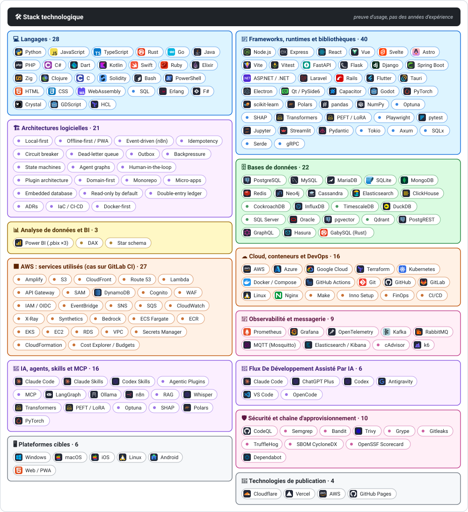
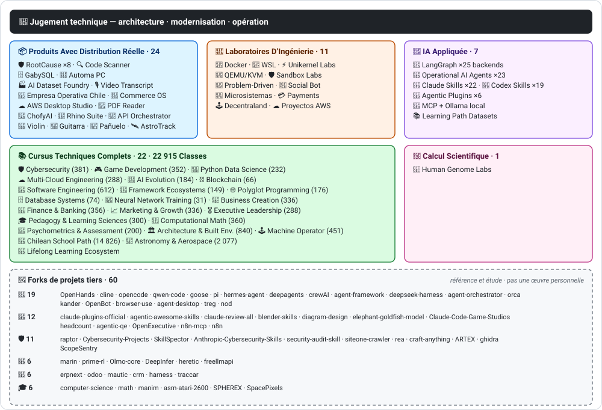

# 👋 Vladimir Acuña

## **Ingénieur en IA · Architecte de Solutions · Senior Full-Stack · Transformation Numérique · Gestion et Opérations**

**Formé en ingénierie informatique et sciences du calcul ainsi qu'en administration d'entreprise, avec plus de 16 ans dans la construction et l'exploitation de logiciels réels. Je relie métiers, personnes, processus et technologie pour concevoir, évaluer, livrer et maintenir des solutions — avec des preuves vérifiables sur ce GitHub.**

<!-- STATS:START -->

<!-- STATS:END -->

[🧭 Par où commencer](docs/START_HERE.fr.md) ·
[🌐 Portfolio (22 langues)](https://vladimiracunadev-create.github.io/) ·
[🧩 Écosystème](#-lécosystème-en-un-coup-dœil) ·
[🛠️ Stack technologique](#-stack-technologique) ·
[⚡ Évaluez-moi en 10 minutes](docs/guides/TECH_LEAD.fr.md) ·
[✅ Périmètre professionnel](#-périmètre-professionnel) ·
[🧭 Gestion sans programmation](#-gestion-administration-et-opportunités-professionnelles-sans-programmation) ·
[📋 Matrice des rôles](PROFESIONAL_ROLES.fr.md) ·
[📬 Contact](#-contact)

**🌐 Versions complètes :** [Español](README.md) · [English](README.en.md) · [Português](README.pt.md) · [Italiano](README.it.md) · [Français](README.fr.md) · [简体中文](README.zh.md) · [繁體中文](README.zh-TW.md) · [日本語](README.ja.md) · [한국어](README.ko.md) · [Türkçe](README.tr.md) · [Русский](README.ru.md) · [Tiếng Việt](README.vi.md) · [ไทย](README.th.md) · [Deutsch](README.de.md) · [Українська](README.uk.md) · [Polski](README.pl.md) · [العربية](README.ar.md) · [فارسی](README.fa.md) · [Bahasa Indonesia](README.id.md) · [Nederlands](README.nl.md) · [हिन्दी](README.hi.md) · [Ελληνικά](README.el.md)

**Noyau technique :**
PHP 8 · Python · Rust · Go · Node/TS · Java 21 · .NET 8 · Dart/Flutter · WASM
· AWS · Terraform · Kubernetes · Docker · n8n · LangGraph/MCP · CI/CD · FinOps · Observabilité

**Pont métier–technologie :** analyse de processus et exigences · évaluation de solutions · coordination de livraison · opérations et continuité · risque · produit et service · formation technique

---

> [!NOTE]
> Ce profil ne transforme pas les possibilités en expérience. Expérience prouvée, compétences transférables, possibilités de candidature et objectifs futurs sont explicitement séparés.

## 🧭 Par où commencer

Choisissez votre cas et allez droit à l'essentiel:

🧑‍💼 [Recrutement](docs/guides/RECRUITER.fr.md) · 💼 [Client ou freelance](docs/guides/FREELANCE.fr.md) · 🛠️ [Évaluation technique](docs/guides/TECH_LEAD.fr.md) · 🏢 [Business et gestion](docs/guides/BUSINESS.fr.md) · 🤝 [Collaboration et sécurité](docs/guides/COLLABORATOR.fr.md) · 🎓 [Apprendre ou enseigner](docs/guides/LEARNER.fr.md)

## 🎯 Ce Que Vous Trouverez Ici

Ce n’est pas « un repo » : c’est un écosystème avec des standards communs.

- 🔁 **Démos reproductibles** — cloner, exécuter, valider.
- 🧰 **Outillage standardisé** — Makefiles, Hub CLI, `doctor` et `smoke` par dépôt.
- 🛡️ **Défense en profondeur** — secret scanning, politiques et pratiques interdites explicites.
- 📈 **Observabilité** — `/health`, `/ready`, `/metrics`, dashboards et traçabilité.
- 📚 **Documentation par audience** — recruteur, débutant, DevOps ou sécurité selon le dépôt.
- 📦 **Distribution comme produit** — releases téléchargeables, checksums et preuves de build ; signatures commerciales/store indiquées comme en cours quand applicable.
- 🌍 **Internationalisation** — ce profil est publié en 22 langues et le portfolio propose 154 PDF publics (7 familles × 22 langues) (ES · EN · PT · IT · FR · ZH · ZH-TW · JA · KO · TR · RU · VI · TH · DE · UK · PL · AR · FA · ID · NL · HI · EL).
- 🧭 **Honnêteté technique** — chaque cas marqué `OPÉRATIONNEL`, `DOCUMENTÉ/SCAFFOLD` ou `PLANIFIÉ`.

## ✅ État Vérifiable

| Surface | Preuve concrète |
|---|---|
| 🧪 **Couverture de tests** | GabySQL **850 tests** + fuzz de **503,8 M requêtes** (0 panic) · Empresa Operativa Chile **230 tests** · Automa **150 pytest** · CI multi-OS |
| 🤖 **Agents en production** | LangGraph RealWorld **25/25 backends opérationnels** (cas 01–25, couverture 100 %) · Operational AI Agents **23 agents** avec **69 evals déterministes** |
| 🔗 **Intégration polyglotte** | **20 cas** émetteur→n8n→récepteur —**19 opérationnels**, audités un par un avec Docker— · **18+ moteurs BD** · **20+ conteneurs** · 11 patterns |
| 📦 **Distribution** | **166 releases** publiées dans un écosystème de **68 dépôts publics propres** · installateurs et artefacts `.exe` · `.msi` · `.dmg` · `.apk` avec checksums et preuves de build ; signatures commerciales/store en cours quand applicable |
| 🛡️ **Supply chain** | CodeQL · Semgrep · Bandit · Trivy · Grype · Gitleaks · TruffleHog · SBOM CycloneDX · Scorecard |
| 📚 **Cursus** | **22 915 classes** vérifiables dans 22 programmes, comptées par [un workflow](.github/workflows/stats.yml) depuis la structure réelle ou une source vérifiable déclarée dans le dépôt —pas écrites à la main— · chaque programme déclare son état éditorial et ses limites |
| 🌐 **Portfolio** | PWA installable · **22 langues** · **154 PDF** par pipeline · CV Data API · Capacitor Android · Lighthouse 100 |
| 🔒 **Télémétrie** | Zéro dans les produits forensiques et Empresa Operativa Chile — vérifié à chaque build (aucune permission Android `INTERNET`) |
| 🌐 **Sites publiés** | **57 sites** GitHub Pages —56 landings, une par produit, programme ou navigateur de l'écosystème, plus le portfolio— chacun déployé depuis son propre dépôt · les 57 vérifiés avec réponse `200` |

## 🛠️ Stack technologique

Technologies détectées dans les dépôts publics (manifestes, dépendances, conteneurs et code), regroupées par domaine. Apparaître dans un dépôt —laboratoires et cursus compris— est une preuve d'usage, pas une affirmation d'années d'expérience en production.

👉 **[D'où vient le Stack technologique](docs/STACK_SOURCES.fr.md)**

**Architectures logicielles**

Local-first → [empresa-operativa-chile](https://github.com/vladimiracunadev-create/empresa-operativa-chile), [ai-dataset-foundry](https://github.com/vladimiracunadev-create/ai-dataset-foundry) · Event-driven → [social-bot-scheduler](https://github.com/vladimiracunadev-create/social-bot-scheduler) · Resilience → [problem-driven-systems-lab](https://github.com/vladimiracunadev-create/problem-driven-systems-lab) · Ledger → [universal-payments-engineering-lab](https://github.com/vladimiracunadev-create/universal-payments-engineering-lab) · Plugins → [agentic-plugins-toolkit](https://github.com/vladimiracunadev-create/agentic-plugins-toolkit) · Agents → [langgraph-realworld](https://github.com/vladimiracunadev-create/langgraph-realworld), [operational-ai-agents](https://github.com/vladimiracunadev-create/operational-ai-agents) · Domain-first → [rhino-suite](https://github.com/vladimiracunadev-create/rhino-suite) · Micro-apps → [microsistemas](https://github.com/vladimiracunadev-create/microsistemas) · Embedded DB → [gabysql](https://github.com/vladimiracunadev-create/gabysql) · IaC → [proyectos-aws](https://github.com/vladimiracunadev-create/proyectos-aws)

**Analyse de données et BI**

Power BI (.pbix ×3) · DAX · Star schema → [social-bot-scheduler](https://github.com/vladimiracunadev-create/social-bot-scheduler)

**AWS : services utilisés (cas sur GitLab CI)**

Cas A–P → [proyectos-aws-gitlab](https://gitlab.com/vladimir.acuna.dev-group/proyectos-aws-gitlab) (GitLab CI → AWS; les 16 déclarés terminés ; le cas M, seulement sa phase 1) · [proyectos-aws](https://github.com/vladimiracunadev-create/proyectos-aws) (GitHub Actions) · EC2, RDS, VPC, Secrets Manager, CloudFormation, Cost Explorer → [aws-desktop-studio](https://github.com/vladimiracunadev-create/aws-desktop-studio) (interrogation réelle de l'inventaire ; EC2 avec démarrage, arrêt et redémarrage sous double contrôle)

**Flux De Développement Assisté Par IA**

| Outil | Usage principal |
|---|---|
| **Claude Code** | Revue architecturale, implémentation et documentation technique |
| **ChatGPT Plus** | Analyse, architecture et itération (depuis 2023) |
| **Codex** | Génération et refactoring de code |
| **Antigravity** | Accélération de flux de développement et automatisation |
| **VS Code / OpenCode** | Environnements avec assistance IA intégrée |

> Je combine jugement technique propre, validation humaine et direction architecturale. L’IA amplifie capacité, vitesse et portée — elle ne remplace pas l’expérience.

**Technologies de publication**

Cloudflare (travail personnel) · Vercel (hackathon NASA Space Apps) · AWS (sites opérationnels, liés à GitLab) · GitHub Pages

## 🗺️ L’Écosystème En Un Coup D’Œil

## 🗂️ Écosystème : produits, laboratoires, IA appliquée, cursus et calcul scientifique

Le travail concret du profil vit dans un document à part : logiciels à télécharger et installer, laboratoires d'ingénierie, IA appliquée, cursus techniques complets et calcul scientifique, ainsi que la description de chaque fork de projets tiers présent dans le compte.

- 📦 [**Produits Avec Distribution Réelle**](docs/ECOSYSTEM.fr.md#products) (24)
- 🧪 [**Laboratoires D’Ingénierie**](docs/ECOSYSTEM.fr.md#labs) (11)
- 🤖 [**IA Appliquée**](docs/ECOSYSTEM.fr.md#ai) (7)
- 📚 [**Cursus Techniques Complets**](docs/ECOSYSTEM.fr.md#curricula) (22)
- 🔬 [**Calcul Scientifique**](docs/ECOSYSTEM.fr.md#science) (1)
- 🍴 [**Forks de projets tiers**](docs/ECOSYSTEM.fr.md#forks) (60)

👉 **[Voir l'écosystème complet](docs/ECOSYSTEM.fr.md)** · [🍴 Forks de projets tiers](docs/ECOSYSTEM.fr.md#forks)

## 🛰️ Hackathon NASA Space Apps 2026

J'ai participé au **NASA Space Apps Challenge 2026** (Santiago, 14 et 15 novembre), sur le défi *Planet X and SPHEREx*, dans une équipe de 6 personnes. Le produit est **AstroTrack · SPHEREx** : un visualiseur web où l'on saisit des coordonnées du ciel et où l'on voit cette zone comme une séquence d'images SPHEREx dans le temps, avec des données NASA/IPAC IRSA.

- **Ma part :** accès aux données (requêtes IRSA avec cache et précalcul des champs de la démo), packaging (PWA, installateurs de bureau avec Tauri et APK Android avec Capacitor), la vue « Téléchargements » et un audit de cohérence entre documentation et code.
- **Livraison vérifiable :** [spherex-releases](https://github.com/vladimiracunadev-create/spherex-releases) réunit 7 releases (v0.1.0 à v0.4.2) avec sommes SHA-256 · [application web](https://spherex-planet-x-tau.vercel.app/) · [dépôt de l'équipe](https://github.com/mauriciovalenzuela742/SPHEREX).
- **Limites déclarées :** le visualiseur, le design et le reste du backend sont le travail d'autres membres de l'équipe ; les installateurs ne sont pas signés et n'ont pas été testés sur de vrais appareils ; j'ai utilisé l'IA (Claude Code) comme assistant, ce qui est déclaré dans le dépôt. Ceci décrit ma contribution, pas un résultat du hackathon.

## 🧠 Standards Que J’Applique Dans Tous Les Dépôts

- **DX d’abord** — si ce n’est pas facile à exécuter, ce n’est utile ni comme démo ni comme base d’équipe.
- **Observabilité dès le jour 1** — métriques et traçabilité, pas après coup.
- **Sécurité comme pipeline** — secret scanning, SBOM par release, pratiques interdites déclarées.
- **Résilience réelle** — idempotence, circuit breaker et dégradation contrôlée.
- **Polyglotte par conception** — langage et moteur choisis par cas d’usage.
- **Honnêteté sur l’état** — un repo a été renommé (`Multisimulador` → `machine-operator-program`) pour ne pas promettre un logiciel qui n’existe pas encore.
- **Les badges sont des signaux, pas des preuves** — chaque repo déclare aussi **ce qu’il ne fait PAS**.
- **Du modèle vers l’extérieur** — le domaine est conçu d’abord ; l’interface est une projection.
- **Ce qui est externe est déclaré** — les [60 forks](docs/ECOSYSTEM.fr.md#forks) de projets tiers sont décrits un par un et restent en dehors de tous les chiffres d'œuvre personnelle de ce profil.

## ✅ Périmètre Professionnel

Ma double formation —**Ingénierie informatique et sciences du calcul + Administration d'entreprise**— traduit les objectifs métier en décisions techniques et les contraintes techniques en options claires pour les opérations, le produit, les clients et la direction.

### 🎯 Identité Principale

| Rôle | Appui |
|---|---|
| **Architecte de Solutions** | Conception de systèmes modulaires, scalables et évolutifs |
| **Architecte de Modernisation Legacy** | Évolution réelle du legacy (PHP 5.x→8.x, refactoring incrémental sans interrompre l’opération) |
| **Senior Full-Stack / Tech Lead** | Architecture, exécution et standards sur plateformes réelles (+16 ans) |
| **AI Automation Architect** | Systèmes agentiques avec LangGraph/MCP et flows n8n avec guardrails |

### ↗ Expansion Naturelle

**AI Orchestration Engineer** · **Systems / Rust Engineer** · **Mobile Engineer (Flutter)** · **Solutions Engineer** · **Technical Product Builder** · **Technical Trainer** · **Consultant en transformation numérique** · **Conseiller Technique (technologie, données et IA)** · **Business / Functional Analyst** · **Technical Product Operations** · **AI Engineer (LLM / ML)** · **Data Engineer** · **DevSecOps / AppSec Engineer** · **QA Automation / Test Engineer** · **Technical Writer** · **Enseignant / Formateur / Instructeur en technologie** · **Instructional Designer (EdTech)** · **Technical Mentor**

### ⚙️ Périmètre Complémentaire

Platform Engineer / IDP · DevOps / CI-CD · Cloud / AWS Engineer · SRE applicatif · Automation Engineer · Consultant technico-commercial · Backend / API Engineer · Fintech / Payments Engineer · Developer Advocate / DevRel

## 🧭 Gestion, Administration et Opportunités Professionnelles sans Programmation

Postes de gestion, d'administration et d'affaires où l'informatique et l'administration apportent sans que programmer soit la tâche centrale, classés avec honnêteté (compétence transférable, possibilité de candidature ou objectif futur) et avec l'écart de chacun. Domaines couverts :

Direction technologique · Projets · Administration · Stratégie · Business analysis · Produit et service · GRC et continuité · Commercial · Finance et contrôle · Qualité · Éducation · Logistique · Données et IA · Secteur public

👉 **[Voir la matrice complète des opportunités](docs/MANAGEMENT.fr.md)**

## 📌 Disponibilité

**Ouvert à :** Senior Full-Stack · Architecture · Modernisation legacy · Platform/IDP · SRE · DevOps · Automatisation · AI Automation · business/functional analysis · coordination de projets IT · Product Operations · transformation numérique · avant-vente/solutions · formation technique · qualité · adoption et gouvernance IA

**Évalué selon le périmètre :** Product Owner/Manager technique · Service Delivery · IT Operations · GRC/risque · administration/opérations · contrôle de gestion · modernisation publique. Les postes de direction sont des objectifs futurs, pas une expérience déclarée.

**Modalité :** remote ou hybride, selon le projet.

## 📬 Contact

---

[🤝 Contribuer](CONTRIBUTING.fr.md) ·
[🛡️ Sécurité](SECURITY.fr.md) ·
[⚖️ Code de conduite](CODE_OF_CONDUCT.fr.md)

README synchronisé avec l’état vérifiable des dépôts publics —chiffres et changements lus via API— · dernière vérification : <!-- VERIFIED:START -->2026-11-24<!-- VERIFIED:END -->.

