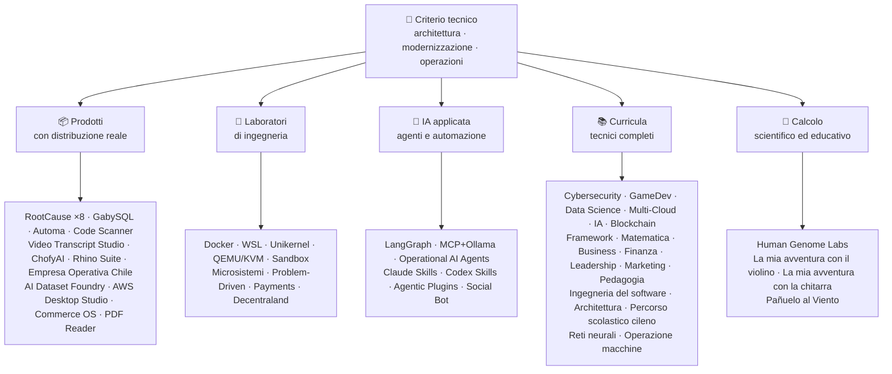

<div align="center">

# 👋 Vladimir Acuña

## **Solution Architect · Senior Full-Stack · Trasformazione Digitale · Gestione e Operazioni**

**Ingegnere in Informatica e Computazione e Amministratore d'Impresa, con oltre 16 anni nella costruzione e gestione di software reale. Collego business, persone, processi e tecnologia per progettare, valutare, consegnare e sostenere soluzioni — con evidenze verificabili su questo GitHub.**

[](https://vladimiracunadev-create.github.io/)
[](https://www.linkedin.com/in/vladimir-acu%C3%B1a-valdebenito-11924a29/)
[](mailto:vladimir.acuna.dev@gmail.com)

[](#-ambito-professionale)
[](#-prodotti-con-distribuzione-reale)
[](#-curricula-tecnici-completi)

<!-- STATS:START -->
[](https://github.com/vladimiracunadev-create?tab=repositories)
[](https://github.com/vladimiracunadev-create?tab=repositories)
[](#-ecosistema-in-sintesi)
[](#-curricula-tecnici-completi)
[](https://github.com/vladimiracunadev-create?tab=repositories)
<!-- STATS:END -->

[](https://github.com/vladimiracunadev-create?tab=repositories)
[](https://github.com/vladimiracunadev-create?tab=followers)

[🌐 Portfolio (6 lingue)](https://vladimiracunadev-create.github.io/) ·
[🧩 Ecosistema](#-ecosistema-in-sintesi) ·
[⚡ Valutami in 10 minuti](#-se-hai-10-minuti-per-valutarmi) ·
[✅ Ambito professionale](#-ambito-professionale) ·
[🧭 Gestione senza programmazione](#-gestione-amministrazione-e-opportunità-professionali-senza-programmazione) ·
[📋 Matrice dei ruoli](PROFESIONAL_ROLES.md) ·
[📬 Contatto](#-contatto)

**Lingue:** [ES](README.md) · [EN](README.en.md) · [PT](README.pt.md) · [IT](README.it.md) · [FR](README.fr.md) · [ZH](README.zh.md)

**Nucleo tecnico:**
PHP 8 · Python · Rust · Go · Node/TS · Java 21 · .NET 8 · Dart/Flutter · WASM
· AWS · Terraform · Kubernetes · Docker · n8n · LangGraph/MCP · CI/CD · FinOps · Osservabilità

**Ponte business–tecnologia:** analisi di processi e requisiti · valutazione di soluzioni · coordinamento della delivery · operazioni e continuità · rischio · prodotto e servizio · formazione tecnica

</div>

---

> [!NOTE]
> Questo profilo non trasforma le possibilità in esperienza. Esperienza comprovata, competenze trasferibili, possibilità di candidatura e obiettivi futuri sono separati esplicitamente.

## 🎯 Cosa Troverai Qui

Non è “un repo”: è un ecosistema con standard comuni.

- 🔁 **Demo riproducibili** — cloni, esegui, validi.
- 🧰 **Tooling standardizzato** — Makefile, Hub CLI, `doctor` e `smoke` per repository.
- 🛡️ **Difesa in profondità** — secret scanning, policy e pratiche proibite dichiarate.
- 📈 **Osservabilità** — `/health`, `/ready`, `/metrics`, dashboard e tracciabilità.
- 📚 **Documentazione per pubblico** — recruiter, principiante, DevOps o sicurezza, secondo il repository.
- 📦 **Distribuzione come prodotto** — release scaricabili, checksum e prove di build; firme commerciali/store dichiarate come in corso quando applicabile.
- 🌍 **Internazionalizzazione** — portfolio in 6 lingue (ES · EN · PT · IT · FR · ZH).
- 🧭 **Onestà tecnica** — ogni caso marcato `OPERATIVO`, `DOCUMENTATO/SCAFFOLD` o `PIANIFICATO`.

## ✅ Stato Verificabile

| Superficie | Evidenza concreta |
|---|---|
| 🧪 **Copertura test** | GabySQL **828 test** + fuzz di **503,8 M query** (0 panic) · Empresa Operativa Chile **158 test** · Automa **150 pytest** · CI multi-OS |
| 🤖 **Agenti in produzione** | LangGraph RealWorld **25/25 backend operativi** (casi 01–25, copertura 100 %) · Operational AI Agents **13 agenti** con **39 eval deterministici** |
| 🔗 **Integrazione poliglotta** | **20 casi** emittente→n8n→ricevitore —**19 operativi**, auditati uno a uno con Docker— · **18+ motori DB** · **20+ container** · 11 pattern |
| 📦 **Distribuzione** | **148 release** pubblicate in un ecosistema di **64 repository pubblici propri** · installer e artefatti `.exe` · `.msi` · `.dmg` · `.apk` con checksum e prove di build; firme commerciali/store in corso quando applicabile |
| 🛡️ **Supply chain** | CodeQL · Semgrep · Bandit · Trivy · Grype · Gitleaks · TruffleHog · SBOM CycloneDX · Scorecard |
| 📚 **Curricula** | **14.500 classi** verificabili in 21 programmi, contate da [un workflow](.github/workflows/stats.yml) sulla struttura reale o su una fonte verificabile dichiarata nel repository —non scritte a mano— · ogni programma dichiara il proprio stato editoriale e i propri limiti |
| 🌐 **Portfolio** | PWA installabile · **6 lingue** · **36 PDF** via pipeline · CV Data API · Capacitor Android · Lighthouse 100 |
| 🔒 **Telemetria** | Zero nei prodotti forensi e in Empresa Operativa Chile — verificata in ogni build (senza permesso Android `INTERNET`) |
| 🌐 **Siti pubblicati** | **56 siti** su GitHub Pages —55 landing, una per prodotto, programma o navigatore dell'ecosistema, più il portfolio— tutti distribuiti dal proprio repository · tutti verificati con risposta `200` |

## 🗺️ Ecosistema In Sintesi



## 📦 Prodotti Con Distribuzione Reale

Software che si scarica, si installa e si usa — non solo si clona.

| Prodotto | Cos'è | Stack | Consegna |
|---|---|---|---|
| [🔍 **RootCause Windows**](https://github.com/vladimiracunadev-create/rootcause-windows-inspector) | Forense di cybersecurity: ogni distorsione anomala delle risorse può essere il primo indizio di una minaccia. Prima diagnosi, poi intervento | Rust 🦀 · ETW/WPR | **v0.19.0** · **16 release** · **5 edizioni**: GUI · Portable · CLI · PowerShell · VS Code · [landing](https://vladimiracunadev-create.github.io/rootcause-windows-inspector/) |
| [📱 **RootCause Mobile**](https://github.com/vladimiracunadev-create/rootcause-mobile-inspector) | Il fratello mobile: sensore forense che confronta ogni app con se stessa, segnala stalkerware e distingue permessi concessi da quelli solo richiesti | Flutter · Kotlin · Swift | **v0.8.0** · APK Android verificabile · 5 lingue · **telemetria zero** · [landing](https://vladimiracunadev-create.github.io/rootcause-mobile-inspector/) |
| [🍎 **RootCause macOS**](https://github.com/vladimiracunadev-create/rootcause-macos-inspector) | Edizione macOS: persistenza `launchd`, Gatekeeper, SIP, FileVault, XProtect, permessi TCC, processi firmati e vicini di rete — ogni superficie contro uno stato noto buono | Rust 🦀 · macOS 13+ | **v0.1.0** · prima release pubblicata · Apache-2.0 · [landing](https://vladimiracunadev-create.github.io/rootcause-macos-inspector/) |
| [🖥️ **RootCause Server**](https://github.com/vladimiracunadev-create/rootcause-server) | Il fratello server: correla superficie esposta, raffiche di accesso, sessione concessa allo stesso indirizzo, integrità di file critici e silenzio del sensore in una frase azionabile | Rust 🦀 · Windows · Linux · macOS | **v0.2.0** · **18 regole** con evidenza e runbook · non esegue azioni da solo · console locale senza dipendenze web · **ancora senza release pubblicata** · [landing](https://vladimiracunadev-create.github.io/rootcause-server/) |
| [🌐 **RootCause Web**](https://github.com/vladimiracunadev-create/rootcause-web-inspector) | Sensore forense del browser: cookie, sessioni email, estensioni, download, permessi e pagine che simulano una finestra reale | JavaScript · estensione MV3 | **v0.2.0** · ancora senza release pubblicata · pannello su `127.0.0.1` · zero dipendenze · telemetria zero verificata in CI · [landing](https://vladimiracunadev-create.github.io/rootcause-web-inspector/) |
| [₿ **RootCause Bitcoin Defense**](https://github.com/vladimiracunadev-create/rootcause-bitcoin-defense) | Difesa watch-only per custodia Bitcoin: inventaria l'origine di ogni chiave, la incrocia con avvisi pubblicati e spiega la causa radice con evidenza | JavaScript · app Windows · pannello locale | **v0.3.0** · **2 release** · zero dipendenze · non chiede mai seed · verificato in CI · [landing](https://vladimiracunadev-create.github.io/rootcause-bitcoin-defense/) |
| [⛓️ **RootCause Blockchain Security**](https://github.com/vladimiracunadev-create/rootcause-blockchain-security) | Console watch-only multi-chain: inventaria contratti, proxy, oracoli, bridge, governance e dipendenze, e genera runbook di causa radice | JavaScript · app Windows · pannello locale | **v0.3.0** nel repository · release pubblicata: `v0.1.0` · zero dipendenze · non chiede mai chiavi private · verificato in CI · [landing](https://vladimiracunadev-create.github.io/rootcause-blockchain-security/) |
| [📷 **RootCause QR Inspector**](https://github.com/vladimiracunadev-create/rootcause-qr-inspector) | App Android locale per ispezionare QR prima di agire: spiega 26 segnali, separa fatti da ipotesi ed esporta evidenza redatta | Flutter · Dart | **v0.1.4** · **5 release** · **107 test** · APK Android pubblicato · SHA-256 verificabile · firma tecnica del pacchetto APK; firme commerciali/store in corso · telemetria zero · [landing](https://vladimiracunadev-create.github.io/rootcause-qr-inspector/) |
| [🏢 **Empresa Operativa Chile**](https://github.com/vladimiracunadev-create/empresa-operativa-chile) | Accompagna una SpA da prima della nascita alla chiusura mensile: costituzione con evidenza, IVA riportato, bozza F29, chiusura immutabile e audit log. Ogni regola ha fonte ufficiale | JavaScript · Rust · PWA | **v1.5.0** · Android · Windows · browser · **158 test** · **0 dipendenze di produzione** · telemetria zero · [landing](https://vladimiracunadev-create.github.io/empresa-operativa-chile/) |
| [🔍 **Universal Code Scanner**](https://github.com/vladimiracunadev-create/universal-code-scanner) | Lettore QR e barcode che **interpreta prima di agire**: 16 segnali locali di rischio URL e conferma esplicita | Flutter · Dart | **v1.1.0** · Android · iOS · macOS · PWA · cronologia cifrata **AES-256-GCM** · [landing](https://vladimiracunadev-create.github.io/universal-code-scanner/) |
| [🗄️ **GabySQL**](https://github.com/vladimiracunadev-create/gabysql) | Database embedded: file unico `.db`, WAL, ottimizzatore cost-based, API HTTP/JSON | Rust 🦀 | Windows · macOS · Linux · [landing](https://vladimiracunadev-create.github.io/gabysql/) |
| [🤖 **Automa PC**](https://github.com/vladimiracunadev-create/automa-pc) | Orchestratore locale: flow JSON che aprono finestre reali, interagiscono con il DOM e lasciano evidenza | Python · Playwright · pywebview | **v0.3.0** · **27 flow** · installer pubblicato e verificabile · [landing](https://vladimiracunadev-create.github.io/automa-pc/) |
| [🏭 **AI Dataset Foundry**](https://github.com/vladimiracunadev-create/ai-dataset-foundry) | Fabbrica local-first che converte PDF, Word, web, Git, JSON e CSV in dataset auditabili per pretraining, fine-tuning, RAG e valutazione | Python | **v0.2.0** · Windows + Android offline · prima release pubblicata · [landing](https://vladimiracunadev-create.github.io/ai-dataset-foundry/) |
| [☁️ **AWS Desktop Studio**](https://github.com/vladimiracunadev-create/aws-desktop-studio) | App local-first con 15 integrazioni di inventario AWS, 20 tutorial, CLI/SSO e lettura predefinita; implementazione in sviluppo, non accesso universale | JavaScript · Windows | **v0.1.1** · prima release pubblicata · [landing](https://vladimiracunadev-create.github.io/aws-desktop-studio/) |
| [🧭 **Commerce OS**](https://github.com/vladimiracunadev-create/commerce-operating-system) | Demo concettuale guidata di operazioni commerciali: catalogo, stock, CRM, ordini, pagamenti mock e tracciabilità | JavaScript · Web · Windows · Android | **v0.3.0** · **2 release** · senza denaro né SII reale · [landing](https://vladimiracunadev-create.github.io/commerce-operating-system/) |
| [📄 **PDF Reader**](https://github.com/vladimiracunadev-create/pdf-reader-windows-android) | Lettore Android-first locale e read-only, con zoom senza tagli, cronologia riapribile, condivisione WhatsApp e scelta come lettore predefinito | HTML · Web · Android · Windows | **v0.3.3** · APK firmato · zero account, permessi sensibili e telemetria · [landing](https://vladimiracunadev-create.github.io/pdf-reader-windows-android/) |
| [🎙️ **Video Transcript Studio**](https://github.com/vladimiracunadev-create/video-transcript-studio) | Un video, playlist o **canale YouTube completo** in testo con timestamp. Non dipende dai sottotitoli: Whisper riconosce l'audio **sul tuo computer**, senza API, account o chiavi | Python · PySide6 · FastAPI · faster-whisper | **v0.2.0** · desktop Windows + pannello locale `127.0.0.1` + CLI, **con la stessa coda** · MD · PDF · TXT · SRT · VTT · JSON · MP3 · OGG · **89 test** · FFmpeg incluso · telemetria zero · [landing](https://vladimiracunadev-create.github.io/video-transcript-studio/) |
| [🎨 **ChofyAI Studio**](https://github.com/vladimiracunadev-create/chofyai-studio) | Launcher locale di IA creativa: orchestra Qwen3-TTS, whisper.cpp, FaceFusion, AceForge e ComfyUI | Tauri 2 · Rust · React | v0.5.1 · **5/5 strumenti con inferenza reale** · macOS Apple Silicon · Windows sperimentale · **ancora senza release pubblicata** · [sito](https://vladimiracunadev-create.github.io/chofyai-studio/) |
| [🦏 **Rhino Suite**](https://github.com/vladimiracunadev-create/rhino-suite) | Suite office da zero: le regole del documento non dipendono dal DOM — HTML è solo una proiezione | Rust/WASM · Go · React 19 | Monorepo evolutivo per fasi · [landing](https://vladimiracunadev-create.github.io/rhino-suite/) |
| [🎻 **La Mia Avventura con il Violino**](https://github.com/vladimiracunadev-create/violin-adventure) | App educativa per bambini: accordatore cromatico, metronomo esatto sull'orologio audio, canzoni con violino reale | Tauri 2 · React · TS | **v1.3.0** · Windows · Android · Linux · macOS · PWA · [landing](https://vladimiracunadev-create.github.io/violin-adventure/) |
| [🎸 **La Mia Avventura con la Chitarra**](https://github.com/vladimiracunadev-create/guitarra-adventure) | Il fratello a corda pizzicata: 24 lezioni in 6 mondi, accordatore a 6 corde, metronomo senza deriva e 11 note reali di chitarra | Tauri 2 · React · TS | **v1.0.0** · Windows · Android · Linux · macOS · iOS · PWA · senza account, pubblicità o dipendenza online · [landing](https://vladimiracunadev-create.github.io/guitarra-adventure/) |
| [🧣 **Pañuelo al Viento**](https://github.com/vladimiracunadev-create/panuelo-al-viento-cueca-app) | La cueca dai 10 anni: 24 lezioni in 8 livelli, 72 attività, laboratorio di sei pulsazioni (3+3 e 2+2+2) e diagrammi di pavimento accessibili. Dichiara che **completa, non sostituisce**, docenti e cultori | Flutter · Dart | **v0.2.0** · Android 7+ · Windows 10/11 · APK · EXE · MSI · portable · **29 test + 2 validatori** · senza camera, microfono, account, pubblicità o internet · [landing](https://vladimiracunadev-create.github.io/panuelo-al-viento-cueca-app/) |

## 🧪 Laboratori Di Ingegneria

| Repo | Cosa dimostra |
|---|---|
| [🐳 **Problem-Driven Systems Lab**](https://github.com/vladimiracunadev-create/problem-driven-systems-lab) | **20 problemi reali** (latenza sotto carico, N+1, retry storm, leak, monolite, cache stampede, backpressure, migrazione senza downtime, DLQ dimenticata) con guasti ad alta fedeltà, risolti in **7 stack**: PHP 8 · Python · Node.js · Java 21 · .NET 8 · **Go 1.23** · **Rust 1.83** · [landing](https://vladimiracunadev-create.github.io/problem-driven-systems-lab/) |
| [📆 **Social Bot Scheduler**](https://github.com/vladimiracunadev-create/social-bot-scheduler) | **v4.10.0** · **20 casi** sorgente→n8n→ricevitore su **18+ motori DB** —**19 operativi**, auditati uno a uno con Docker— audit a **8 livelli**, guardrail di idempotenza, circuit breaker e DLQ · [landing](https://vladimiracunadev-create.github.io/social-bot-scheduler/) |
| [🧰 **Microsistemas**](https://github.com/vladimiracunadev-create/microsistemas) | **12 microapp** di diagnosi e modernizzazione PHP · server MCP locale read-only · hardening in 3 fasi · [landing](https://vladimiracunadev-create.github.io/microsistemas/) |
| [🧪 **Docker Labs**](https://github.com/vladimiracunadev-create/docker-labs) | **13 lab** su piattaforma a 4 servizi + installer `.exe` automatizzato con launcher · [landing](https://vladimiracunadev-create.github.io/docker-labs/) |
| [🐳 **WSL Labs**](https://github.com/vladimiracunadev-create/wsl-labs) | **12 casi** su `wslc`, motore container nativo WSL — **senza Docker Desktop** · [landing](https://vladimiracunadev-create.github.io/wsl-labs/) |
| [⚡ **Unikernel Labs**](https://github.com/vladimiracunadev-create/unikernel-labs) | “Docker Desktop per unikernel”: controllo Windows su Unikraft con backend WSL2, `kraft` + QEMU/KVM · [landing](https://vladimiracunadev-create.github.io/unikernel-labs/) |
| [🧰 **QEMU/KVM Labs**](https://github.com/vladimiracunadev-create/qemu-kvm-labs) | **12 lab** di virtualizzazione reale con QEMU, KVM, libvirt, cloud-init e `vm-manager` su Linux e WSL2 · [landing](https://vladimiracunadev-create.github.io/qemu-kvm-labs/) |
| [🛡️ **Sandbox Labs**](https://github.com/vladimiracunadev-create/sandbox-labs) | Isolamento Linux: esegue codice, file e modelli business di terzi sotto policy dichiarate e **produce evidenza firmata dei controlli applicati davvero** · **36 casi** in due famiglie —15 tecnici e 21 capital market— · sperimentale ed educativo, *non un prodotto di sicurezza* · [landing](https://vladimiracunadev-create.github.io/sandbox-labs/) |
| [💳 **Universal Payments Engineering Lab**](https://github.com/vladimiracunadev-create/universal-payments-engineering-lab) | **28 famiglie** di pagamenti in una demo locale autoesplicativa: stati, ledger, riconciliazione, sicurezza e guide implementative · [landing](https://vladimiracunadev-create.github.io/universal-payments-engineering-lab/) |
| [🕹️ **Decentraland Social Arcade**](https://github.com/vladimiracunadev-create/decentraland-social-arcade) | Esperienza 3D sociale nativa Decentraland: un MVP e architettura multigioco con SDK7, ECS e TypeScript · documentazione in spagnolo · senza pagamenti né telemetria |
| [☁️ **Progetti AWS**](https://github.com/vladimiracunadev-create/proyectos-aws) | Casi progressivi dove ciascuno aggiunge un servizio AWS **e** una nuova capacità GitHub Actions · copertura SAA-C03 · DVA-C02 · SOA-C02 |

## 🤖 IA Applicata

| Repo | Cosa dimostra |
|---|---|
| [🤖 **LangGraph RealWorld**](https://github.com/vladimiracunadev-create/langgraph-realworld) | **25/25 backend operativi** — stato tipizzato, rotte condizionali, streaming NDJSON, modalità DEMO/LIVE, 8 livelli di sicurezza, chain of custody SHA-256 |
| [🧭 **Operational AI Agents**](https://github.com/vladimiracunadev-create/operational-ai-agents) | **13 agenti operativi** per Claude Code e runtime compatibili: missioni complete per evoluzione repo, modernizzazione legacy, design curricolare, portfolio, sicurezza e incidenti · **39 eval deterministici** · 34 test · zero-deps · Linux · macOS · Windows · [sito](https://vladimiracunadev-create.github.io/operational-ai-agents/) |
| [🧠 **MCP + Ollama Local**](https://github.com/vladimiracunadev-create/mcp-ollama-local) | IA local-first con tool MCP in sandbox · bind `127.0.0.1` · profilo di fiducia multilivello · onesto sui limiti |
| [🧩 **Agentic Plugins Toolkit**](https://github.com/vladimiracunadev-create/agentic-plugins-toolkit) | **6 plugin agentic** installabili in Claude Code, OpenAI/Codex, Copilot, Gemini e MCP da una fonte unica · **69 viste generate senza drift** · zero-deps · Linux · macOS · Windows · [sito](https://vladimiracunadev-create.github.io/agentic-plugins-toolkit/) |
| [🧰 **Claude Skills Toolkit**](https://github.com/vladimiracunadev-create/claude-skills-toolkit) | **15 skill agentic** per Claude Code · sicurezza, custodia Bitcoin, gate repo, coerenza, Docker e documentazione · zero-deps · multipiattaforma |
| [🧰 **Codex Skills Toolkit**](https://github.com/vladimiracunadev-create/codex-skills-toolkit) | **19 skill agentic** per Codex: sicurezza e supply chain, preflight, flussi funzionali, resilienza e stato, evidenza di release, gate Python/YAML/Markdown, versioni, dipendenze, Docker e documenti · Python-first · `pnpm` · Linux · macOS · Windows · [sito](https://vladimiracunadev-create.github.io/codex-skills-toolkit/) |

## 📚 Curricula Tecnici Completi

Programmi sequenziali in spagnolo, con stato e ambito dichiarati da ogni repository. I 21 programmi sommano **14.500 classi**, contate da [un workflow](.github/workflows/stats.yml) sulla struttura reale o su una fonte verificabile dichiarata nel repository; il badge viene aggiornato ogni settimana e non è scritto a mano.

🧭 [**Lifelong Learning Ecosystem**](https://github.com/vladimiracunadev-create/lifelong-learning-ecosystem) è una bussola federata che collega 30 percorsi reali in 6 aree tramite mappe visuali e un [portale offline accessibile](https://vladimiracunadev-create.github.io/lifelong-learning-ecosystem/), senza essere contato come programma aggiuntivo.

| Programma | Classi | Ambito |
|---|---:|---|
| [🔢 **Matematica Computazionale**](https://github.com/vladimiracunadev-create/computational-mathematics-program) | 360 | Dal contare con le dita a riprodurre un paper · **360 dimostrazioni deterministiche verificate in CI** · 1.080 notebook · glossario di 489 termini · [sito](https://vladimiracunadev-create.github.io/computational-mathematics-program/) |
| [🏦 **Finanza e Banca**](https://github.com/vladimiracunadev-create/finance-and-banking-evolution-program) | 356 | 534 h · matematica finanziaria e IFRS → credito, rischio, Basilea III, open finance, DLT, stablecoin e MiCA · **27 casi** · **298 test** · [sito](https://vladimiracunadev-create.github.io/finance-and-banking-evolution-program/) |
| [🎮 **GameDev**](https://github.com/vladimiracunadev-create/modern-gamedev-program) | 352 | Matematica e C#/C++/GDScript → shader, IA, multiplayer, VR/AR · Godot · Unity · Unreal · **10 lab Godot verificati in CI** · [sito](https://vladimiracunadev-create.github.io/modern-gamedev-program/) |
| [🛡️ **Cybersecurity**](https://github.com/vladimiracunadev-create/modern-cybersecurity-program) | 360 | **v1.3.0** · 20 parti · fondamenti → Red Team, DFIR, cloud security, exploit dev, CTF e game security · mappato a **7 certificazioni** · app offline Android/web · manuale PDF · [sito](https://vladimiracunadev-create.github.io/modern-cybersecurity-program/) |
| [📈 **Marketing, Vendite e Crescita**](https://github.com/vladimiracunadev-create/marketing-sales-growth-evolution-program) | 336 | 24 parti con definizioni operative, schede di misurazione, bibliografia verificabile e contesto normativo cileno · **v1.6.0** · 1,29 M parole · 17 percorsi per ruolo · [sito](https://vladimiracunadev-create.github.io/marketing-sales-growth-evolution-program/) |
| [🏢 **Creazione d'Impresa**](https://github.com/vladimiracunadev-create/modern-business-creation-program) | 336 | Creare e operare un'impresa reale in Cile: idea, costituzione, SII, operazione, crisi e uscita · 360 diagrammi · glossario di 1.251 termini · manuale di 1.548 pagine · [sito](https://vladimiracunadev-create.github.io/modern-business-creation-program/) |
| [🏛️ **Architettura e Ambiente Costruito**](https://github.com/vladimiracunadev-create/architecture-built-environment-learning-program) | 800 | 80 parti · 60 sessioni integrative · 33 percorsi · fonti tracciabili · Markdown, lettore offline e GitHub Pages · [sito](https://vladimiracunadev-create.github.io/architecture-built-environment-learning-program/) |
| [🇨🇱 **Percorso Scolastico Cileno**](https://github.com/vladimiracunadev-create/chilean-school-learning-path) | 8.841 | Dalla 1ª primaria alla 4ª superiore cilena · **4.156 esperienze trasversali integrate** · **2.823 obiettivi di apprendimento** · fonti MINEDUC · nessuna proposta in sospeso e revisione umana specializzata ancora necessaria · [sito](https://vladimiracunadev-create.github.io/chilean-school-learning-path/) |
| [🧭 **Ingegneria del software moderna**](https://github.com/vladimiracunadev-create/modern-software-engineering-program) | 480 | 40 parti e 8 fasi · fondamenti → prodotto, architettura, sicurezza, DevOps, SRE, SPEC, IA e sistemi multi-agente · stato editoriale dichiarato dal repository · [sito](https://vladimiracunadev-create.github.io/modern-software-engineering-program/) |
| [🎓 **Pedagogia e Scienze dell'Apprendimento**](https://github.com/vladimiracunadev-create/education-pedagogy-learning-sciences-program) | 300 | Come una persona impara e come si forma chi insegna · 25 parti · **ogni classe dichiara evidenza e limiti** · alfabetizzazione, metodologie comparate, bisogni educativi, convivenza, diversità culturale · glossario di 1.097 termini · 14 percorsi · **v2.1.0** · [sito](https://vladimiracunadev-create.github.io/education-pedagogy-learning-sciences-program/) |
| [☁️ **Multi-Cloud**](https://github.com/vladimiracunadev-create/multi-cloud-engineering-program) | 288 | AWS · Azure · GCP · Kubernetes · Terraform · SRE · FinOps · **1.288 ore** · 288 lab con evidenza JSON · 1.032 fonti · manuale PDF di 2.884 pagine · [sito](https://vladimiracunadev-create.github.io/multi-cloud-engineering-program/) |
| [🎖️ **Leadership Esecutiva**](https://github.com/vladimiracunadev-create/executive-leadership-founder-program) | 288 | Dal primo risultato alla direzione di un'azienda e alla fondazione della propria: team, KPI/OKR, finanza, prodotto, rischio, board e M&A · [sito](https://vladimiracunadev-create.github.io/executive-leadership-founder-program/) |
| [🐍 **Python Data Science**](https://github.com/vladimiracunadev-create/python-data-science-program) | 232 | Polars, ML+Optuna/SHAP, PyTorch/LLMs/LoRA, MLOps · app Windows nativa + APK Android · [sito](https://vladimiracunadev-create.github.io/python-data-science-program/) |
| [🧠 **Evoluzione dell'IA**](https://github.com/vladimiracunadev-create/artificial-intelligence-evolution-program) | 184 | Simbolica → probabilistica → deep learning → LLM, RAG, agenti, sicurezza e frontiera · **v0.17.0** · **708 notebook** · 148 paper fondamentali · app offline Windows, Android e PWA · [sito](https://vladimiracunadev-create.github.io/artificial-intelligence-evolution-program/) |
| [🌐 **Programmazione Comparata**](https://github.com/vladimiracunadev-create/polyglot-programming-labs) | 176 | Un concetto, **10 linguaggi** verificati in CI — **1.360 implementazioni** — più **1.632 programmi** in linguaggi ancora vivi e atlas di **60 schede in 15 famiglie** · [sito](https://vladimiracunadev-create.github.io/polyglot-programming-labs/) |
| [🧩 **Framework Comparati**](https://github.com/vladimiracunadev-create/framework-ecosystems-labs) | 149 | Un contratto eseguibile contro Express, FastAPI, Spring Boot, ASP.NET, Django, Rails, Laravel, React, Vue, Svelte e altri · **70 classi costruite** · **397 casi verificati in CI** · **210 fonti** ISBN/DOI · [sito](https://vladimiracunadev-create.github.io/framework-ecosystems-labs/) |
| [🗄️ **Database**](https://github.com/vladimiracunadev-create/database-systems-labs) | 74 | **v3.0.0** · ingegneria database in 15 parti · 230 ore · 120 fonti con ISBN, DOI o standard · stesso caso in 27 motori · 150 pytest · [sito](https://vladimiracunadev-create.github.io/database-systems-labs/) |
| [📐 **Psicometria e Misurazione**](https://github.com/vladimiracunadev-create/psychometrics-and-assessment-program) | 40 | Come si costruisce, valuta, valida e audita uno strumento di misurazione · 8 parti · motore eseguibile con **5 strumenti e 344 item, 276 di pubblico dominio** |
| [⛓️ **Blockchain**](https://github.com/vladimiracunadev-create/blockchain-learning-path) | 66 | **v0.14.0** · da zero a infrastruttura finanziaria programmabile e analitica on-chain · **91 pratiche** e **356 test** · Foundry e Slither in CI · [sito](https://vladimiracunadev-create.github.io/blockchain-learning-path/) |
| [🧠 **Neural Network Training Labs**](https://github.com/vladimiracunadev-create/neural-network-training-labs) | 31 | 7 moduli · ≈214 ore · **93 notebook** —31 classi, 31 versioni studente e 31 soluzioni— · PyTorch · [sito di studio](https://vladimiracunadev-create.github.io/neural-network-training-labs/) |
| [🕹️ **Machine Operator**](https://github.com/vladimiracunadev-create/machine-operator-program) | 451 | **41 moduli formativi**, uno per macchina · **502 h 15 min** · sistemi, comandi, fisica, sicurezza e design di simulazione con fonti per classe · *nessun simulatore eseguibile ancora, e viene dichiarato* |

## 🔬 Calcolo Scientifico

| Repo | Cosa dimostra |
|---|---|
| [🧬 **Human Genome Labs**](https://github.com/vladimiracunadev-create/human-genome-labs) | Piattaforma riproducibile di genomica: contratti tipizzati `ScientificResult<T>`, FASTA/GFF3/VCF, moduli con **maturità ed evidenza esplicite**. Onestà radicale: *non effettua diagnosi clinica* · [sito](https://vladimiracunadev-create.github.io/human-genome-labs/) |

## ⚡ Se Hai 10 Minuti Per Valutarmi

L'idea non è solo guardare codice: è vedere **come penso**, come documento e come rendo tutto eseguibile.

**Percorso A — Osservabilità e orchestrazione reale** *(il mio preferito)*

```bash
git clone https://github.com/vladimiracunadev-create/social-bot-scheduler.git
```

Vedrai workflow, metriche, dashboard e guardrail su 19 casi e 18+ motori DB.

**Percorso B — Infrastruttura riproducibile in pochi minuti**

```bash
git clone https://github.com/vladimiracunadev-create/docker-labs.git
```

**Percorso C — Agenti con stato tipizzato**

```bash
git clone https://github.com/vladimiracunadev-create/langgraph-realworld.git
```

**Percorso D — Prodotto forense in Rust, senza clonare**

Scarica installer o binario CLI dalle [release di RootCause](https://github.com/vladimiracunadev-create/rootcause-windows-inspector/releases) e verifica `SHA256SUMS`.

## 🧠 Standard Che Applico In Tutti I Repository

- **DX prima di tutto** — se non si esegue facilmente, non serve come demo né come base di team.
- **Osservabilità dal giorno 1** — metriche e tracciabilità, non aggiunte dopo.
- **Sicurezza come pipeline** — secret scanning, SBOM per release, pratiche proibite dichiarate.
- **Resilienza reale** — idempotenza, circuit breaker e degradazione controllata.
- **Poliglotta per design** — linguaggio e motore scelti dal caso d'uso.
- **Onestà sullo stato** — un repo è stato rinominato (`Multisimulador` → `machine-operator-program`) per non promettere software che non esiste ancora.
- **I badge sono segnali, non evidenza** — ogni repo dichiara anche **cosa NON fa**.
- **Dal modello verso l'esterno** — prima il dominio, poi l'interfaccia come proiezione.
- **Ciò che è esterno viene dichiarato** — dei 70 repository pubblici, 64 sono opera propria. Gli altri sei —[`agentic-qe`](https://github.com/vladimiracunadev-create/agentic-qe), [`Anthropic-Cybersecurity-Skills`](https://github.com/vladimiracunadev-create/Anthropic-Cybersecurity-Skills), [`erpnext`](https://github.com/vladimiracunadev-create/erpnext), [`OpenExecutive`](https://github.com/vladimiracunadev-create/OpenExecutive), [`raptor`](https://github.com/vladimiracunadev-create/raptor) e [`security-audit-skill`](https://github.com/vladimiracunadev-create/security-audit-skill)— sono fork esclusi dalle metriche di opera propria.

## ✅ Ambito Professionale

La mia formazione doppia —**Ingegneria Informatica e della Computazione + Amministrazione d'Impresa**— traduce obiettivi di business in decisioni tecniche e vincoli tecnici in opzioni chiare per operazioni, prodotto, clienti e direzione.

### 🎯 Identità Principale

| Ruolo | Evidenza |
|---|---|
| **Solution Architect** | Design di sistemi modulari, scalabili e con criterio evolutivo |
| **Legacy Modernization Architect** | Evoluzione reale del legacy (PHP 5.x→8.x, refactoring incrementale senza fermare l'operazione) |
| **Senior Full-Stack / Tech Lead** | Architettura, esecuzione e standard in piattaforme reali (+16 anni) |
| **AI Automation Architect** | Sistemi agentic con LangGraph/MCP e flussi n8n con guardrail |

### ↗ Espansione Naturale

**AI Orchestration Engineer** · **Systems / Rust Engineer** · **Mobile Engineer (Flutter)** · **Solutions Engineer** · **Technical Product Builder** · **Technical Trainer** · **Consulente di Trasformazione Digitale** · **Business / Functional Analyst** · **Technical Product Operations**

### ⚙️ Ambito Complementare

Platform Engineer / IDP · DevOps / CI-CD · Cloud / AWS Engineer · Application SRE · Automation Engineer · Consulente tecnico-commerciale

## 🧭 Gestione, Amministrazione e Opportunità Professionali senza Programmazione

Questa estensione non afferma che tutti i ruoli siano stati ricoperti. Prioritizza funzioni in cui informatica, amministrazione ed evidenza pubblica creano valore senza la programmazione come compito centrale.

| Famiglia | Ruoli riconoscibili | Classificazione onesta | Codice | Evidenza e condizione |
|---|---|---|---|---|
| **Direzione tecnologica** | Head of IT · IT Operations Manager · Digital Transformation Manager · CIO | **Possibilità / futuro** | Nessuno/occasionale | Base tecnica forte; persone, budget, fornitori e accountability esecutiva vanno provati |
| **Progetti** | Coordinator/Project Manager · PMO · Scrum Master · Agile Delivery | **Trasferibile / possibilità** | Nessuno/occasionale | Delivery e release; mancano team, budget e sponsor formali |
| **Amministrazione** | Business Administrator · Administration/Operations Manager · Contratti | **Possibilità** | Nessuno | Formazione e artefatti operativi; ownership di risorse e persone è una lacuna |
| **Strategia** | Consulenza · Change Manager · Planning · Innovation/Transformation | **Trasferibile / possibilità** | Nessuno | Modernizzazione e valutazione; l'adozione organizzativa deve essere dimostrata |
| **Business analysis** | Business/Functional Analyst · Requirements · BPM · Continuous Improvement | **Trasferibile / possibilità** | Nessuno/occasionale | Modellazione e documentazione; servono casi con stakeholder esterni |
| **Prodotto e servizio** | Product Owner/Manager · Product Operations · Service Delivery · Customer Success | **Trasferibile / possibilità** | Nessuno/occasionale | Roadmap e lifecycle; P&L, portafoglio clienti e SLA dipendono dal ruolo |
| **GRC e continuità** | GRC · IT Auditor · Technology Risk · Security/Continuity | **Possibilità** | Nessuno/occasionale | Controlli e RootCause; audit organizzativi e credenziali non sono dichiarati |
| **Commerciale** | Presales · Solutions Consultant · Technical KAM · Business Development | **Trasferibile / possibilità** | Nessuno | Traduzione del valore; quota, account e contratti non sono dichiarati |
| **Finanza e controllo** | Budget/Cost · Valutazione · FP&A · Management Control | **Possibilità** | Nessuno | Finanza e FinOps; servono budget e bilanci reali |
| **Qualità** | Quality/Process Analyst · Auditor · Continuous Improvement | **Trasferibile / possibilità** | Nessuno/occasionale | Gate, test e metriche; manca ownership formale del sistema qualità |
| **Educazione** | Technical Trainer · Facilitatore · Coordinatore accademico · EdTech/Instructional Design | **Trasferibile / possibilità** | Nessuno/occasionale | 21 programmi e 14.500 classi; la docenza formale va provata separatamente |
| **Logistica** | Procurement · Supply · Vendor/Contract · Operations Coordination | **Possibilità** | Nessuno | Base di processo; acquisti, inventario e fornitori reali sono lacune |
| **Dati e IA** | Data Steward · Data Governance · AI Adoption/Governance | **Trasferibile / possibilità** | Nessuno/occasionale | Dataset auditabili e gate umani; politiche e comitati organizzativi sono lacune |
| **Settore pubblico** | Modernizzazione · ICT Coordinator · Digital Projects · Public Planning | **Possibilità** | Nessuno | Contesto cileno e tracciabilità; procurement pubblico ed esperienza settoriale non sono dichiarati |

La [matrice completa in spagnolo](PROFESIONAL_ROLES.md) dettaglia obiettivi, responsabilità, esperienza di mercato, conoscenze, evidenze, compatibilità e lacune delle 14 famiglie.

## 🤖 Flusso Di Sviluppo Assistito Da IA

| Strumento | Uso principale |
|---|---|
| **Claude Code** | Revisione architetturale, implementazione e documentazione tecnica |
| **ChatGPT Plus** | Analisi, architettura e iterazione (dal 2023) |
| **Codex** | Generazione e refactoring di codice |
| **Antigravity** | Accelerazione di flussi di sviluppo e automazione |
| **VS Code / OpenCode** | Ambienti con assistenza IA integrata |

> Combino criterio tecnico proprio, validazione umana e direzione architetturale. L'IA amplifica capacità, velocità e portata — non sostituisce l'esperienza.

## 📌 Disponibilità

**Aperto a:** Senior Full-Stack · Architettura · Modernizzazione legacy · Platform/IDP · SRE · DevOps · Automazione · AI Automation · business/functional analysis · coordinamento progetti IT · Product Operations · trasformazione digitale · presales/solutions · formazione tecnica · qualità · adozione e governance IA

**Valutato in base al perimetro:** Product Owner/Manager tecnico · Service Delivery · IT Operations · GRC/risk · amministrazione/operations · management control · modernizzazione pubblica. I ruoli dirigenziali sono obiettivi futuri, non esperienza dichiarata.

**Modalità:** remoto o ibrido, secondo il progetto.

## 📬 Contatto

[](https://vladimiracunadev-create.github.io/)
[](https://www.linkedin.com/in/vladimir-acu%C3%B1a-valdebenito-11924a29/)
[](https://gitlab.com/vladimir.acuna.dev-group/vladimir.acuna.dev-group)
[](mailto:vladimir.acuna.dev@gmail.com)

---

<div align="center">

[🤝 Contribuire](CONTRIBUTING.it.md) ·
[🛡️ Sicurezza](SECURITY.it.md) ·
[⚖️ Codice di condotta](CODE_OF_CONDUCT.it.md)

<sub>README sincronizzato con lo stato verificabile dei repository pubblici —cifre e cambiamenti letti via API— · ultima verifica: 9 ottobre 2026.</sub>

</div>
