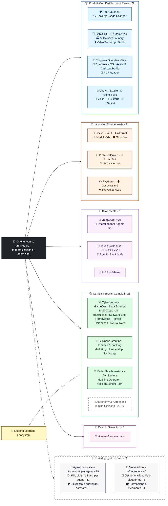

<div align="center">

# 👋 Vladimir Acuña

## **Solution Architect · Senior Full-Stack · Trasformazione Digitale · Gestione e Operazioni**

**Ingegnere in Informatica e Computazione e Amministratore d'Impresa, con oltre 16 anni nella costruzione e gestione di software reale. Collego business, persone, processi e tecnologia per progettare, valutare, consegnare e sostenere soluzioni — con evidenze verificabili su questo GitHub.**

[](https://vladimiracunadev-create.github.io/)
[](https://www.linkedin.com/in/vladimir-acu%C3%B1a-valdebenito-11924a29/)
[](mailto:vladimir.acuna.dev@gmail.com)

[](#-ambito-professionale)
[](docs/ECOSYSTEM.it.md)
[](#-curricula-tecnici-completi)

<!-- STATS:START -->
[](https://github.com/vladimiracunadev-create?tab=repositories)
[](https://github.com/vladimiracunadev-create?tab=repositories)
[](#-ecosistema-in-sintesi)
[](#-curricula-tecnici-completi)
[](https://github.com/vladimiracunadev-create?tab=repositories)
[](docs/ECOSYSTEM.it.md#forks)
[](https://github.com/vladimiracunadev-create?tab=repositories)
[](https://github.com/pulls?q=author%3Avladimiracunadev-create+type%3Apr)
[](https://github.com/issues?q=author%3Avladimiracunadev-create+type%3Aissue)
<!-- STATS:END -->

[](https://github.com/vladimiracunadev-create?tab=repositories)
[](https://github.com/vladimiracunadev-create?tab=followers)

[🌐 Portfolio (22 lingue)](https://vladimiracunadev-create.github.io/) ·
[🧩 Ecosistema](#-ecosistema-in-sintesi) ·
[🛠️ Stack tecnologico](#-stack-tecnologico) ·
[⚡ Valutami in 10 minuti](#-se-hai-10-minuti-per-valutarmi) ·
[✅ Ambito professionale](#-ambito-professionale) ·
[🧭 Gestione senza programmazione](#-gestione-amministrazione-e-opportunità-professionali-senza-programmazione) ·
[📋 Matrice dei ruoli](PROFESIONAL_ROLES.md) ·
[📬 Contatto](#-contatto)

**🌐 Versioni complete:** [Español](README.md) · [English](README.en.md) · [Português](README.pt.md) · [Italiano](README.it.md) · [Français](README.fr.md) · [简体中文](README.zh.md) · [繁體中文](README.zh-TW.md) · [日本語](README.ja.md) · [한국어](README.ko.md) · [Türkçe](README.tr.md) · [Русский](README.ru.md) · [Tiếng Việt](README.vi.md) · [ไทย](README.th.md) · [Deutsch](README.de.md) · [Українська](README.uk.md) · [Polski](README.pl.md) · [العربية](README.ar.md) · [فارسی](README.fa.md) · [Bahasa Indonesia](README.id.md) · [Nederlands](README.nl.md) · [हिन्दी](README.hi.md) · [Ελληνικά](README.el.md)

**Nucleo tecnico:**
PHP 8 · Python · Rust · Go · Node/TS · Java 21 · .NET 8 · Dart/Flutter · WASM
· AWS · Terraform · Kubernetes · Docker · n8n · LangGraph/MCP · CI/CD · FinOps · Osservabilità

**Ponte business–tecnologia:** analisi di processi e requisiti · valutazione di soluzioni · coordinamento della delivery · operazioni e continuità · rischio · prodotto e servizio · formazione tecnica

</div>

---

> [!NOTE]
> Questo profilo non trasforma le possibilità in esperienza. Esperienza comprovata, competenze trasferibili, possibilità di candidatura e obiettivi futuri sono separati esplicitamente.

## 🎯 Cosa Troverai Qui

Non è “un repo”: è un ecosistema con standard comuni.

- 🔁 **Demo riproducibili** — cloni, esegui, validi.
- 🧰 **Tooling standardizzato** — Makefile, Hub CLI, `doctor` e `smoke` per repository.
- 🛡️ **Difesa in profondità** — secret scanning, policy e pratiche proibite dichiarate.
- 📈 **Osservabilità** — `/health`, `/ready`, `/metrics`, dashboard e tracciabilità.
- 📚 **Documentazione per pubblico** — recruiter, principiante, DevOps o sicurezza, secondo il repository.
- 📦 **Distribuzione come prodotto** — release scaricabili, checksum e prove di build; firme commerciali/store dichiarate come in corso quando applicabile.
- 🌍 **Internazionalizzazione** — questo profilo è pubblicato in 22 lingue e il portfolio offre 154 PDF pubblici (7 famiglie × 22 lingue) (ES · EN · PT · IT · FR · ZH · ZH-TW · JA · KO · TR · RU · VI · TH · DE · UK · PL · AR · FA · ID · NL · HI · EL).
- 🧭 **Onestà tecnica** — ogni caso marcato `OPERATIVO`, `DOCUMENTATO/SCAFFOLD` o `PIANIFICATO`.

## ✅ Stato Verificabile

| Superficie | Evidenza concreta |
|---|---|
| 🧪 **Copertura test** | GabySQL **850 test** + fuzz di **503,8 M query** (0 panic) · Empresa Operativa Chile **230 test** · Automa **150 pytest** · CI multi-OS |
| 🤖 **Agenti in produzione** | LangGraph RealWorld **25/25 backend operativi** (casi 01–25, copertura 100 %) · Operational AI Agents **23 agenti** con **69 eval deterministici** |
| 🔗 **Integrazione poliglotta** | **20 casi** emittente→n8n→ricevitore —**19 operativi**, auditati uno a uno con Docker— · **18+ motori DB** · **20+ container** · 11 pattern |
| 📦 **Distribuzione** | **155 release** pubblicate in un ecosistema di **65 repository pubblici propri** · installer e artefatti `.exe` · `.msi` · `.dmg` · `.apk` con checksum e prove di build; firme commerciali/store in corso quando applicabile |
| 🛡️ **Supply chain** | CodeQL · Semgrep · Bandit · Trivy · Grype · Gitleaks · TruffleHog · SBOM CycloneDX · Scorecard |
| 📚 **Curricula** | **14.550 classi** verificabili in 21 programmi, contate da [un workflow](.github/workflows/stats.yml) sulla struttura reale o su una fonte verificabile dichiarata nel repository —non scritte a mano— · ogni programma dichiara il proprio stato editoriale e i propri limiti |
| 🌐 **Portfolio** | PWA installabile · **22 lingue** · **154 PDF** via pipeline · CV Data API · Capacitor Android · Lighthouse 100 |
| 🔒 **Telemetria** | Zero nei prodotti forensi e in Empresa Operativa Chile — verificata in ogni build (senza permesso Android `INTERNET`) |
| 🌐 **Siti pubblicati** | **57 siti** su GitHub Pages —56 landing, una per prodotto, programma o navigatore dell'ecosistema, più il portfolio— tutti distribuiti dal proprio repository · tutti verificati con risposta `200` |

## 🛠️ Stack tecnologico

Tecnologie rilevate nei repository pubblici (manifest, dipendenze, container e codice), raggruppate per area. Comparire in un repository —inclusi laboratori e curricula— è evidenza di utilizzo, non un'affermazione di anni di esperienza in produzione.

**Linguaggi**


<sub>Python · JavaScript · TypeScript · Rust · Go · Java · PHP · C# · Dart · Kotlin · Swift · Ruby · Elixir · Zig · Clojure · C · Solidity · Bash · PowerShell · HTML · CSS · WebAssembly · SQL · Erlang · F# · Crystal · GDScript · HCL</sub>

**Framework, runtime e librerie**


<sub>Node.js · Express · React · Vue · Svelte · Astro · Vite · Vitest · FastAPI · Flask · Django · Spring Boot · ASP.NET / .NET · Laravel · Rails · Flutter · Tauri · Electron · Qt / PySide6 · Capacitor · Godot · PyTorch · scikit-learn · Polars · pandas · NumPy · Optuna · SHAP · Transformers · PEFT / LoRA · Playwright · pytest · Jupyter · Streamlit · Pydantic · Tokio · Axum · SQLx · Serde</sub>

**Database**


<sub>PostgreSQL · MySQL · MariaDB · SQLite · MongoDB · Redis · Neo4j · Cassandra · Elasticsearch · ClickHouse · CockroachDB · InfluxDB · TimescaleDB · DuckDB · SQL Server · Oracle · pgvector · PostgREST · GraphQL · GabySQL (Rust)</sub>

**Cloud, container e DevOps**


<sub>AWS · Terraform · Kubernetes · Docker / Compose · GitHub Actions · Git · GitHub · GitLab · Linux · Nginx · Make · Inno Setup · FinOps · CI/CD</sub>

**Osservabilità e messaggistica**


<sub>Prometheus · Grafana · OpenTelemetry · Kafka · MQTT (Mosquitto) · Elasticsearch / Kibana · cAdvisor · k6</sub>

**IA, agenti, skill e MCP**


<sub>Claude Code · Claude Skills · Codex Skills · Agentic Plugins · MCP · LangGraph · Ollama · n8n · RAG · Whisper · Transformers · PEFT / LoRA · Optuna · SHAP · Polars · PyTorch</sub>

**Sicurezza e supply chain**


**Piattaforme di destinazione**


<sub>Windows · macOS · iOS · Linux · Android · Web / PWA</sub>

## 🗺️ Ecosistema In Sintesi


```mermaid
flowchart LR
    CORE["🧠 Criterio tecnico<br/>architettura · modernizzazione · operazioni"]:::core

    subgraph P["📦 Prodotti Con Distribuzione Reale · 22"]
        direction LR
        P1["🛡️ RootCause ×8<br/>🔍 Universal Code Scanner"]:::prod
        P2["🗄️ GabySQL · 🤖 Automa PC<br/>🏭 AI Dataset Foundry<br/>🎙️ Video Transcript Studio"]:::prod
        P3["🏢 Empresa Operativa Chile<br/>🧭 Commerce OS · ☁️ AWS Desktop Studio<br/>📄 PDF Reader"]:::prod
        P4["🎨 ChofyAI Studio · 🦏 Rhino Suite<br/>🎻 Violin · 🎸 Guitarra · 🧣 Pañuelo"]:::prod
    end
    subgraph L["🧪 Laboratori Di Ingegneria · 11"]
        direction LR
        L1["🐳 Docker · WSL · Unikernel<br/>🧰 QEMU/KVM · 🛡️ Sandbox"]:::lab
        L2["🧪 Problem-Driven · 📆 Social Bot<br/>🧰 Microsistemas"]:::lab
        L3["💳 Payments · 🕹️ Decentraland<br/>☁️ Proyectos AWS"]:::lab
    end
    subgraph I["🤖 IA Applicata · 6"]
        direction LR
        I1["🤖 LangGraph ×25<br/>🧭 Operational AI Agents ×23"]:::ai
        I2["🧰 Claude Skills ×22 · Codex Skills ×19<br/>🧩 Agentic Plugins ×6"]:::ai
        I3["🧠 MCP + Ollama"]:::ai
    end
    subgraph C["📚 Curricula Tecnici Completi · 21"]
        direction LR
        C1["💻 Cybersecurity · GameDev · Data Science<br/>Multi-Cloud · AI · Blockchain · Software Eng.<br/>Frameworks · Polyglot · Databases · Neural Nets"]:::cur
        C2["💼 Business Creation · Finance & Banking<br/>Marketing · Leadership · Pedagogy"]:::cur
        C3["🔬 Math · Psychometrics · Architecture<br/>Machine Operator · Chilean School Path"]:::cur
        C4["🌌 Astronomy & Aerospace<br/>in pianificazione · 2.077"]:::plan
    end
    LL["🧭 Lifelong Learning Ecosystem"]:::core2
    subgraph S["🔬 Calcolo Scientifico · 1"]
        S1["🧬 Human Genome Labs"]:::sci
    end
    subgraph F["🍴 Fork di progetti di terzi · 52"]
        F1["🤖 Agenti di codice e framework per agenti · 18<br/>🧩 Skill, plugin e flussi per agenti · 11<br/>🛡️ Sicurezza e analisi del software · 8"]:::fork
        F2["🧠 Modelli di IA e infrastruttura · 5<br/>🏢 Gestione aziendale e piattaforme · 6<br/>🎓 Formazione e riferimento · 4"]:::fork
    end

    CORE --> P
    CORE --> L
    CORE --> I
    CORE --> C
    CORE --> S
    CORE -.-> F
    LL -.- C

    classDef core fill:#1f2328,stroke:#8b949e,color:#ffffff,stroke-width:2px
    classDef core2 fill:#fff8c5,stroke:#9a6700,color:#4d2d00,stroke-width:2px
    classDef prod fill:#ddf4ff,stroke:#0969da,color:#0a3069
    classDef lab fill:#fff1e5,stroke:#bc4c00,color:#5c2200
    classDef ai fill:#fbefff,stroke:#8250df,color:#3b1d73
    classDef cur fill:#dafbe1,stroke:#1a7f37,color:#0f3d1e
    classDef sci fill:#ffeff7,stroke:#bf3989,color:#5c1541
    classDef fork fill:#f6f8fa,stroke:#6e7781,color:#24292f
    classDef plan fill:#ffffff,stroke:#6e7781,color:#57606a,stroke-dasharray:5 5
    style P fill:none,stroke:#0969da,stroke-width:1.5px
    style L fill:none,stroke:#bc4c00,stroke-width:1.5px
    style I fill:none,stroke:#8250df,stroke-width:1.5px
    style C fill:none,stroke:#1a7f37,stroke-width:1.5px
    style S fill:none,stroke:#bf3989,stroke-width:1.5px
    style F fill:none,stroke:#6e7781,stroke-width:1.5px,stroke-dasharray:5 5
```

## 🗂️ Ecosistema: prodotti, laboratori, IA applicata, curricula e calcolo scientifico

Il lavoro pratico del profilo vive in un documento a parte: software da scaricare e installare, laboratori di ingegneria, IA applicata, curricula tecnici completi e calcolo scientifico, più la descrizione di ogni fork di progetti di terzi presente nell'account.

- 📦 **Prodotti Con Distribuzione Reale** (22)
- 🧪 **Laboratori Di Ingegneria** (11)
- 🤖 **IA Applicata** (6)
- 📚 **Curricula Tecnici Completi** (21)
- 🔬 **Calcolo Scientifico** (1)
- 🍴 **Fork di progetti di terzi** (52)

👉 **[Vedi l'ecosistema completo](docs/ECOSYSTEM.it.md)** · [🍴 Fork di progetti di terzi](docs/ECOSYSTEM.it.md#forks)

## 📚 Curricula Tecnici Completi

Programmi sequenziali in spagnolo, con stato e ambito dichiarati da ogni repository. I 21 programmi sommano **14.550 classi**, contate da [un workflow](.github/workflows/stats.yml) sulla struttura reale o su una fonte verificabile dichiarata nel repository; il badge viene aggiornato ogni settimana e non è scritto a mano.

🌌 **In pianificazione, fuori dal conteggio:** [Astronomia, astrofisica, scienze spaziali e ingegneria aerospaziale](https://github.com/vladimiracunadev-create/astronomy-astrophysics-space-sciences-aerospace-engineering-learning-program) — 2.077 lezioni pianificate in 12 aree e 133 blocchi; 397 con testo redatto e tutte ancora allo stato E0. Formazione indipendente, non abilitazione professionale · [sito](https://vladimiracunadev-create.github.io/astronomy-astrophysics-space-sciences-aerospace-engineering-learning-program/).

👉 **[Vedi i 21 programmi completi](docs/ECOSYSTEM.it.md#curricula)**

## ⚡ Se Hai 10 Minuti Per Valutarmi

L'idea non è solo guardare codice: è vedere **come penso**, come documento e come rendo tutto eseguibile.

**Percorso A — Osservabilità e orchestrazione reale** *(il mio preferito)*

```bash
git clone https://github.com/vladimiracunadev-create/social-bot-scheduler.git
```

Vedrai workflow, metriche, dashboard e guardrail su 20 casi e 18+ motori DB.

**Percorso B — Infrastruttura riproducibile in pochi minuti**

```bash
git clone https://github.com/vladimiracunadev-create/docker-labs.git
```

**Percorso C — Agenti con stato tipizzato**

```bash
git clone https://github.com/vladimiracunadev-create/langgraph-realworld.git
```

**Percorso D — Prodotto forense in Rust, senza clonare**

Scarica installer o binario CLI dalle [release di RootCause](https://github.com/vladimiracunadev-create/rootcause-windows-inspector/releases) e verifica `SHA256SUMS`.

## 🧠 Standard Che Applico In Tutti I Repository

- **DX prima di tutto** — se non si esegue facilmente, non serve come demo né come base di team.
- **Osservabilità dal giorno 1** — metriche e tracciabilità, non aggiunte dopo.
- **Sicurezza come pipeline** — secret scanning, SBOM per release, pratiche proibite dichiarate.
- **Resilienza reale** — idempotenza, circuit breaker e degradazione controllata.
- **Poliglotta per design** — linguaggio e motore scelti dal caso d'uso.
- **Onestà sullo stato** — un repo è stato rinominato (`Multisimulador` → `machine-operator-program`) per non promettere software che non esiste ancora.
- **I badge sono segnali, non evidenza** — ogni repo dichiara anche **cosa NON fa**.
- **Dal modello verso l'esterno** — prima il dominio, poi l'interfaccia come proiezione.
- **Ciò che è esterno viene dichiarato** — i [52 fork](docs/ECOSYSTEM.it.md#forks) di progetti di terzi sono descritti uno per uno e restano fuori da tutti i numeri di opera propria di questo profilo.

## ✅ Ambito Professionale

La mia formazione doppia —**Ingegneria Informatica e della Computazione + Amministrazione d'Impresa**— traduce obiettivi di business in decisioni tecniche e vincoli tecnici in opzioni chiare per operazioni, prodotto, clienti e direzione.

### 🎯 Identità Principale

| Ruolo | Evidenza |
|---|---|
| **Solution Architect** | Design di sistemi modulari, scalabili e con criterio evolutivo |
| **Legacy Modernization Architect** | Evoluzione reale del legacy (PHP 5.x→8.x, refactoring incrementale senza fermare l'operazione) |
| **Senior Full-Stack / Tech Lead** | Architettura, esecuzione e standard in piattaforme reali (+16 anni) |
| **AI Automation Architect** | Sistemi agentic con LangGraph/MCP e flussi n8n con guardrail |

### ↗ Espansione Naturale

**AI Orchestration Engineer** · **Systems / Rust Engineer** · **Mobile Engineer (Flutter)** · **Solutions Engineer** · **Technical Product Builder** · **Technical Trainer** · **Consulente di Trasformazione Digitale** · **Business / Functional Analyst** · **Technical Product Operations**

### ⚙️ Ambito Complementare

Platform Engineer / IDP · DevOps / CI-CD · Cloud / AWS Engineer · Application SRE · Automation Engineer · Consulente tecnico-commerciale

## 🧭 Gestione, Amministrazione e Opportunità Professionali senza Programmazione

Ruoli di gestione, amministrazione e business in cui informatica e amministrazione contribuiscono senza che programmare sia il compito centrale, classificati con onestà (competenza trasferibile, possibilità di candidatura o obiettivo futuro) e con il divario di ciascuno. Aree coperte:

Direzione tecnologica · Progetti · Amministrazione · Strategia · Business analysis · Prodotto e servizio · GRC e continuità · Commerciale · Finanza e controllo · Qualità · Educazione · Logistica · Dati e IA · Settore pubblico

👉 **[Vedi la matrice completa delle opportunità](docs/MANAGEMENT.it.md)**

## 🤖 Flusso Di Sviluppo Assistito Da IA

| Strumento | Uso principale |
|---|---|
| **Claude Code** | Revisione architetturale, implementazione e documentazione tecnica |
| **ChatGPT Plus** | Analisi, architettura e iterazione (dal 2023) |
| **Codex** | Generazione e refactoring di codice |
| **Antigravity** | Accelerazione di flussi di sviluppo e automazione |
| **VS Code / OpenCode** | Ambienti con assistenza IA integrata |

> Combino criterio tecnico proprio, validazione umana e direzione architetturale. L'IA amplifica capacità, velocità e portata — non sostituisce l'esperienza.

## 📌 Disponibilità

**Aperto a:** Senior Full-Stack · Architettura · Modernizzazione legacy · Platform/IDP · SRE · DevOps · Automazione · AI Automation · business/functional analysis · coordinamento progetti IT · Product Operations · trasformazione digitale · presales/solutions · formazione tecnica · qualità · adozione e governance IA

**Valutato in base al perimetro:** Product Owner/Manager tecnico · Service Delivery · IT Operations · GRC/risk · amministrazione/operations · management control · modernizzazione pubblica. I ruoli dirigenziali sono obiettivi futuri, non esperienza dichiarata.

**Modalità:** remoto o ibrido, secondo il progetto.

## 📬 Contatto

[](https://vladimiracunadev-create.github.io/)
[](https://www.linkedin.com/in/vladimir-acu%C3%B1a-valdebenito-11924a29/)
[](https://gitlab.com/vladimir.acuna.dev-group/vladimir.acuna.dev-group)
[](mailto:vladimir.acuna.dev@gmail.com)

---

<div align="center">

[🤝 Contribuire](CONTRIBUTING.it.md) ·
[🛡️ Sicurezza](SECURITY.it.md) ·
[⚖️ Codice di condotta](CODE_OF_CONDUCT.it.md)

<sub>README sincronizzato con lo stato verificabile dei repository pubblici —cifre e cambiamenti letti via API— · ultima verifica: <!-- VERIFIED:START -->2026-11-09<!-- VERIFIED:END -->.</sub>

</div>
