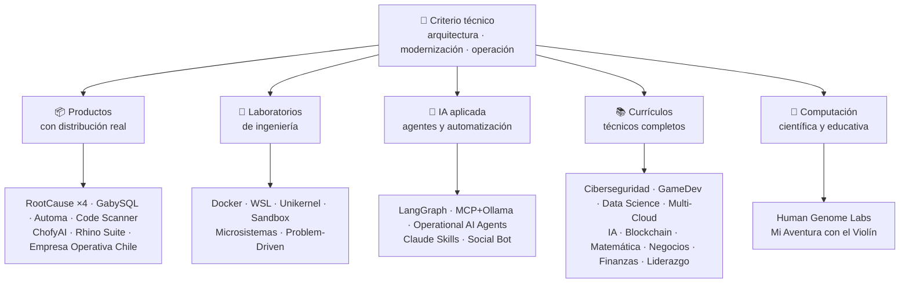

<div align="center">

# 👋 Vladimir Acuña

## **Arquitecto de Soluciones · Legacy Modernization · Senior Full-Stack · AI Automation**

**+16 años construyendo y operando software en entornos reales. Diseño, construyo y opero sistemas de producción con foco en confiabilidad, rendimiento, entrega continua y criterio técnico propio — todo verificable en este GitHub.**

[](https://vladimiracunadev-create.github.io/)
[](https://www.linkedin.com/in/vladimir-acu%C3%B1a-valdebenito-11924a29/)
[](mailto:vladimir.acuna.dev@gmail.com)

[](#-alcance-profesional)
[](#-productos-con-distribución-real)
[](#-currículos-técnicos-completos)

<!-- STATS:START -->
[](https://github.com/vladimiracunadev-create?tab=repositories)
[](https://github.com/vladimiracunadev-create?tab=repositories)
[](#-el-ecosistema-de-un-vistazo)
[](#-currículos-técnicos-completos)
<!-- STATS:END -->

[🌐 Portafolio (6 idiomas)](https://vladimiracunadev-create.github.io/) ·
[🧩 Ecosistema](#-el-ecosistema-de-un-vistazo) ·
[⚡ Evalúame en 10 minutos](#-si-tienes-10-minutos-para-evaluarme) ·
[✅ Alcance profesional](#-alcance-profesional) ·
[📬 Contacto](#-contacto)

**Núcleo técnico:**
PHP 8 · Python · Rust · Go · Node/TS · Java 21 · .NET 8 · Dart/Flutter · WASM
· AWS · Terraform · Kubernetes · Docker · n8n · LangGraph/MCP · CI/CD · FinOps · Observabilidad

</div>

---

> [!NOTE]
> Este perfil no es una lista de aspiraciones. Cada afirmación de abajo tiene un repositorio que la respalda, ejecutable y con evidencia. Donde algo **no** está terminado, se declara como tal.

## 🎯 Qué encontrarás aquí

No es «un repo»: es un ecosistema con estándares comunes.

- 🔁 **Demos reproducibles** — clonas, ejecutas, validas.
- 🧰 **Tooling estandarizado** — Makefiles, Hub CLI, `doctor` y `smoke` por repo.
- 🛡️ **Defensa en profundidad** — secret scanning, políticas, prácticas prohibidas explícitas.
- 📈 **Observabilidad** — `/health`, `/ready`, `/metrics`, dashboards y trazabilidad.
- 📚 **Documentación por audiencia** — reclutador, novato, DevOps o seguridad, según el repo.
- 📦 **Distribución como producto** — instaladores firmados, no `docker compose up` y suerte.
- 🌍 **Internacionalización** — portafolio en 6 idiomas (ES · EN · PT · IT · FR · ZH).
- 🧭 **Honestidad técnica** — cada caso etiquetado `OPERATIVO`, `DOCUMENTADO/SCAFFOLD` o `PLANIFICADO`.

## ✅ Estado verificable

| Superficie | Evidencia concreta |
|---|---|
| 🧪 **Cobertura de pruebas** | GabySQL **828 tests** + fuzz de **503,8 M queries** (0 panics) · Empresa Operativa Chile **153 pruebas** · Automa **150 pytest** · CI multi-OS |
| 🤖 **Agentes en producción** | LangGraph RealWorld **25/25 backends operativos** (casos 01–25, cobertura 100 %) · Operational AI Agents **13 agentes** con **39 evals deterministas** |
| 🔗 **Integración políglota** | **19 casos** emisor→n8n→receptor · **18+ motores de BD** · **20+ contenedores** · 11 patrones |
| 📦 **Distribución** | **115 releases** publicadas en **39 repos públicos** · instaladores `.exe` · `.msi` · `.dmg` · `.apk` firmados y automatizados, con `SHA256SUMS` por release |
| 🛡️ **Cadena de suministro** | CodeQL · Semgrep · Bandit · Trivy · Grype · Gitleaks · TruffleHog · SBOM CycloneDX · Scorecard |
| 📚 **Currículos** | **1.931 clases** numeradas en 7 programas —contadas sobre las carpetas del repositorio, no declaradas— más seis programas que declaran las suyas con otra estructura · cada clase con laboratorio y reto con criterio de aceptación |
| 🌐 **Portafolio** | PWA instalable · **6 idiomas** · **30+ PDFs** por pipeline · CV Data API · Capacitor Android · Lighthouse 100 |
| 🔒 **Telemetría** | Cero en los productos forenses y en Empresa Operativa Chile — verificada en cada build (sin permiso `INTERNET` en Android) |
| 🌐 **Sitios publicados** | **28 landings** en GitHub Pages, una por producto o programa, desplegadas desde su propio repositorio · todas comprobadas con respuesta `200` |

## 🗺️ El ecosistema de un vistazo



## 📦 Productos con distribución real

Software que se descarga, se instala y se usa — no solo se clona.

| Producto | Qué es | Stack | Entrega |
|---|---|---|---|
| [🔍 **RootCause Windows**](https://github.com/vladimiracunadev-create/rootcause-windows-inspector) | Forense de ciberseguridad: toda distorsión anómala de recursos puede ser el primer indicio de una amenaza. Diagnóstico primero, intervención después | Rust 🦀 · ETW/WPR | **v0.19.0** · **16 releases** · **5 ediciones**: GUI · Portable · CLI · PowerShell · VS Code · [landing](https://vladimiracunadev-create.github.io/rootcause-windows-inspector/) |
| [📱 **RootCause Mobile**](https://github.com/vladimiracunadev-create/rootcause-mobile-inspector) | El hermano móvil: sensor forense que compara cada app consigo misma, señala stalkerware y distingue permisos concedidos de solo pedidos | Flutter · Kotlin · Swift | **v0.8.0** · APK firmado · 5 idiomas · **telemetría cero** · [landing](https://vladimiracunadev-create.github.io/rootcause-mobile-inspector/) |
| [🍎 **RootCause macOS**](https://github.com/vladimiracunadev-create/rootcause-macos-inspector) | La cuarta edición: persistencia `launchd`, Gatekeeper, SIP, FileVault, XProtect, permisos TCC, procesos firmados y vecinos de red — cada superficie contra un estado bueno conocido | Rust 🦀 · macOS 13+ | **v0.1.0** · primera release publicada · Apache-2.0 · [landing](https://vladimiracunadev-create.github.io/rootcause-macos-inspector/) |
| [🌐 **RootCause Web**](https://github.com/vladimiracunadev-create/rootcause-web-inspector) | Sensor de la superficie del navegador — cookies, sesiones de correo, extensiones, descargas y permisos de sitio | JavaScript · extensión MV3 | v0.1.0, **aún sin release publicada** · panel en `127.0.0.1` · cero dependencias · telemetría cero verificada en CI · [landing](https://vladimiracunadev-create.github.io/rootcause-web-inspector/) |
| [🏢 **Empresa Operativa Chile**](https://github.com/vladimiracunadev-create/empresa-operativa-chile) | Acompaña a una SpA desde antes de existir hasta el cierre de cada mes: constitución con evidencia, IVA con remanente arrastrado, borrador de F29, cierre inmutable y bitácora de auditoría. Cada regla con su fuente oficial | JavaScript · Rust · PWA | **v1.4.0** · Android · Windows · navegador · **153 pruebas** · **0 dependencias de producción** · telemetría cero · [landing](https://vladimiracunadev-create.github.io/empresa-operativa-chile/) |
| [🔍 **Universal Code Scanner**](https://github.com/vladimiracunadev-create/universal-code-scanner) | Lector de QR y códigos de barras que **interpreta antes de actuar**: 16 señales de riesgo locales por URL y confirmación explícita | Flutter · Dart | **v1.1.0** · Android · iOS · macOS · PWA · historial cifrado **AES-256-GCM** · [landing](https://vladimiracunadev-create.github.io/universal-code-scanner/) |
| [🗄️ **GabySQL**](https://github.com/vladimiracunadev-create/gabysql) | Base de datos embebida: archivo único `.db`, WAL, optimizador por costos, API HTTP/JSON | Rust 🦀 | Windows · macOS · Linux · [landing](https://vladimiracunadev-create.github.io/gabysql/) |
| [🤖 **Automa PC**](https://github.com/vladimiracunadev-create/automa-pc) | Orquestador local: flows JSON que abren ventanas reales, interactúan con DOM y dejan evidencia | Python · Playwright · pywebview | **v0.3.0** · **27 flows** · instalador firmado · [landing](https://vladimiracunadev-create.github.io/automa-pc/) |
| [🎨 **ChofyAI Studio**](https://github.com/vladimiracunadev-create/chofyai-studio) | Launcher de IA creativa local: orquesta Qwen3-TTS, whisper.cpp, FaceFusion, AceForge y ComfyUI | Tauri 2 · Rust · React | v0.5.1 · **5/5 herramientas con inferencia real** · macOS Apple Silicon · Windows experimental · **aún sin release publicada** · [sitio](https://vladimiracunadev-create.github.io/chofyai-studio/) |
| [🦏 **Rhino Suite**](https://github.com/vladimiracunadev-create/rhino-suite) | Suite ofimática desde cero: las reglas del documento no dependen del DOM — el HTML es solo una proyección | Rust/WASM · Go · React 19 | Monorepo evolutivo por fases · [landing](https://vladimiracunadev-create.github.io/rhino-suite/) |
| [🎻 **Mi Aventura con el Violín**](https://github.com/vladimiracunadev-create/violin-adventure) | App educativa infantil: afinador cromático, metrónomo exacto sobre el reloj de audio, canciones con violín real | Tauri 2 · React · TS | **v1.3.0** · Windows · Android · Linux · macOS · PWA · [landing](https://vladimiracunadev-create.github.io/violin-adventure/) |

## 🧪 Laboratorios de ingeniería

| Repo | Qué demuestra |
|---|---|
| [🐳 **Problem-Driven Systems Lab**](https://github.com/vladimiracunadev-create/problem-driven-systems-lab) | **12 problemas reales** (latencia bajo carga, N+1, retry storms, fugas, monolito) con fallos de alta fidelidad inyectados, resueltos en **7 stacks**: PHP 8 · Python · Node.js · Java 21 · .NET 8 · **Go** · **Rust** |
| [📆 **Social Bot Scheduler**](https://github.com/vladimiracunadev-create/social-bot-scheduler) | **19 casos** origen→n8n→receptor sobre **18+ motores de BD**, auditoría de **8 capas**, guardrails de idempotencia, circuit breaker y DLQ |
| [🧰 **Microsistemas**](https://github.com/vladimiracunadev-create/microsistemas) | **12 microapps** de diagnóstico y modernización PHP · servidor MCP local de solo lectura · hardening en 3 fases · [landing](https://vladimiracunadev-create.github.io/microsistemas/) |
| [🧪 **Docker Labs**](https://github.com/vladimiracunadev-create/docker-labs) | **13 labs** en plataforma de 4 servicios + instalador `.exe` automatizado con launcher |
| [🐳 **WSL Labs**](https://github.com/vladimiracunadev-create/wsl-labs) | **12 casos** sobre `wslc`, el motor de contenedores nativo de WSL — **sin Docker Desktop** |
| [⚡ **Unikernel Labs**](https://github.com/vladimiracunadev-create/unikernel-labs) | «Docker Desktop para unikernels»: control Windows sobre Unikraft con backend WSL2, `kraft` + QEMU/KVM · [landing](https://vladimiracunadev-create.github.io/unikernel-labs/) |
| [🛡️ **Sandbox Labs**](https://github.com/vladimiracunadev-create/sandbox-labs) | Aislamiento en Linux: ejecuta código, archivos y modelos de negocio ajenos bajo políticas declaradas y **emite evidencia firmada de qué controles se aplicaron de verdad** · **36 casos** en dos familias · declarado experimental y educativo, *no un producto de seguridad* · [landing](https://vladimiracunadev-create.github.io/sandbox-labs/) |
| [☁️ **Proyectos AWS**](https://github.com/vladimiracunadev-create/proyectos-aws) | Casos progresivos donde cada uno añade un servicio AWS **y** una capacidad de GitHub Actions nueva · cobertura SAA-C03 · DVA-C02 · SOA-C02 |

## 🤖 IA aplicada

| Repo | Qué demuestra |
|---|---|
| [🤖 **LangGraph RealWorld**](https://github.com/vladimiracunadev-create/langgraph-realworld) | **25/25 backends operativos** — estado tipado, rutas condicionales, streaming NDJSON, modo DEMO/LIVE, 8 capas de seguridad, cadena de custodia SHA-256 |
| [🧭 **Operational AI Agents**](https://github.com/vladimiracunadev-create/operational-ai-agents) | **13 agentes operativos** para Claude Code y runtimes compatibles: cada uno recibe una misión completa —evolución de repositorios, modernización de legacy, diseño curricular, publicación de portafolio, remediación de seguridad, análisis de incidentes— bajo **contrato declarado, gates humanos y evidencia verificable** · **39 evals deterministas** · 34 tests · zero-deps (solo stdlib) · Linux · macOS · Windows · [sitio](https://vladimiracunadev-create.github.io/operational-ai-agents/) |
| [🧠 **MCP + Ollama Local**](https://github.com/vladimiracunadev-create/mcp-ollama-local) | IA local-first con tools MCP en sandbox · bind `127.0.0.1` · trust profile multi-capa · honesto sobre sus límites |
| [🧰 **Claude Skills Toolkit**](https://github.com/vladimiracunadev-create/claude-skills-toolkit) | **14 skills agentic** para Claude Code · **seguridad**: `security-audit` de 12 capas (OSV · KEV · EPSS · SAST · contenedor · secretos) · **gates de repositorio**: `pre-commit-guard`, `pre-push-guard`, `yaml-control`, `md-lint-fix`, `python-lint-guard` · **coherencia**: `repo-coherence-audit`, `version-bump`, `python-version-control`, `python-deps-pinning` · **Docker**: `docker-cleanup`, `docker-compose-doctor` · **documentación**: `md-to-doc`, `web-snap` · zero-deps · multiplataforma |

## 📚 Currículos técnicos completos

Programas secuenciales en español, cada clase con laboratorio guiado y **reto con criterio de aceptación**. Siete de ellos —los que numeran cada clase en su propia carpeta— suman **1.931 clases**, contadas sobre el repositorio real por [un workflow](.github/workflows/stats.yml) que refresca la insignia cada semana, no escritas a mano. Los demás organizan el temario con otra estructura y declaran sus propias cifras, marcadas abajo con *(declarado)*.

| Programa | Clases | Alcance |
|---|---:|---|
| [🔢 **Matemática computacional**](https://github.com/vladimiracunadev-create/computational-mathematics-program) | 360 | De contar con los dedos a reproducir un paper · **360 demostraciones deterministas verificadas en CI** · 1.080 notebooks · glosario de 489 términos · [sitio](https://vladimiracunadev-create.github.io/computational-mathematics-program/) |
| [🏦 **Finanzas y Banca**](https://github.com/vladimiracunadev-create/finance-and-banking-evolution-program) | 356 *(declarado)* | 534 h · matemática financiera y NIIF → crédito, riesgos, Basilea III, finanzas abiertas, DLT, stablecoins y MiCA · 26 casos con **fuentes oficiales verificables en cada clase** · [sitio](https://vladimiracunadev-create.github.io/finance-and-banking-evolution-program/) |
| [🎮 **GameDev**](https://github.com/vladimiracunadev-create/modern-gamedev-program) | 352 | Matemáticas y C#/C++/GDScript → shaders, IA, multijugador, VR/AR · Godot · Unity · Unreal · **10 labs Godot verificados en CI** (301 comprobaciones) · [sitio](https://vladimiracunadev-create.github.io/modern-gamedev-program/) |
| [🛡️ **Ciberseguridad**](https://github.com/vladimiracunadev-create/modern-cybersecurity-program) | 340 | Fundamentos → Red Team, DFIR, cloud security, exploit dev · mapeo a **7 certificaciones** · [sitio](https://vladimiracunadev-create.github.io/modern-cybersecurity-program/) |
| [🏢 **Creación de empresas**](https://github.com/vladimiracunadev-create/modern-business-creation-program) | 336 *(declarado)* | Crear y operar una empresa real en Chile: de la idea a la constitución, el SII, la operación, la crisis y la salida · 360 diagramas · glosario de 1.251 términos · manual de 1.548 páginas · [sitio](https://vladimiracunadev-create.github.io/modern-business-creation-program/) |
| [☁️ **Multi-Cloud**](https://github.com/vladimiracunadev-create/multi-cloud-engineering-program) | 288 | AWS · Azure · GCP · Kubernetes · Terraform · SRE · FinOps · manual PDF de 1.220 páginas · [sitio](https://vladimiracunadev-create.github.io/multi-cloud-engineering-program/) |
| [🎖️ **Liderazgo ejecutivo**](https://github.com/vladimiracunadev-create/executive-leadership-founder-program) | 288 *(declarado)* | De asumir tu primer resultado a dirigir una empresa y fundar la propia: equipos, KPI/OKR, finanzas, producto, riesgo, directorio y M&A · 24 casos, 96 labs y 39 plantillas · [sitio](https://vladimiracunadev-create.github.io/executive-leadership-founder-program/) |
| [🐍 **Python Data Science**](https://github.com/vladimiracunadev-create/python-data-science-program) | 232 | Polars, ML+Optuna/SHAP, PyTorch/LLMs/LoRA, MLOps · app Windows nativa + APK Android · [sitio](https://vladimiracunadev-create.github.io/python-data-science-program/) |
| [🧠 **Evolución de la IA**](https://github.com/vladimiracunadev-create/artificial-intelligence-evolution-program) | 183 | Simbólica → probabilística → deep learning → LLMs, RAG, agentes, robótica, MLOps · **609 notebooks** · eje de **52 papers fundacionales** enlazados desde 86 clases · apps de Windows y Android · [sitio](https://vladimiracunadev-create.github.io/artificial-intelligence-evolution-program/) |
| [🌐 **Programación comparada**](https://github.com/vladimiracunadev-create/polyglot-programming-labs) | 176 | Un concepto, **10 lenguajes** verificados en CI — **1.360 implementaciones** — más **1.632 programas** en los lenguajes que siguen vivos (COBOL, Fortran, Ada, RPG, MUMPS…) y atlas de ~40 familias · [sitio](https://vladimiracunadev-create.github.io/polyglot-programming-labs/) |
| [⛓️ **Blockchain**](https://github.com/vladimiracunadev-create/blockchain-learning-path) | 28 módulos | De cero a la infraestructura financiera programable · **70 prácticas · 186 pruebas** · apps offline · [sitio](https://vladimiracunadev-create.github.io/blockchain-learning-path/) |
| [🧠 **Neural Network Labs**](https://github.com/vladimiracunadev-create/neural-network-training-labs) | 31 rutas · 93 notebooks | 25 labs + 6 especializaciones · ciclo completo: sellado de test, champion/challenger, ONNX/INT8, DDP/FSDP2, SBOM · [sitio](https://vladimiracunadev-create.github.io/neural-network-training-labs/) |
| [🕹️ **Machine Operator**](https://github.com/vladimiracunadev-create/machine-operator-program) | — | Base documental de simulación · *sin simulador ejecutable todavía, y así se declara* |

## 🔬 Computación científica

| Repo | Qué demuestra |
|---|---|
| [🧬 **Human Genome Labs**](https://github.com/vladimiracunadev-create/human-genome-labs) | Plataforma reproducible de genómica: contratos tipados `ScientificResult<T>`, FASTA/GFF3/VCF, módulos con **madurez y evidencia explícitas**. Honestidad radical: *no realiza diagnóstico clínico* · [sitio](https://vladimiracunadev-create.github.io/human-genome-labs/) |

## ⚡ Si tienes 10 minutos para evaluarme

La idea no es mirar código: es ver **cómo pienso**, cómo documento y cómo hago que todo sea ejecutable.

**Ruta A — Observabilidad y orquestación real** *(mi favorita)*

```bash
git clone https://github.com/vladimiracunadev-create/social-bot-scheduler.git
```

Verás workflows, métricas, dashboards y guardrails sobre 19 casos y 18+ motores de BD.

**Ruta B — Infraestructura reproducible en minutos**

```bash
git clone https://github.com/vladimiracunadev-create/docker-labs.git
```

**Ruta C — Agentes con estado tipado**

```bash
git clone https://github.com/vladimiracunadev-create/langgraph-realworld.git
```

**Ruta D — Producto forense en Rust, sin clonar**

Descarga el instalador o el binario CLI desde [las releases de RootCause](https://github.com/vladimiracunadev-create/rootcause-windows-inspector/releases) y verifica `SHA256SUMS`.

## 🧠 Estándares que aplico en todos los repos

- **DX primero** — si no se ejecuta fácil, no sirve ni como demo ni como base de equipo.
- **Observabilidad desde el día 1** — métricas y trazabilidad, no como añadido posterior.
- **Seguridad como pipeline** — secret scanning, SBOM por release, prácticas prohibidas declaradas.
- **Resiliencia real** — idempotencia, circuit breaker y degradación controlada.
- **Políglota por diseño** — lenguaje y motor elegidos por caso de uso, nunca por moda.
- **Honestidad sobre el estado** — un repo se renombró (`Multisimulador` → `machine-operator-program`) para no prometer software que aún no existe.
- **Los badges son señales, no evidencia** — cada repo declara también **lo que NO hace**.
- **Del modelo hacia afuera** — el dominio se diseña primero; la interfaz es una proyección.

## ✅ Alcance profesional

### 🎯 Identidad principal

| Rol | Respaldo |
|---|---|
| **Arquitecto de Soluciones** | Diseño de sistemas modulares, escalables y con criterio evolutivo |
| **Legacy Modernization Architect** | Evolución real de legado (PHP 5.x→8.x, refactor incremental sin cortar operación) |
| **Senior Full-Stack / Tech Lead** | Arquitectura, ejecución y estándares en plataformas reales (+16 años) |
| **AI Automation Architect** | Sistemas agénticos con LangGraph/MCP y flujos n8n con guardrails |

### ↗ Expansión natural

**AI Orchestration Engineer** · **Systems / Rust Engineer** · **Mobile Engineer (Flutter)** · **Solutions Engineer** · **Technical Product Builder** · **Technical Trainer** · **Consultor de Transformación Digital** · **Product Operations Técnico**

### ⚙️ Alcance complementario

Platform Engineer / IDP · DevOps / CI-CD · Cloud / AWS Engineer · SRE de aplicaciones · Automation Engineer · Consultor técnico-comercial

## 🤖 Flujo de desarrollo asistido por IA

| Herramienta | Uso principal |
|---|---|
| **Claude Code** | Revisión arquitectónica, implementación y documentación técnica |
| **ChatGPT Plus** | Análisis, arquitectura e iteración (desde 2023) |
| **Codex** | Generación y refactorización de código |
| **Antigravity** | Aceleración de flujos de desarrollo y automatización |
| **VS Code / OpenCode** | Entornos con asistencia IA integrada |

> Combino criterio técnico propio, validación humana y dirección arquitectónica. La IA amplifica capacidad, velocidad y alcance — no reemplaza experiencia.

## 📌 Disponibilidad

**Abierto a:** Senior Full-Stack · Arquitectura · Modernización de legado · Platform/IDP · SRE de aplicaciones · DevOps pragmático · Automatización · AI Automation

**Modalidad:** remoto o híbrido, según proyecto.

## 📬 Contacto

[](https://vladimiracunadev-create.github.io/)
[](https://www.linkedin.com/in/vladimir-acu%C3%B1a-valdebenito-11924a29/)
[](https://gitlab.com/vladimir.acuna.dev-group/vladimir.acuna.dev-group)
[](mailto:vladimir.acuna.dev@gmail.com)

---

<div align="center">

[🤝 Contribuir](CONTRIBUTING.md) ·
[🛡️ Seguridad](SECURITY.md) ·
[⚖️ Código de conducta](CODE_OF_CONDUCT.md)

<sub>README sincronizado con el estado real verificado de cada repositorio público · última verificación: 17 de agosto de 2026.</sub>

</div>
