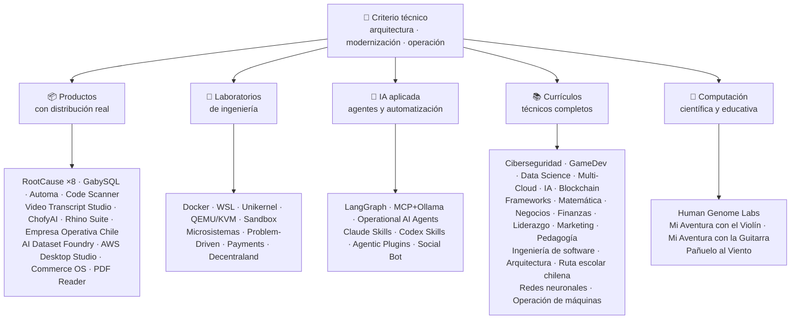

<div align="center">

# 👋 Vladimir Acuña

## **Arquitecto de Soluciones · Senior Full-Stack · Transformación Digital · Gestión y Operaciones**

**Ingeniero en Informática y Computación y Administrador de Empresas, con +16 años construyendo y operando software en entornos reales. Conecto negocios, personas, procesos y tecnología para diseñar, evaluar, entregar y sostener soluciones con criterio técnico y visión operacional — con evidencia verificable en este GitHub.**

[](https://vladimiracunadev-create.github.io/)
[](https://www.linkedin.com/in/vladimir-acu%C3%B1a-valdebenito-11924a29/)
[](mailto:vladimir.acuna.dev@gmail.com)

[](#-alcance-profesional)
[](#-productos-con-distribución-real)
[](#-currículos-técnicos-completos)

<!-- STATS:START -->
[](https://github.com/vladimiracunadev-create?tab=repositories)
[](https://github.com/vladimiracunadev-create?tab=repositories)
[](#-el-ecosistema-de-un-vistazo)
[](#-currículos-técnicos-completos)
[](https://github.com/vladimiracunadev-create?tab=repositories)
<!-- STATS:END -->

[](https://github.com/vladimiracunadev-create?tab=repositories)
[](https://github.com/vladimiracunadev-create?tab=followers)

[🌐 Portafolio (6 idiomas)](https://vladimiracunadev-create.github.io/) ·
[🧩 Ecosistema](#-el-ecosistema-de-un-vistazo) ·
[⚡ Evalúame en 10 minutos](#-si-tienes-10-minutos-para-evaluarme) ·
[✅ Alcance profesional](#-alcance-profesional) ·
[🧭 Gestión sin programación](#-gestión-administración-y-oportunidades-profesionales-sin-programación) ·
[📋 Matriz de cargos](PROFESIONAL_ROLES.md) ·
[📬 Contacto](#-contacto)

**Idiomas:** [ES](README.md) · [EN](README.en.md) · [PT](README.pt.md) · [IT](README.it.md) · [FR](README.fr.md) · [ZH](README.zh.md)

**Núcleo técnico:**
PHP 8 · Python · Rust · Go · Node/TS · Java 21 · .NET 8 · Dart/Flutter · WASM
· AWS · Terraform · Kubernetes · Docker · n8n · LangGraph/MCP · CI/CD · FinOps · Observabilidad

**Puente negocio–tecnología:**
análisis de procesos y requerimientos · evaluación de soluciones · coordinación de entrega · operación y continuidad · gestión de riesgos · producto y servicio · formación técnica

</div>

---

> [!NOTE]
> Este perfil no convierte posibilidades en experiencia. La trayectoria técnica acreditada, las competencias transferibles, las posibilidades de postulación y los objetivos futuros se distinguen de forma explícita. Cada evidencia de GitHub enlazada es ejecutable o documental; donde algo **no** está terminado, se declara como tal.

## 🎯 Qué encontrarás aquí

No es «un repo»: es un ecosistema con estándares comunes.

- 🔁 **Demos reproducibles** — clonas, ejecutas, validas.
- 🧰 **Tooling estandarizado** — Makefiles, Hub CLI, `doctor` y `smoke` por repo.
- 🛡️ **Defensa en profundidad** — secret scanning, políticas, prácticas prohibidas explícitas.
- 📈 **Observabilidad** — `/health`, `/ready`, `/metrics`, dashboards y trazabilidad.
- 📚 **Documentación por audiencia** — reclutador, novato, DevOps o seguridad, según el repo.
- 📦 **Distribución como producto** — releases descargables, checksums y evidencia de build; firmas comerciales/en tiendas declaradas como pendientes cuando aplica.
- 🌍 **Internacionalización** — portafolio en 6 idiomas (ES · EN · PT · IT · FR · ZH).
- 🧭 **Honestidad técnica** — cada caso etiquetado `OPERATIVO`, `DOCUMENTADO/SCAFFOLD` o `PLANIFICADO`.

## ✅ Estado verificable

| Superficie | Evidencia concreta |
|---|---|
| 🧪 **Cobertura de pruebas** | GabySQL **828 tests** + fuzz de **503,8 M queries** (0 panics) · Empresa Operativa Chile **158 pruebas** · Automa **150 pytest** · CI multi-OS |
| 🤖 **Agentes en producción** | LangGraph RealWorld **25/25 backends operativos** (casos 01–25, cobertura 100 %) · Operational AI Agents **13 agentes** con **39 evals deterministas** |
| 🔗 **Integración políglota** | **20 casos** emisor→n8n→receptor —**19 operativos**, auditados uno a uno con Docker— · **18+ motores de BD** · **20+ contenedores** · 11 patrones |
| 📦 **Distribución** | **148 releases** publicadas en un ecosistema de **64 repositorios públicos propios** · instaladores y artefactos `.exe` · `.msi` · `.dmg` · `.apk` con checksums y evidencia de build; firmas comerciales/en tiendas en trámite cuando aplica |
| 🛡️ **Cadena de suministro** | CodeQL · Semgrep · Bandit · Trivy · Grype · Gitleaks · TruffleHog · SBOM CycloneDX · Scorecard |
| 📚 **Currículos** | **14.500 clases** verificables en 21 programas, contadas por [un workflow](.github/workflows/stats.yml) sobre estructura real o fuente verificable declarada en el repositorio —no escritas a mano— · cada programa declara su estado editorial y sus límites |
| 🌐 **Portafolio** | PWA instalable · **6 idiomas** · **36 PDFs** por pipeline · CV Data API · Capacitor Android · Lighthouse 100 |
| 🔒 **Telemetría** | Cero en los productos forenses y en Empresa Operativa Chile — verificada en cada build (sin permiso `INTERNET` en Android) |
| 🌐 **Sitios publicados** | **56 sitios** en GitHub Pages —55 landings, una por producto, programa o navegador del ecosistema, más el portafolio— cada uno desplegado desde su propio repositorio · los 56 comprobados con respuesta `200` |

## 🗺️ El ecosistema de un vistazo


```mermaid
flowchart TD
    A["🧠 Criterio técnico<br/>arquitectura · modernización · operación"] --> B["📦 Productos<br/>con distribución real"]
    A --> C["🧪 Laboratorios<br/>de ingeniería"]
    A --> D["🤖 IA aplicada<br/>agentes y automatización"]
    A --> E["📚 Currículos<br/>técnicos completos"]
    A --> F["🔬 Computación<br/>científica y educativa"]

    B --> B1["RootCause ×8 · GabySQL · Automa · Code Scanner<br/>Video Transcript Studio · ChofyAI · Rhino Suite · Empresa Operativa Chile<br/>AI Dataset Foundry · AWS Desktop Studio · Commerce OS · PDF Reader"]
    C --> C1["Docker · WSL · Unikernel · QEMU/KVM · Sandbox<br/>Microsistemas · Problem-Driven · Payments · Decentraland"]
    D --> D1["LangGraph · MCP+Ollama · Operational AI Agents<br/>Claude Skills · Codex Skills · Agentic Plugins · Social Bot"]
    E --> E1["Ciberseguridad · GameDev · Data Science · Multi-Cloud · IA · Blockchain<br/>Frameworks · Matemática · Negocios · Finanzas · Liderazgo · Marketing · Pedagogía<br/>Ingeniería de software · Arquitectura · Ruta escolar chilena<br/>Redes neuronales · Operación de máquinas"]
    F --> F1["Human Genome Labs<br/>Mi Aventura con el Violín · Mi Aventura con la Guitarra<br/>Pañuelo al Viento"]
```

## 📦 Productos con distribución real

Software que se descarga, se instala y se usa — no solo se clona.

| Producto | Qué es | Stack | Entrega |
|---|---|---|---|
| [🔍 **RootCause Windows**](https://github.com/vladimiracunadev-create/rootcause-windows-inspector) | Forense de ciberseguridad: toda distorsión anómala de recursos puede ser el primer indicio de una amenaza. Diagnóstico primero, intervención después | Rust 🦀 · ETW/WPR | **v0.19.0** · **16 releases** · **5 ediciones**: GUI · Portable · CLI · PowerShell · VS Code · [landing](https://vladimiracunadev-create.github.io/rootcause-windows-inspector/) |
| [📱 **RootCause Mobile**](https://github.com/vladimiracunadev-create/rootcause-mobile-inspector) | El hermano móvil: sensor forense que compara cada app consigo misma, señala stalkerware y distingue permisos concedidos de solo pedidos | Flutter · Kotlin · Swift | **v0.8.0** · APK Android verificable · 5 idiomas · **telemetría cero** · [landing](https://vladimiracunadev-create.github.io/rootcause-mobile-inspector/) |
| [🍎 **RootCause macOS**](https://github.com/vladimiracunadev-create/rootcause-macos-inspector) | Edición macOS: persistencia `launchd`, Gatekeeper, SIP, FileVault, XProtect, permisos TCC, procesos firmados y vecinos de red — cada superficie contra un estado bueno conocido | Rust 🦀 · macOS 13+ | **v0.1.0** · primera release publicada · Apache-2.0 · [landing](https://vladimiracunadev-create.github.io/rootcause-macos-inspector/) |
| [🖥️ **RootCause Server**](https://github.com/vladimiracunadev-create/rootcause-server) | El hermano de servidor: correlaciona lo que ningún registro ve junto —superficie expuesta, ráfaga de intentos de acceso, sesión concedida a esa misma dirección, integridad de archivos críticos y silencio del sensor— y lo dice en una frase accionable | Rust 🦀 · Windows · Linux · macOS | **v0.2.0** · **18 reglas** con evidencia y runbook · nunca ejecuta nada por su cuenta · consola local sin dependencias web · **aún sin release publicada** · [landing](https://vladimiracunadev-create.github.io/rootcause-server/) |
| [🌐 **RootCause Web**](https://github.com/vladimiracunadev-create/rootcause-web-inspector) | Sensor forense del navegador: cookies, sesiones de correo, extensiones, descargas, permisos y páginas que simulan una ventana real | JavaScript · extensión MV3 | **v0.2.0** · aún sin release publicada · panel en `127.0.0.1` · cero dependencias · telemetría cero verificada en CI · [landing](https://vladimiracunadev-create.github.io/rootcause-web-inspector/) |
| [₿ **RootCause Bitcoin Defense**](https://github.com/vladimiracunadev-create/rootcause-bitcoin-defense) | Defensa watch-only para custodia Bitcoin: inventaría la procedencia de cada clave, la cruza con avisos publicados y explica la causa raíz con evidencia | JavaScript · app Windows · panel local | **v0.3.0** · **2 releases** · cero dependencias · nunca pide semillas · verificado en CI · [landing](https://vladimiracunadev-create.github.io/rootcause-bitcoin-defense/) |
| [⛓️ **RootCause Blockchain Security**](https://github.com/vladimiracunadev-create/rootcause-blockchain-security) | Consola watch-only multi-chain: inventaría contratos, proxies, oráculos, puentes, gobernanza y dependencias, y genera runbooks de causa raíz | JavaScript · app Windows · panel local | **v0.3.0** en el repositorio · release publicada: `v0.1.0` · cero dependencias · nunca pide claves privadas · verificado en CI · [landing](https://vladimiracunadev-create.github.io/rootcause-blockchain-security/) |
| [📷 **RootCause QR Inspector**](https://github.com/vladimiracunadev-create/rootcause-qr-inspector) | App Android local para inspeccionar QR antes de actuar: explica 26 señales, separa hechos de hipótesis y exporta evidencia redactada | Flutter · Dart | **v0.1.4** · **5 releases** · **107 pruebas** · APK Android publicado · SHA-256 verificable · firma técnica de paquete APK; firmas comerciales/en tiendas en trámite · telemetría cero · [landing](https://vladimiracunadev-create.github.io/rootcause-qr-inspector/) |
| [🏢 **Empresa Operativa Chile**](https://github.com/vladimiracunadev-create/empresa-operativa-chile) | Acompaña a una SpA desde antes de existir hasta el cierre de cada mes: constitución con evidencia, IVA con remanente arrastrado, borrador de F29, cierre inmutable y bitácora de auditoría. Cada regla con su fuente oficial | JavaScript · Rust · PWA | **v1.5.0** · Android · Windows · navegador · **158 pruebas** · **0 dependencias de producción** · telemetría cero · [landing](https://vladimiracunadev-create.github.io/empresa-operativa-chile/) |
| [🔍 **Universal Code Scanner**](https://github.com/vladimiracunadev-create/universal-code-scanner) | Lector de QR y códigos de barras que **interpreta antes de actuar**: 16 señales de riesgo locales por URL y confirmación explícita | Flutter · Dart | **v1.1.0** · Android · iOS · macOS · PWA · historial cifrado **AES-256-GCM** · [landing](https://vladimiracunadev-create.github.io/universal-code-scanner/) |
| [🗄️ **GabySQL**](https://github.com/vladimiracunadev-create/gabysql) | Base de datos embebida: archivo único `.db`, WAL, optimizador por costos, API HTTP/JSON | Rust 🦀 | Windows · macOS · Linux · [landing](https://vladimiracunadev-create.github.io/gabysql/) |
| [🤖 **Automa PC**](https://github.com/vladimiracunadev-create/automa-pc) | Orquestador local: flows JSON que abren ventanas reales, interactúan con DOM y dejan evidencia | Python · Playwright · pywebview | **v0.3.0** · **27 flows** · instalador publicado y verificable · [landing](https://vladimiracunadev-create.github.io/automa-pc/) |
| [🏭 **AI Dataset Foundry**](https://github.com/vladimiracunadev-create/ai-dataset-foundry) | Factoría local-first que convierte PDF, Word, web, Git, JSON y CSV en datasets auditables para pretraining, fine-tuning, RAG y evaluación | Python | **v0.2.0** · Windows + Android offline · primera release publicada · [landing](https://vladimiracunadev-create.github.io/ai-dataset-foundry/) |
| [☁️ **AWS Desktop Studio**](https://github.com/vladimiracunadev-create/aws-desktop-studio) | App local-first con 15 integraciones de inventario AWS, 20 tutoriales, CLI/SSO y lectura por defecto; implementación en desarrollo, no acceso universal | JavaScript · Windows | **v0.1.1** · primera release publicada · [landing](https://vladimiracunadev-create.github.io/aws-desktop-studio/) |
| [🧭 **Commerce OS**](https://github.com/vladimiracunadev-create/commerce-operating-system) | Demo conceptual guiada de operación comercial: catálogo, stock, CRM, pedidos, pagos mock y trazabilidad | JavaScript · Web · Windows · Android | **v0.3.0** · **2 releases** · sin dinero ni SII real · [landing](https://vladimiracunadev-create.github.io/commerce-operating-system/) |
| [📄 **PDF Reader**](https://github.com/vladimiracunadev-create/pdf-reader-windows-android) | Lector Android-first local y de solo lectura, con zoom sin recortes, historial reabrible, compartir a WhatsApp y elección como lector predeterminado | HTML · Web · Android · Windows | **v0.3.3** · APK firmado · cero cuentas, permisos sensibles y telemetría · [landing](https://vladimiracunadev-create.github.io/pdf-reader-windows-android/) |
| [🎙️ **Video Transcript Studio**](https://github.com/vladimiracunadev-create/video-transcript-studio) | Un video, una lista o un **canal completo** de YouTube a texto con marcas de tiempo. No depende de que el video traiga subtítulos: Whisper reconoce el audio **en tu equipo**, sin API, sin cuenta y sin clave que configurar | Python · PySide6 · FastAPI · faster-whisper | **v0.2.0** · escritorio Windows + panel local en `127.0.0.1` + CLI, **con la misma cola** · MD · PDF · TXT · SRT · VTT · JSON · MP3 · OGG · **89 pruebas** · FFmpeg incluido · telemetría cero · [landing](https://vladimiracunadev-create.github.io/video-transcript-studio/) |
| [🎨 **ChofyAI Studio**](https://github.com/vladimiracunadev-create/chofyai-studio) | Launcher de IA creativa local: orquesta Qwen3-TTS, whisper.cpp, FaceFusion, AceForge y ComfyUI | Tauri 2 · Rust · React | v0.5.1 · **5/5 herramientas con inferencia real** · macOS Apple Silicon · Windows experimental · **aún sin release publicada** · [sitio](https://vladimiracunadev-create.github.io/chofyai-studio/) |
| [🦏 **Rhino Suite**](https://github.com/vladimiracunadev-create/rhino-suite) | Suite ofimática desde cero: las reglas del documento no dependen del DOM — el HTML es solo una proyección | Rust/WASM · Go · React 19 | Monorepo evolutivo por fases · [landing](https://vladimiracunadev-create.github.io/rhino-suite/) |
| [🎻 **Mi Aventura con el Violín**](https://github.com/vladimiracunadev-create/violin-adventure) | App educativa infantil: afinador cromático, metrónomo exacto sobre el reloj de audio, canciones con violín real | Tauri 2 · React · TS | **v1.3.0** · Windows · Android · Linux · macOS · PWA · [landing](https://vladimiracunadev-create.github.io/violin-adventure/) |
| [🎸 **Mi Aventura con la Guitarra**](https://github.com/vladimiracunadev-create/guitarra-adventure) | El hermano de cuerda pulsada: 24 lecciones en 6 mundos, afinador de las 6 cuerdas, metrónomo sin deriva y 11 notas grabadas de guitarra real | Tauri 2 · React · TS | **v1.0.0** · Windows · Android · Linux · macOS · iOS · PWA · sin cuentas, sin publicidad, offline · [landing](https://vladimiracunadev-create.github.io/guitarra-adventure/) |
| [🧣 **Pañuelo al Viento**](https://github.com/vladimiracunadev-create/panuelo-al-viento-cueca-app) | La cueca desde los 10 años: 24 clases en 8 niveles, 72 actividades, laboratorio de seis pulsos (3+3 y 2+2+2) y diagramas de piso accesibles. Declara que **complementa, no reemplaza**, a docentes y personas cultoras | Flutter · Dart | **v0.2.0** · Android 7+ · Windows 10/11 · APK · EXE · MSI · portable · **29 pruebas + 2 validadores** · sin cámara, micrófono, cuenta, publicidad ni internet · [landing](https://vladimiracunadev-create.github.io/panuelo-al-viento-cueca-app/) |

## 🧪 Laboratorios de ingeniería

| Repo | Qué demuestra |
|---|---|
| [🐳 **Problem-Driven Systems Lab**](https://github.com/vladimiracunadev-create/problem-driven-systems-lab) | **20 problemas reales** (latencia bajo carga, N+1, retry storms, fugas, monolito, cache stampede, backpressure, migración sin downtime, DLQ olvidada) con fallos de alta fidelidad inyectados, resueltos en **7 stacks**: PHP 8 · Python · Node.js · Java 21 · .NET 8 · **Go 1.23** · **Rust 1.83** · [landing](https://vladimiracunadev-create.github.io/problem-driven-systems-lab/) |
| [📆 **Social Bot Scheduler**](https://github.com/vladimiracunadev-create/social-bot-scheduler) | **v4.10.0** · **20 casos** origen→n8n→receptor sobre **18+ motores de BD** —**19 operativos**, auditados uno a uno con Docker— auditoría de **8 capas**, guardrails de idempotencia, circuit breaker y DLQ · [landing](https://vladimiracunadev-create.github.io/social-bot-scheduler/) |
| [🧰 **Microsistemas**](https://github.com/vladimiracunadev-create/microsistemas) | **12 microapps** de diagnóstico y modernización PHP · servidor MCP local de solo lectura · hardening en 3 fases · [landing](https://vladimiracunadev-create.github.io/microsistemas/) |
| [🧪 **Docker Labs**](https://github.com/vladimiracunadev-create/docker-labs) | **13 labs** en plataforma de 4 servicios + instalador `.exe` automatizado con launcher · [landing](https://vladimiracunadev-create.github.io/docker-labs/) |
| [🐳 **WSL Labs**](https://github.com/vladimiracunadev-create/wsl-labs) | **12 casos** sobre `wslc`, el motor de contenedores nativo de WSL — **sin Docker Desktop** · [landing](https://vladimiracunadev-create.github.io/wsl-labs/) |
| [⚡ **Unikernel Labs**](https://github.com/vladimiracunadev-create/unikernel-labs) | «Docker Desktop para unikernels»: control Windows sobre Unikraft con backend WSL2, `kraft` + QEMU/KVM · [landing](https://vladimiracunadev-create.github.io/unikernel-labs/) |
| [🧰 **QEMU/KVM Labs**](https://github.com/vladimiracunadev-create/qemu-kvm-labs) | **12 labs** de virtualización real con QEMU, KVM, libvirt, cloud-init y `vm-manager` sobre Linux y WSL2 · [landing](https://vladimiracunadev-create.github.io/qemu-kvm-labs/) |
| [🛡️ **Sandbox Labs**](https://github.com/vladimiracunadev-create/sandbox-labs) | Aislamiento en Linux: ejecuta código, archivos y modelos de negocio ajenos bajo políticas declaradas y **emite evidencia firmada de qué controles se aplicaron de verdad** · **36 casos** en dos familias —15 técnicos y 21 de mercado de capitales— · declarado experimental y educativo, *no un producto de seguridad* · [landing](https://vladimiracunadev-create.github.io/sandbox-labs/) |
| [💳 **Universal Payments Engineering Lab**](https://github.com/vladimiracunadev-create/universal-payments-engineering-lab) | **28 familias** de pagos en una demo local autoexplicativa: estados, ledger, conciliación, seguridad y guías de implementación · [landing](https://vladimiracunadev-create.github.io/universal-payments-engineering-lab/) |
| [🕹️ **Decentraland Social Arcade**](https://github.com/vladimiracunadev-create/decentraland-social-arcade) | Experiencia 3D social nativa de Decentraland: un MVP y arquitectura multijuego con SDK7, ECS y TypeScript · documentación en español · sin pagos ni telemetría |
| [☁️ **Proyectos AWS**](https://github.com/vladimiracunadev-create/proyectos-aws) | Casos progresivos donde cada uno añade un servicio AWS **y** una capacidad de GitHub Actions nueva · cobertura SAA-C03 · DVA-C02 · SOA-C02 |

## 🤖 IA aplicada

| Repo | Qué demuestra |
|---|---|
| [🤖 **LangGraph RealWorld**](https://github.com/vladimiracunadev-create/langgraph-realworld) | **25/25 backends operativos** — estado tipado, rutas condicionales, streaming NDJSON, modo DEMO/LIVE, 8 capas de seguridad, cadena de custodia SHA-256 |
| [🧭 **Operational AI Agents**](https://github.com/vladimiracunadev-create/operational-ai-agents) | **13 agentes operativos** para Claude Code y runtimes compatibles: cada uno recibe una misión completa —evolución de repositorios, modernización de legacy, diseño curricular, publicación de portafolio, remediación de seguridad, análisis de incidentes— bajo **contrato declarado, gates humanos y evidencia verificable** · **39 evals deterministas** · 34 tests · zero-deps (solo stdlib) · Linux · macOS · Windows · [sitio](https://vladimiracunadev-create.github.io/operational-ai-agents/) |
| [🧠 **MCP + Ollama Local**](https://github.com/vladimiracunadev-create/mcp-ollama-local) | IA local-first con tools MCP en sandbox · bind `127.0.0.1` · trust profile multi-capa · honesto sobre sus límites |
| [🧩 **Agentic Plugins Toolkit**](https://github.com/vladimiracunadev-create/agentic-plugins-toolkit) | **6 plugins agénticos** que se instalan en Claude Code, OpenAI/Codex, Copilot, Gemini y MCP desde una única fuente: `repository-engineering`, `legacy-modernization`, `learning-program-studio`, `product-evolution`, `portfolio-governance` y `rootcause-response` · **69 vistas generadas sin drift** —cada runtime recibe su formato desde el mismo contrato— · zero-deps · Linux · macOS · Windows · [sitio](https://vladimiracunadev-create.github.io/agentic-plugins-toolkit/) |
| [🧰 **Claude Skills Toolkit**](https://github.com/vladimiracunadev-create/claude-skills-toolkit) | **15 skills agentic** para Claude Code · **seguridad**: `security-audit` de 12 capas (OSV · KEV · EPSS · SAST · contenedor · secretos) y `bitcoin-custody-audit` en 14 etapas · **gates de repositorio**: `pre-commit-guard`, `pre-push-guard`, `yaml-control`, `md-lint-fix`, `python-lint-guard` · **coherencia**: `repo-coherence-audit`, `version-bump`, `python-version-control`, `python-deps-pinning` · **Docker**: `docker-cleanup`, `docker-compose-doctor` · **documentación**: `md-to-doc` · zero-deps · multiplataforma |
| [🧰 **Codex Skills Toolkit**](https://github.com/vladimiracunadev-create/codex-skills-toolkit) | **19 skills agentic** para Codex: seguridad y supply chain, preflight, flujos funcionales, resiliencia y estado, evidencia de release, gates Python/YAML/Markdown, versiones, dependencias, Docker y documentos · Python-first · `pnpm` · Linux · macOS · Windows · [sitio](https://vladimiracunadev-create.github.io/codex-skills-toolkit/) |

## 📚 Currículos técnicos completos

Programas secuenciales en español, con estado y alcance declarados por repositorio. Los 21 programas suman **14.500 clases**, contadas por [un workflow](.github/workflows/stats.yml) sobre estructura real o fuente verificable declarada en el repositorio; la insignia se refresca cada semana, no está escrita a mano.

🧭 [**Lifelong Learning Ecosystem**](https://github.com/vladimiracunadev-create/lifelong-learning-ecosystem) funciona como brújula federada: conecta 30 recorridos reales en 6 áreas con mapas visuales y un [portal offline accesible](https://vladimiracunadev-create.github.io/lifelong-learning-ecosystem/), sin contarse como un programa adicional.

| Programa | Clases | Alcance |
|---|---:|---|
| [🔢 **Matemática computacional**](https://github.com/vladimiracunadev-create/computational-mathematics-program) | 360 | De contar con los dedos a reproducir un paper · **360 demostraciones deterministas verificadas en CI** · 1.080 notebooks · glosario de 489 términos · [sitio](https://vladimiracunadev-create.github.io/computational-mathematics-program/) |
| [🏦 **Finanzas y Banca**](https://github.com/vladimiracunadev-create/finance-and-banking-evolution-program) | 356 | 534 h · matemática financiera y NIIF → crédito, riesgos, Basilea III, finanzas abiertas, DLT, stablecoins y MiCA · **27 casos** · **298 pruebas** · [sitio](https://vladimiracunadev-create.github.io/finance-and-banking-evolution-program/) |
| [🎮 **GameDev**](https://github.com/vladimiracunadev-create/modern-gamedev-program) | 352 | Matemáticas y C#/C++/GDScript → shaders, IA, multijugador, VR/AR · Godot · Unity · Unreal · **10 labs Godot verificados en CI** (301 comprobaciones) · [sitio](https://vladimiracunadev-create.github.io/modern-gamedev-program/) |
| [🛡️ **Ciberseguridad**](https://github.com/vladimiracunadev-create/modern-cybersecurity-program) | 360 | **v1.3.0** · 20 partes · fundamentos → Red Team, DFIR, cloud security, exploit dev, CTF y game security · mapeo a **7 certificaciones** · app Android/web offline · manual PDF · CI, Security y Pages verificados · [sitio](https://vladimiracunadev-create.github.io/modern-cybersecurity-program/) |
| [📈 **Marketing, ventas y crecimiento**](https://github.com/vladimiracunadev-create/marketing-sales-growth-evolution-program) | 336 | 24 partes con definiciones operacionales, fichas de medición, bibliografía verificable y contexto normativo chileno · **v1.6.0** · 1,29 M palabras · 17 rutas por rol · [sitio](https://vladimiracunadev-create.github.io/marketing-sales-growth-evolution-program/) |
| [🏢 **Creación de empresas**](https://github.com/vladimiracunadev-create/modern-business-creation-program) | 336 | Crear y operar una empresa real en Chile: de la idea a la constitución, el SII, la operación, la crisis y la salida · 360 diagramas · glosario de 1.251 términos · manual de 1.548 páginas · [sitio](https://vladimiracunadev-create.github.io/modern-business-creation-program/) |
| [🏛️ **Arquitectura y entorno construido**](https://github.com/vladimiracunadev-create/architecture-built-environment-learning-program) | 800 | 80 partes · 60 sesiones integradoras · 33 rutas · fuentes trazables · Markdown, lector offline y GitHub Pages · [sitio](https://vladimiracunadev-create.github.io/architecture-built-environment-learning-program/) |
| [🇨🇱 **Ruta escolar chilena**](https://github.com/vladimiracunadev-create/chilean-school-learning-path) | 8.841 | De 1° básico a 4° medio · **4.156 experiencias transversales integradas** · **2.823 OA** · fuentes MINEDUC · 0 propuestas pendientes y revisión humana especializada pendiente · [sitio](https://vladimiracunadev-create.github.io/chilean-school-learning-path/) |
| [🧭 **Ingeniería de software moderna**](https://github.com/vladimiracunadev-create/modern-software-engineering-program) | 480 | 40 partes y 8 etapas · fundamentos → producto, arquitectura, seguridad, DevOps, SRE, SPEC, IA y sistemas multiagente · estado editorial declarado por el repositorio · [sitio](https://vladimiracunadev-create.github.io/modern-software-engineering-program/) |
| [🎓 **Pedagogía y ciencias del aprendizaje**](https://github.com/vladimiracunadev-create/education-pedagogy-learning-sciences-program) | 300 | De cómo aprende una persona a cómo se forma a quien enseña · 25 partes · **cada clase declara su estado de evidencia y sus límites** · alfabetización inicial, metodologías comparadas, necesidades educativas específicas, convivencia, diversidad cultural y evidencia internacional · glosario de 1.097 términos, 325 diagramas y banco de 60 actividades de aula · 14 rutas de carrera por rol · exportable a LMS · **v2.1.0** · [sitio](https://vladimiracunadev-create.github.io/education-pedagogy-learning-sciences-program/) |
| [☁️ **Multi-Cloud**](https://github.com/vladimiracunadev-create/multi-cloud-engineering-program) | 288 | AWS · Azure · GCP · Kubernetes · Terraform · SRE · FinOps · **1.288 horas** · 288 labs con evidencia JSON · 1.032 fuentes trazadas · manual PDF de 2.884 páginas · [sitio](https://vladimiracunadev-create.github.io/multi-cloud-engineering-program/) |
| [🎖️ **Liderazgo ejecutivo**](https://github.com/vladimiracunadev-create/executive-leadership-founder-program) | 288 | De asumir tu primer resultado a dirigir una empresa y fundar la propia: equipos, KPI/OKR, finanzas, producto, riesgo, directorio y M&A · 24 casos, 96 labs y 39 plantillas · [sitio](https://vladimiracunadev-create.github.io/executive-leadership-founder-program/) |
| [🐍 **Python Data Science**](https://github.com/vladimiracunadev-create/python-data-science-program) | 232 | Polars, ML+Optuna/SHAP, PyTorch/LLMs/LoRA, MLOps · app Windows nativa + APK Android · [sitio](https://vladimiracunadev-create.github.io/python-data-science-program/) |
| [🧠 **Evolución de la IA**](https://github.com/vladimiracunadev-create/artificial-intelligence-evolution-program) | 184 | Simbólica → probabilística → deep learning → LLMs, RAG, agentes, seguridad y frontera · **v0.17.0** · **708 notebooks** · eje de **148 papers fundacionales** · apps de Windows, Android y PWA offline · [sitio](https://vladimiracunadev-create.github.io/artificial-intelligence-evolution-program/) |
| [🌐 **Programación comparada**](https://github.com/vladimiracunadev-create/polyglot-programming-labs) | 176 | Un concepto, **10 lenguajes** verificados en CI — **1.360 implementaciones** — más **1.632 programas** en los lenguajes que siguen vivos (COBOL, Fortran, Ada, RPG, MUMPS…) y atlas de **60 fichas en 15 familias** · v1.1.0 · [sitio](https://vladimiracunadev-create.github.io/polyglot-programming-labs/) |
| [🧩 **Frameworks comparados**](https://github.com/vladimiracunadev-create/framework-ecosystems-labs) | 149 | Un contrato ejecutable, sin adaptadores, contra Express, FastAPI, Spring Boot, ASP.NET, Django, Rails, Laravel, React, Vue, Svelte y más · 12 partes · **70 clases construidas** · **397 casos verificados en CI** · **210 fuentes** con ISBN/DOI · [sitio](https://vladimiracunadev-create.github.io/framework-ecosystems-labs/) |
| [🗄️ **Bases de datos**](https://github.com/vladimiracunadev-create/database-systems-labs) | 74 | **v3.0.0** · ingeniería de bases de datos en 15 partes · 230 horas · **la fuente verificable de cada afirmación**: 120 fuentes con ISBN, DOI o norma · el mismo caso resuelto en 27 motores · glosario de 306 términos · 150 pytest · [sitio](https://vladimiracunadev-create.github.io/database-systems-labs/) |
| [📐 **Psicometría y medición**](https://github.com/vladimiracunadev-create/psychometrics-and-assessment-program) | 40 | Cómo se construye, puntúa, valida y audita un instrumento de medición · 8 partes · motor ejecutable con **5 instrumentos y 344 ítems, 276 de dominio público** |
| [⛓️ **Blockchain**](https://github.com/vladimiracunadev-create/blockchain-learning-path) | 66 | **v0.14.0** · de cero a la infraestructura financiera programable y la analítica on-chain · **91 prácticas** y **356 pruebas** · contratos con Foundry (fuzzing e invariantes) y análisis estático Slither en CI · apps offline verificadas abriendo el binario y contando lo que lleva dentro · [sitio](https://vladimiracunadev-create.github.io/blockchain-learning-path/) |
| [🧠 **Neural Network Training Labs**](https://github.com/vladimiracunadev-create/neural-network-training-labs) | 31 | 7 módulos · ≈214 horas · **93 notebooks** —31 clases, 31 versiones para estudiante y 31 soluciones— · preguntas, mapas visuales, prácticas y evaluación con datos públicos reales · PyTorch · [sitio de estudio](https://vladimiracunadev-create.github.io/neural-network-training-labs/) |
| [🕹️ **Machine Operator**](https://github.com/vladimiracunadev-create/machine-operator-program) | 451 | **41 módulos formativos**, uno por máquina · **502 h 15 min** · sistemas, mandos, física, seguridad y diseño de simulación con fuentes por clase · *sin simulador ejecutable todavía, y así se declara* |

## 🔬 Computación científica

| Repo | Qué demuestra |
|---|---|
| [🧬 **Human Genome Labs**](https://github.com/vladimiracunadev-create/human-genome-labs) | Plataforma reproducible de genómica: contratos tipados `ScientificResult<T>`, FASTA/GFF3/VCF, módulos con **madurez y evidencia explícitas**. Honestidad radical: *no realiza diagnóstico clínico* · [sitio](https://vladimiracunadev-create.github.io/human-genome-labs/) |

## ⚡ Si tienes 10 minutos para evaluarme

La idea no es mirar código: es ver **cómo pienso**, cómo documento y cómo hago que todo sea ejecutable.

**Ruta A — Observabilidad y orquestación real** *(mi favorita)*

```bash
git clone https://github.com/vladimiracunadev-create/social-bot-scheduler.git
```

Verás workflows, métricas, dashboards y guardrails sobre 19 casos y 18+ motores de BD.

**Ruta B — Infraestructura reproducible en minutos**

```bash
git clone https://github.com/vladimiracunadev-create/docker-labs.git
```

**Ruta C — Agentes con estado tipado**

```bash
git clone https://github.com/vladimiracunadev-create/langgraph-realworld.git
```

**Ruta D — Producto forense en Rust, sin clonar**

Descarga el instalador o el binario CLI desde [las releases de RootCause](https://github.com/vladimiracunadev-create/rootcause-windows-inspector/releases) y verifica `SHA256SUMS`.

## 🧠 Estándares que aplico en todos los repos

- **DX primero** — si no se ejecuta fácil, no sirve ni como demo ni como base de equipo.
- **Observabilidad desde el día 1** — métricas y trazabilidad, no como añadido posterior.
- **Seguridad como pipeline** — secret scanning, SBOM por release, prácticas prohibidas declaradas.
- **Resiliencia real** — idempotencia, circuit breaker y degradación controlada.
- **Políglota por diseño** — lenguaje y motor elegidos por caso de uso, nunca por moda.
- **Honestidad sobre el estado** — un repo se renombró (`Multisimulador` → `machine-operator-program`) para no prometer software que aún no existe.
- **Los badges son señales, no evidencia** — cada repo declara también **lo que NO hace**.
- **Del modelo hacia afuera** — el dominio se diseña primero; la interfaz es una proyección.
- **Lo ajeno se declara ajeno** — de los 70 repositorios públicos de la cuenta, 64 son obra propia. Los seis restantes —[`agentic-qe`](https://github.com/vladimiracunadev-create/agentic-qe), [`Anthropic-Cybersecurity-Skills`](https://github.com/vladimiracunadev-create/Anthropic-Cybersecurity-Skills), [`erpnext`](https://github.com/vladimiracunadev-create/erpnext), [`OpenExecutive`](https://github.com/vladimiracunadev-create/OpenExecutive), [`raptor`](https://github.com/vladimiracunadev-create/raptor) y [`security-audit-skill`](https://github.com/vladimiracunadev-create/security-audit-skill)— son forks y quedan fuera de todas las cifras de obra propia de este perfil.

## ✅ Alcance profesional

Mi formación dual —**Ingeniería en Informática y Computación + Administración de Empresas**— me permite traducir objetivos de negocio en decisiones técnicas, y restricciones técnicas en opciones comprensibles para operaciones, producto, clientes y dirección.

### 🎯 Identidad principal

| Rol | Respaldo |
|---|---|
| **Arquitecto de Soluciones** | Diseño de sistemas modulares, escalables y con criterio evolutivo |
| **Legacy Modernization Architect** | Evolución real de legado (PHP 5.x→8.x, refactor incremental sin cortar operación) |
| **Senior Full-Stack / Tech Lead** | Arquitectura, ejecución y estándares en plataformas reales (+16 años) |
| **AI Automation Architect** | Sistemas agénticos con LangGraph/MCP y flujos n8n con guardrails |

### ↗ Expansión natural

**AI Orchestration Engineer** · **Systems / Rust Engineer** · **Mobile Engineer (Flutter)** · **Solutions Engineer** · **Technical Product Builder** · **Technical Trainer** · **Consultor de Transformación Digital** · **Business / Functional Analyst** · **Product Operations Técnico**

### ⚙️ Alcance complementario

Platform Engineer / IDP · DevOps / CI-CD · Cloud / AWS Engineer · SRE de aplicaciones · Automation Engineer · Consultor técnico-comercial

## 🧭 Gestión, administración y oportunidades profesionales sin programación

Esta ampliación no afirma que todos estos cargos hayan sido ejercidos. Prioriza funciones donde la combinación de informática, administración y evidencia pública permite aportar sin que escribir código sea la tarea central.

| Prioridad profesional | Denominaciones reconocibles | Clasificación honesta | Programación | Respaldo y condición |
|---|---|---|---|---|
| **Análisis de negocio y procesos** | Business Analyst · Analista funcional · Analista de requerimientos · BPM / mejora continua | **Competencia transferible** | Ninguna u ocasional | Modelado de dominio, requisitos, documentación por audiencia y productos operacionales; falta acreditar proyectos BA con stakeholders externos |
| **Gestión de proyectos tecnológicos** | Coordinador/Jefe de proyectos · IT Project Manager · PMO Analyst · Scrum Master / Agile Delivery | **Competencia transferible / posibilidad de postulación** | Ninguna u ocasional | Entrega sostenida de productos, releases, CI/CD y planificación; falta evidencia formal de presupuesto, dotación y patrocinio organizacional |
| **Producto y servicio** | Product Owner · Product Manager técnico · Product Operations · Service Delivery Manager | **Competencia transferible / posibilidad de postulación** | Ninguna u ocasional | Roadmaps, ciclo de vida, distribución, soporte documental y operación; falta responsabilidad acreditada sobre P&L y producto de terceros |
| **Transformación digital** | Consultor de transformación · Change Manager · Innovation Manager · Planificación tecnológica | **Competencia transferible** | Ninguna | Modernización de legado, automatización, adopción de IA y evaluación de soluciones; la gestión del cambio organizacional debe demostrarse en contexto empleador |
| **Operaciones TI y continuidad** | IT Operations Lead · Coordinador TIC · Service Operations · Continuidad operacional | **Posibilidad de postulación** | Ninguna u ocasional | Observabilidad, resiliencia, runbooks, incidentes y operación local/cloud; falta acreditar guardias, SLA y continuidad corporativa bajo un empleador |
| **Riesgo, controles y GRC** | Analista GRC · Auditor de controles TI · Riesgo tecnológico · Seguridad de la información | **Posibilidad de postulación** | Ninguna u ocasional | Supply chain, SBOM, controles, RootCause y documentación de riesgos; faltan auditorías organizacionales y credenciales como CISA/CISM/CRISC o ISO 27001 |
| **Preventa y desarrollo de negocios tecnológicos** | Solutions Consultant · Preventa TI · Technical Account Manager · Business Development B2B | **Competencia transferible / posibilidad de postulación** | Ninguna | Capacidad de traducir arquitectura, valor, límites y demostraciones; falta evidencia de cuota comercial, cartera y negociación contractual |
| **Administración y operaciones empresariales** | Administrador · Coordinador/Jefe administrativo · Operations Coordinator · Gestión de contratos y proveedores | **Posibilidad de postulación** | Ninguna | Formación en Administración y artefactos de Empresa Operativa Chile, Commerce OS y creación de empresas; falta experiencia laboral verificable administrando presupuesto, personas o proveedores |
| **Control de gestión y evaluación** | Analista de control de gestión · Presupuestos y costos · Evaluación de proyectos · Planning Analyst | **Posibilidad de postulación** | Ninguna | Analítica, trazabilidad, FinOps y currículos de finanzas/negocios; se requiere evidencia aplicada con estados financieros, presupuesto real y KPI corporativos |
| **Calidad y mejora continua** | Process / Quality Analyst · Auditor de procesos · Continuous Improvement | **Competencia transferible** | Ninguna u ocasional | Gates, pruebas, métricas, estándares y remediación reproducible; faltan auditorías ISO o ownership formal de un sistema de gestión de calidad |
| **Educación y formación** | Instructor tecnológico · Relator · Coordinador académico · EdTech / Instructional Designer | **Competencia transferible** | Ninguna u ocasional | 21 programas, 14.500 clases, rutas por rol y material multiformato; la docencia formal y resultados de estudiantes deben acreditarse por separado |
| **Datos e IA responsable** | Data Steward · Data Governance Analyst · AI Adoption Lead · AI Governance Analyst | **Competencia transferible / posibilidad de postulación** | Ninguna u ocasional | Datasets auditables, trazabilidad, agentes con gates y evaluación; faltan mandato organizacional sobre calidad de datos, políticas y comités de IA |
| **Sector público y modernización institucional** | Coordinador TIC · Analista de modernización · Gestor de proyectos digitales · Planificación pública | **Posibilidad de postulación** | Ninguna | Interoperabilidad, documentación, seguridad y productos con contexto chileno; faltan experiencia sectorial acreditada y dominio aplicado de compras y normativa pública |
| **Dirección tecnológica o empresarial** | Gerente TI · Head of IT · CIO · Gerente de Operaciones · Gerente de Transformación Digital | **Objetivo de desarrollo futuro** | Ninguna | Base técnica y empresarial compatible; requiere acreditar conducción de personas, presupuesto, proveedores, estrategia, gobierno y resultados organizacionales |

La [matriz completa de cargos, responsabilidades, experiencia de mercado, certificaciones, evidencias, compatibilidad y brechas](PROFESIONAL_ROLES.md) desarrolla las 14 familias sin confundir formación, proyectos propios y experiencia laboral.

## 🤖 Flujo de desarrollo asistido por IA

| Herramienta | Uso principal |
|---|---|
| **Claude Code** | Revisión arquitectónica, implementación y documentación técnica |
| **ChatGPT Plus** | Análisis, arquitectura e iteración (desde 2023) |
| **Codex** | Generación y refactorización de código |
| **Antigravity** | Aceleración de flujos de desarrollo y automatización |
| **VS Code / OpenCode** | Entornos con asistencia IA integrada |

> Combino criterio técnico propio, validación humana y dirección arquitectónica. La IA amplifica capacidad, velocidad y alcance — no reemplaza experiencia.

## 📌 Disponibilidad

**Abierto a:** Senior Full-Stack · Arquitectura · Modernización de legado · Platform/IDP · SRE de aplicaciones · DevOps pragmático · Automatización · AI Automation · análisis de negocio/funcional · coordinación de proyectos TI · Product Operations · transformación digital · preventa de soluciones · formación tecnológica · calidad y mejora continua · adopción y gobierno de IA

**En evaluación según alcance y evidencia exigida:** Product Owner / Product Manager técnico · Service Delivery · operaciones TI · GRC / riesgo tecnológico · administración y operaciones · control de gestión · proyectos de modernización pública. Los cargos de gerencia y dirección se presentan como desarrollo futuro, no como experiencia ya acreditada.

**Modalidad:** remoto o híbrido, según proyecto.

## 📬 Contacto

[](https://vladimiracunadev-create.github.io/)
[](https://www.linkedin.com/in/vladimir-acu%C3%B1a-valdebenito-11924a29/)
[](https://gitlab.com/vladimir.acuna.dev-group/vladimir.acuna.dev-group)
[](mailto:vladimir.acuna.dev@gmail.com)

---

<div align="center">

[🤝 Contribuir](CONTRIBUTING.md) ·
[🛡️ Seguridad](SECURITY.md) ·
[⚖️ Código de conducta](CODE_OF_CONDUCT.md)

<sub>README sincronizado con el estado real verificable de los repositorios públicos —cifras y cambios leídos por API— · última verificación: 9 de octubre de 2026.</sub>

</div>
