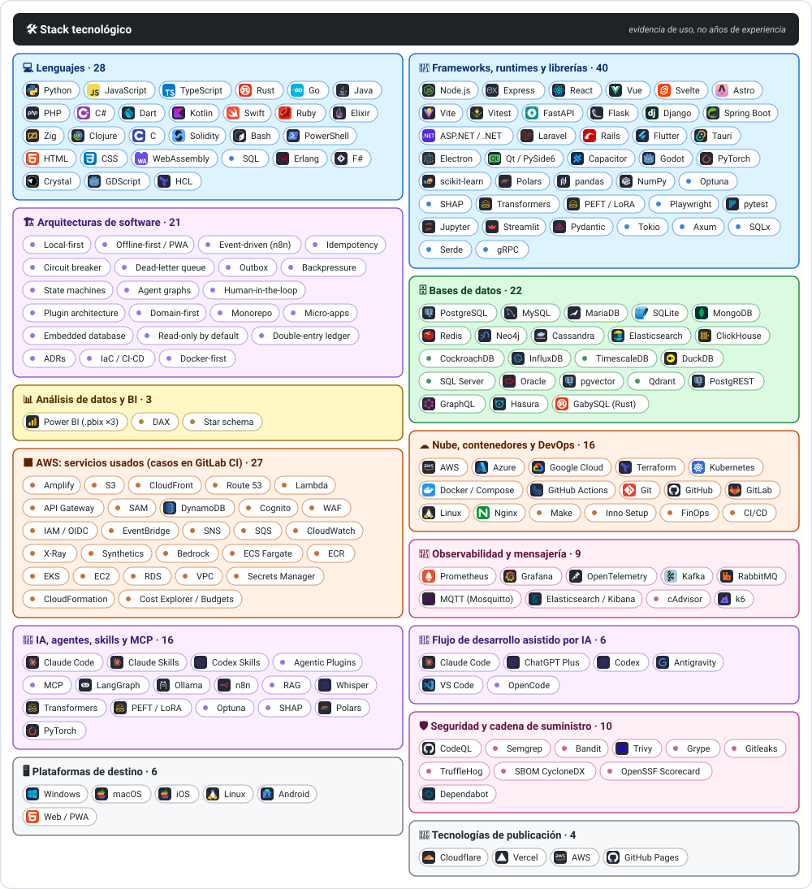
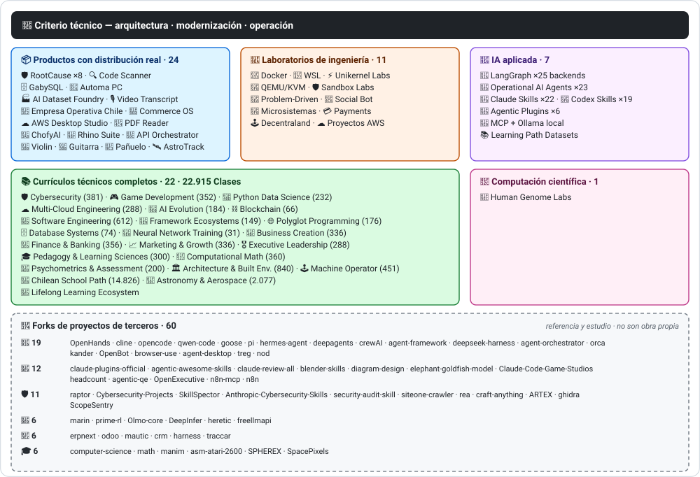

# 👋 Vladimir Acuña

## **Ingeniero en IA · Arquitecto de Soluciones · Senior Full-Stack · Transformación Digital · Gestión y Operaciones**

**Ingeniero en Informática y Computación y Administrador de Empresas, con +16 años construyendo y operando software en entornos reales. Conecto negocios, personas, procesos y tecnología para diseñar, evaluar, entregar y sostener soluciones con criterio técnico y visión operacional — con evidencia verificable en este GitHub.**

<!-- STATS:START -->

<!-- STATS:END -->

[🧭 Por dónde empezar](docs/START_HERE.md) ·
[🌐 Portafolio (22 idiomas)](https://vladimiracunadev-create.github.io/) ·
[🧩 Ecosistema](#-el-ecosistema-de-un-vistazo) ·
[🛠️ Stack tecnológico](#-stack-tecnológico) ·
[⚡ Evalúame en 10 minutos](docs/guides/TECH_LEAD.md) ·
[✅ Alcance profesional](#-alcance-profesional) ·
[🧭 Gestión sin programación](#-gestión-administración-y-oportunidades-profesionales-sin-programación) ·
[📋 Matriz de cargos](PROFESIONAL_ROLES.md) ·
[📬 Contacto](#-contacto)

**🌐 Versiones completas:** [Español](README.md) · [English](README.en.md) · [Português](README.pt.md) · [Italiano](README.it.md) · [Français](README.fr.md) · [简体中文](README.zh.md) · [繁體中文](README.zh-TW.md) · [日本語](README.ja.md) · [한국어](README.ko.md) · [Türkçe](README.tr.md) · [Русский](README.ru.md) · [Tiếng Việt](README.vi.md) · [ไทย](README.th.md) · [Deutsch](README.de.md) · [Українська](README.uk.md) · [Polski](README.pl.md) · [العربية](README.ar.md) · [فارسی](README.fa.md) · [Bahasa Indonesia](README.id.md) · [Nederlands](README.nl.md) · [हिन्दी](README.hi.md) · [Ελληνικά](README.el.md)

**Núcleo técnico:**
PHP 8 · Python · Rust · Go · Node/TS · Java 21 · .NET 8 · Dart/Flutter · WASM
· AWS · Terraform · Kubernetes · Docker · n8n · LangGraph/MCP · CI/CD · FinOps · Observabilidad

**Puente negocio–tecnología:**
análisis de procesos y requerimientos · evaluación de soluciones · coordinación de entrega · operación y continuidad · gestión de riesgos · producto y servicio · formación técnica

---

> [!NOTE]
> Este perfil no convierte posibilidades en experiencia. La trayectoria técnica acreditada, las competencias transferibles, las posibilidades de postulación y los objetivos futuros se distinguen de forma explícita. Cada evidencia de GitHub enlazada es ejecutable o documental; donde algo **no** está terminado, se declara como tal.

## 🧭 Por dónde empezar

Elige tu caso y ve directo a lo que necesitas:

🧑‍💼 [Reclutamiento](docs/guides/RECRUITER.md) · 💼 [Cliente o freelance](docs/guides/FREELANCE.md) · 🛠️ [Evaluación técnica](docs/guides/TECH_LEAD.md) · 🏢 [Negocio y gestión](docs/guides/BUSINESS.md) · 🤝 [Colaboración y seguridad](docs/guides/COLLABORATOR.md) · 🎓 [Aprender o enseñar](docs/guides/LEARNER.md)

## 🎯 Qué encontrarás aquí

No es «un repo»: es un ecosistema con estándares comunes.

- 🔁 **Demos reproducibles** — clonas, ejecutas, validas.
- 🧰 **Tooling estandarizado** — Makefiles, Hub CLI, `doctor` y `smoke` por repo.
- 🛡️ **Defensa en profundidad** — secret scanning, políticas, prácticas prohibidas explícitas.
- 📈 **Observabilidad** — `/health`, `/ready`, `/metrics`, dashboards y trazabilidad.
- 📚 **Documentación por audiencia** — reclutador, novato, DevOps o seguridad, según el repo.
- 📦 **Distribución como producto** — releases descargables, checksums y evidencia de build; firmas comerciales/en tiendas declaradas como pendientes cuando aplica.
- 🌍 **Internacionalización** — este perfil se publica en 22 idiomas y el portafolio ofrece 154 PDFs públicos (7 familias × 22 idiomas) (ES · EN · PT · IT · FR · ZH · ZH-TW · JA · KO · TR · RU · VI · TH · DE · UK · PL · AR · FA · ID · NL · HI · EL).
- 🧭 **Honestidad técnica** — cada caso etiquetado `OPERATIVO`, `DOCUMENTADO/SCAFFOLD` o `PLANIFICADO`.

## ✅ Estado verificable

| Superficie | Evidencia concreta |
|---|---|
| 🧪 **Cobertura de pruebas** | GabySQL **850 tests** + fuzz de **503,8 M queries** (0 panics) · Empresa Operativa Chile **230 pruebas** · Automa **150 pytest** · CI multi-OS |
| 🤖 **Agentes en producción** | LangGraph RealWorld **25/25 backends operativos** (casos 01–25, cobertura 100 %) · Operational AI Agents **23 agentes** con **69 evals deterministas** |
| 🔗 **Integración políglota** | **20 casos** emisor→n8n→receptor —**19 operativos**, auditados uno a uno con Docker— · **18+ motores de BD** · **20+ contenedores** · 11 patrones |
| 📦 **Distribución** | **166 releases** publicadas en un ecosistema de **68 repositorios públicos propios** · instaladores y artefactos `.exe` · `.msi` · `.dmg` · `.apk` con checksums y evidencia de build; firmas comerciales/en tiendas en trámite cuando aplica |
| 🛡️ **Cadena de suministro** | CodeQL · Semgrep · Bandit · Trivy · Grype · Gitleaks · TruffleHog · SBOM CycloneDX · Scorecard |
| 📚 **Currículos** | **22.915 clases** verificables en 22 programas, contadas por [un workflow](.github/workflows/stats.yml) sobre estructura real o fuente verificable declarada en el repositorio —no escritas a mano— · cada programa declara su estado editorial y sus límites |
| 🌐 **Portafolio** | PWA instalable · **22 idiomas** · **154 PDFs** por pipeline · CV Data API · Capacitor Android · Lighthouse 100 |
| 🔒 **Telemetría** | Cero en los productos forenses y en Empresa Operativa Chile — verificada en cada build (sin permiso `INTERNET` en Android) |
| 🌐 **Sitios publicados** | **57 sitios** en GitHub Pages —56 landings, una por producto, programa o navegador del ecosistema, más el portafolio— cada uno desplegado desde su propio repositorio · los 57 comprobados con respuesta `200` |

## 🛠️ Stack tecnológico

Tecnologías detectadas en los repositorios públicos (manifiestos, dependencias, contenedores y código), agrupadas por área. Aparecer en un repositorio —incluidos laboratorios y currículos— es evidencia de uso, no una afirmación de años de experiencia productiva.

👉 **[De dónde sale el Stack tecnológico](docs/STACK_SOURCES.md)**

**Arquitecturas de software**

Local-first → [empresa-operativa-chile](https://github.com/vladimiracunadev-create/empresa-operativa-chile), [ai-dataset-foundry](https://github.com/vladimiracunadev-create/ai-dataset-foundry) · Event-driven → [social-bot-scheduler](https://github.com/vladimiracunadev-create/social-bot-scheduler) · Resilience → [problem-driven-systems-lab](https://github.com/vladimiracunadev-create/problem-driven-systems-lab) · Ledger → [universal-payments-engineering-lab](https://github.com/vladimiracunadev-create/universal-payments-engineering-lab) · Plugins → [agentic-plugins-toolkit](https://github.com/vladimiracunadev-create/agentic-plugins-toolkit) · Agents → [langgraph-realworld](https://github.com/vladimiracunadev-create/langgraph-realworld), [operational-ai-agents](https://github.com/vladimiracunadev-create/operational-ai-agents) · Domain-first → [rhino-suite](https://github.com/vladimiracunadev-create/rhino-suite) · Micro-apps → [microsistemas](https://github.com/vladimiracunadev-create/microsistemas) · Embedded DB → [gabysql](https://github.com/vladimiracunadev-create/gabysql) · IaC → [proyectos-aws](https://github.com/vladimiracunadev-create/proyectos-aws)

**Análisis de datos y BI**

Power BI (.pbix ×3) · DAX · Star schema → [social-bot-scheduler](https://github.com/vladimiracunadev-create/social-bot-scheduler)

**AWS: servicios usados (casos en GitLab CI)**

Casos A–P → [proyectos-aws-gitlab](https://gitlab.com/vladimir.acuna.dev-group/proyectos-aws-gitlab) (GitLab CI → AWS; los 16 declarados completados; el caso M, solo su fase 1) · [proyectos-aws](https://github.com/vladimiracunadev-create/proyectos-aws) (GitHub Actions) · EC2, RDS, VPC, Secrets Manager, CloudFormation, Cost Explorer → [aws-desktop-studio](https://github.com/vladimiracunadev-create/aws-desktop-studio) (consulta real de inventario; EC2 con inicio, parada y reinicio con doble control)

**Flujo de desarrollo asistido por IA**

| Herramienta | Uso principal |
|---|---|
| **Claude Code** | Revisión arquitectónica, implementación y documentación técnica |
| **ChatGPT Plus** | Análisis, arquitectura e iteración (desde 2023) |
| **Codex** | Generación y refactorización de código |
| **Antigravity** | Aceleración de flujos de desarrollo y automatización |
| **VS Code / OpenCode** | Entornos con asistencia IA integrada |

> Combino criterio técnico propio, validación humana y dirección arquitectónica. La IA amplifica capacidad, velocidad y alcance — no reemplaza experiencia.

**Tecnologías de publicación**

Cloudflare (trabajo personal) · Vercel (hackatón NASA Space Apps) · AWS (webs operativas, asociadas a GitLab) · GitHub Pages

## 🗺️ El ecosistema de un vistazo

## 🗂️ Ecosistema: productos, laboratorios, IA aplicada, currículos y computación científica

La obra práctica del perfil vive en un documento propio: software que se descarga e instala, laboratorios de ingeniería, IA aplicada, currículos técnicos completos y computación científica, además de la descripción de cada fork de proyectos de terceros que hay en la cuenta.

- 📦 [**Productos con distribución real**](docs/ECOSYSTEM.md#products) (24)
- 🧪 [**Laboratorios de ingeniería**](docs/ECOSYSTEM.md#labs) (11)
- 🤖 [**IA aplicada**](docs/ECOSYSTEM.md#ai) (7)
- 📚 [**Currículos técnicos completos**](docs/ECOSYSTEM.md#curricula) (22)
- 🔬 [**Computación científica**](docs/ECOSYSTEM.md#science) (1)
- 🍴 [**Forks de proyectos de terceros**](docs/ECOSYSTEM.md#forks) (60)

👉 **[Ver el ecosistema completo](docs/ECOSYSTEM.md)** · [🍴 Forks de proyectos de terceros](docs/ECOSYSTEM.md#forks)

## 🛰️ Hackatón NASA Space Apps 2026

Participé en el **NASA Space Apps Challenge 2026** (Santiago, 14 y 15 de noviembre), en el desafío *Planet X and SPHEREx*, dentro de un equipo de 6 personas. El producto es **AstroTrack · SPHEREx**: un visor web donde se escriben unas coordenadas del cielo y se ve esa zona como una secuencia de imágenes de SPHEREx a lo largo del tiempo, con datos de NASA/IPAC IRSA.

- **Mi parte:** acceso a datos (consultas a IRSA con caché y precálculo de los campos de la demo), empaquetado (PWA, instaladores de escritorio con Tauri y APK de Android con Capacitor), la vista «Descargas» y una auditoría de coherencia entre documentación y código.
- **Entrega verificable:** [spherex-releases](https://github.com/vladimiracunadev-create/spherex-releases) reúne 7 releases (v0.1.0 a v0.4.2) con sumas SHA-256 · [aplicación web](https://spherex-planet-x-tau.vercel.app/) · [repositorio del equipo](https://github.com/mauriciovalenzuela742/SPHEREX).
- **Límites declarados:** el visor, el diseño y el resto del backend son trabajo de otras personas del equipo; los instaladores no están firmados ni se probaron en equipos reales; usé IA (Claude Code) como asistente y está declarado en el repositorio. Esto describe mi contribución, no un resultado del hackatón.

## 🧠 Estándares que aplico en todos los repos

- **DX primero** — si no se ejecuta fácil, no sirve ni como demo ni como base de equipo.
- **Observabilidad desde el día 1** — métricas y trazabilidad, no como añadido posterior.
- **Seguridad como pipeline** — secret scanning, SBOM por release, prácticas prohibidas declaradas.
- **Resiliencia real** — idempotencia, circuit breaker y degradación controlada.
- **Políglota por diseño** — lenguaje y motor elegidos por caso de uso, nunca por moda.
- **Honestidad sobre el estado** — un repo se renombró (`Multisimulador` → `machine-operator-program`) para no prometer software que aún no existe.
- **Los badges son señales, no evidencia** — cada repo declara también **lo que NO hace**.
- **Del modelo hacia afuera** — el dominio se diseña primero; la interfaz es una proyección.
- **Lo ajeno se declara ajeno** — los [60 forks](docs/ECOSYSTEM.md#forks) de proyectos de terceros se describen uno a uno y quedan fuera de todas las cifras de obra propia de este perfil.

## ✅ Alcance profesional

Mi formación dual —**Ingeniería en Informática y Computación + Administración de Empresas**— me permite traducir objetivos de negocio en decisiones técnicas, y restricciones técnicas en opciones comprensibles para operaciones, producto, clientes y dirección.

### 🎯 Identidad principal

| Rol | Respaldo |
|---|---|
| **Arquitecto de Soluciones** | Diseño de sistemas modulares, escalables y con criterio evolutivo |
| **Legacy Modernization Architect** | Evolución real de legado (PHP 5.x→8.x, refactor incremental sin cortar operación) |
| **Senior Full-Stack / Tech Lead** | Arquitectura, ejecución y estándares en plataformas reales (+16 años) |
| **AI Automation Architect** | Sistemas agénticos con LangGraph/MCP y flujos n8n con guardrails |

### ↗ Expansión natural

**AI Orchestration Engineer** · **Systems / Rust Engineer** · **Mobile Engineer (Flutter)** · **Solutions Engineer** · **Technical Product Builder** · **Technical Trainer** · **Consultor de Transformación Digital** · **Asesor Técnico (tecnología, datos e IA)** · **Business / Functional Analyst** · **Product Operations Técnico** · **AI Engineer (LLM / ML)** · **Data Engineer** · **DevSecOps / AppSec Engineer** · **QA Automation / Test Engineer** · **Technical Writer** · **Docente / Relator / Instructor de tecnología** · **Instructional Designer (EdTech)** · **Technical Mentor**

### ⚙️ Alcance complementario

Platform Engineer / IDP · DevOps / CI-CD · Cloud / AWS Engineer · SRE de aplicaciones · Automation Engineer · Consultor técnico-comercial · Backend / API Engineer · Fintech / Payments Engineer · Developer Advocate / DevRel

## 🧭 Gestión, administración y oportunidades profesionales sin programación

Cargos de gestión, administración y negocio donde la informática y la administración aportan sin que programar sea la tarea central, clasificados con honestidad (competencia transferible, posibilidad de postulación u objetivo futuro) y con la brecha de cada uno. Áreas cubiertas:

Análisis de negocio y procesos · Gestión de proyectos tecnológicos · Producto y servicio · Transformación digital · Operaciones TI y continuidad · Riesgo, controles y GRC · Preventa y desarrollo de negocios tecnológicos · Administración y operaciones empresariales · Control de gestión y evaluación · Calidad y mejora continua · Educación y formación · Datos e IA responsable · Sector público y modernización institucional · Dirección tecnológica o empresarial

👉 **[Ver la matriz completa de oportunidades](docs/MANAGEMENT.md)**

## 📌 Disponibilidad

**Abierto a:** Senior Full-Stack · Arquitectura · Modernización de legado · Platform/IDP · SRE de aplicaciones · DevOps pragmático · Automatización · AI Automation · análisis de negocio/funcional · coordinación de proyectos TI · Product Operations · transformación digital · preventa de soluciones · formación tecnológica · calidad y mejora continua · adopción y gobierno de IA

**En evaluación según alcance y evidencia exigida:** Product Owner / Product Manager técnico · Service Delivery · operaciones TI · GRC / riesgo tecnológico · administración y operaciones · control de gestión · proyectos de modernización pública. Los cargos de gerencia y dirección se presentan como desarrollo futuro, no como experiencia ya acreditada.

**Modalidad:** remoto o híbrido, según proyecto.

## 📬 Contacto

---

[🤝 Contribuir](CONTRIBUTING.md) ·
[🛡️ Seguridad](SECURITY.md) ·
[⚖️ Código de conducta](CODE_OF_CONDUCT.md)

README sincronizado con el estado real verificable de los repositorios públicos —cifras y cambios leídos por API— · última verificación: <!-- VERIFIED:START -->2026-11-24<!-- VERIFIED:END -->.

