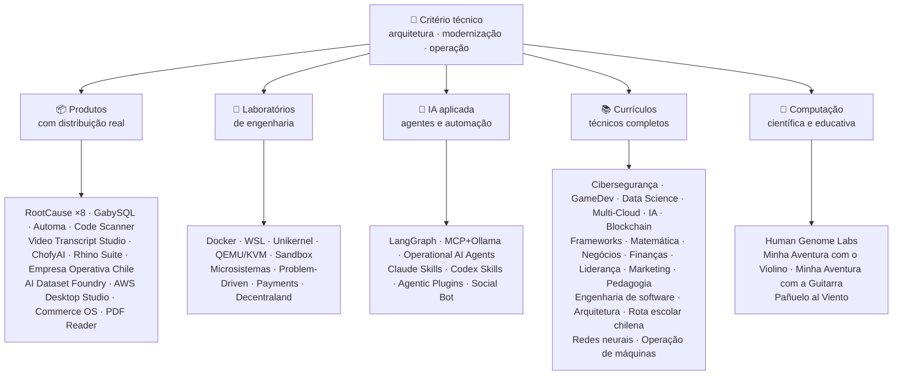

<div align="center">

# 👋 Vladimir Acuña

## **Arquiteto de Soluções · Senior Full-Stack · Transformação Digital · Gestão e Operações**

**Engenheiro em Informática e Computação e Administrador de Empresas, com mais de 16 anos construindo e operando software em ambientes reais. Conecto negócios, pessoas, processos e tecnologia para desenhar, avaliar, entregar e sustentar soluções — com evidência verificável neste GitHub.**

[](https://vladimiracunadev-create.github.io/)
[](https://www.linkedin.com/in/vladimir-acu%C3%B1a-valdebenito-11924a29/)
[](mailto:vladimir.acuna.dev@gmail.com)

[](#-escopo-profissional)
[](#-produtos-com-distribuição-real)
[](#-currículos-técnicos-completos)

<!-- STATS:START -->
[](https://github.com/vladimiracunadev-create?tab=repositories)
[](https://github.com/vladimiracunadev-create?tab=repositories)
[](#-ecossistema-em-uma-visão)
[](#-currículos-técnicos-completos)
[](https://github.com/vladimiracunadev-create?tab=repositories)
<!-- STATS:END -->

[](https://github.com/vladimiracunadev-create?tab=repositories)
[](https://github.com/vladimiracunadev-create?tab=followers)

[🌐 Portfólio (6 idiomas)](https://vladimiracunadev-create.github.io/) ·
[🧩 Ecossistema](#-ecossistema-em-uma-visão) ·
[⚡ Avalie-me em 10 minutos](#-se-você-tem-10-minutos-para-me-avaliar) ·
[✅ Escopo profissional](#-escopo-profissional) ·
[🧭 Gestão sem programação](#-gestão-administração-e-oportunidades-profissionais-sem-programação) ·
[📋 Matriz de cargos](PROFESIONAL_ROLES.md) ·
[📬 Contato](#-contato)

**Idiomas:** [ES](README.md) · [EN](README.en.md) · [PT](README.pt.md) · [IT](README.it.md) · [FR](README.fr.md) · [ZH](README.zh.md)

**Núcleo técnico:**
PHP 8 · Python · Rust · Go · Node/TS · Java 21 · .NET 8 · Dart/Flutter · WASM
· AWS · Terraform · Kubernetes · Docker · n8n · LangGraph/MCP · CI/CD · FinOps · Observabilidade

**Ponte negócio–tecnologia:** análise de processos e requisitos · avaliação de soluções · coordenação de entrega · operações e continuidade · riscos · produto e serviço · formação técnica

</div>

---

> [!NOTE]
> Este perfil não transforma possibilidades em experiência. Experiência comprovada, competências transferíveis, possibilidades de candidatura e objetivos futuros são diferenciados explicitamente.

## 🎯 O Que Você Vai Encontrar Aqui

Não é “um repo”: é um ecossistema com padrões comuns.

- 🔁 **Demos reproduzíveis** — clonar, executar, validar.
- 🧰 **Tooling padronizado** — Makefiles, Hub CLI, `doctor` e `smoke` por repositório.
- 🛡️ **Defesa em profundidade** — secret scanning, políticas e práticas proibidas explicitamente.
- 📈 **Observabilidade** — `/health`, `/ready`, `/metrics`, dashboards e rastreabilidade.
- 📚 **Documentação por audiência** — recrutador, iniciante, DevOps ou segurança, conforme o repositório.
- 📦 **Distribuição como produto** — releases baixáveis, checksums e evidência de build; assinaturas comerciais/de loja declaradas como pendentes quando aplicável.
- 🌍 **Internacionalização** — portfólio em 6 idiomas (ES · EN · PT · IT · FR · ZH).
- 🧭 **Honestidade técnica** — cada caso marcado como `OPERACIONAL`, `DOCUMENTADO/SCAFFOLD` ou `PLANEJADO`.

## ✅ Estado Verificável

| Superfície | Evidência concreta |
|---|---|
| 🧪 **Cobertura de testes** | GabySQL **828 testes** + fuzz de **503,8 M queries** (0 panics) · Empresa Operativa Chile **158 testes** · Automa **150 pytest** · CI multi-OS |
| 🤖 **Agentes em produção** | LangGraph RealWorld **25/25 backends operacionais** (casos 01–25, cobertura 100 %) · Operational AI Agents **13 agentes** com **39 evals determinísticos** |
| 🔗 **Integração políglota** | **20 casos** emissor→n8n→receptor —**19 operacionais**, auditados um a um com Docker— · **18+ motores de BD** · **20+ contêineres** · 11 padrões |
| 📦 **Distribuição** | **148 releases** publicadas em um ecossistema de **64 repositórios públicos próprios** · instaladores e artefatos `.exe` · `.msi` · `.dmg` · `.apk` com checksums e evidência de build; assinaturas comerciais/de loja em andamento quando aplicável |
| 🛡️ **Cadeia de suprimentos** | CodeQL · Semgrep · Bandit · Trivy · Grype · Gitleaks · TruffleHog · SBOM CycloneDX · Scorecard |
| 📚 **Currículos** | **14.500 aulas** verificáveis em 21 programas, contadas por [um workflow](.github/workflows/stats.yml) sobre estrutura real ou fonte verificável declarada no repositório —não escritas à mão— · cada programa declara seu estado editorial e seus limites |
| 🌐 **Portfólio** | PWA instalável · **6 idiomas** · **36 PDFs** por pipeline · CV Data API · Capacitor Android · Lighthouse 100 |
| 🔒 **Telemetria** | Zero nos produtos forenses e em Empresa Operativa Chile — verificada em cada build (sem permissão `INTERNET` no Android) |
| 🌐 **Sites publicados** | **56 sites** no GitHub Pages —55 landings, uma por produto, programa ou navegador do ecossistema, mais o portfólio— todos implantados a partir do próprio repositório · os 56 verificados com resposta `200` |

## 🗺️ Ecossistema Em Uma Visão



## 📦 Produtos Com Distribuição Real

Software que se baixa, instala e usa — não apenas se clona.

| Produto | O que é | Stack | Entrega |
|---|---|---|---|
| [🔍 **RootCause Windows**](https://github.com/vladimiracunadev-create/rootcause-windows-inspector) | Forense de cibersegurança: toda distorção anômala de recursos pode ser o primeiro indício de uma ameaça. Diagnóstico primeiro, intervenção depois | Rust 🦀 · ETW/WPR | **v0.19.0** · **16 releases** · **5 edições**: GUI · Portable · CLI · PowerShell · VS Code · [landing](https://vladimiracunadev-create.github.io/rootcause-windows-inspector/) |
| [📱 **RootCause Mobile**](https://github.com/vladimiracunadev-create/rootcause-mobile-inspector) | O irmão móvel: sensor forense que compara cada app consigo mesmo, aponta stalkerware e separa permissões concedidas das apenas solicitadas | Flutter · Kotlin · Swift | **v0.8.0** · APK Android verificável · 5 idiomas · **telemetria zero** · [landing](https://vladimiracunadev-create.github.io/rootcause-mobile-inspector/) |
| [🍎 **RootCause macOS**](https://github.com/vladimiracunadev-create/rootcause-macos-inspector) | Edição macOS: persistência `launchd`, Gatekeeper, SIP, FileVault, XProtect, permissões TCC, processos assinados e vizinhos de rede — cada superfície contra um estado bom conhecido | Rust 🦀 · macOS 13+ | **v0.1.0** · primeira release publicada · Apache-2.0 · [landing](https://vladimiracunadev-create.github.io/rootcause-macos-inspector/) |
| [🖥️ **RootCause Server**](https://github.com/vladimiracunadev-create/rootcause-server) | O irmão de servidor: correlaciona superfície exposta, rajadas de tentativas, sessão concedida ao mesmo endereço, integridade de arquivos críticos e silêncio do sensor em uma frase acionável | Rust 🦀 · Windows · Linux · macOS | **v0.2.0** · **18 regras** com evidência e runbook · nunca executa ações sozinho · console local sem dependências web · **ainda sem release publicada** · [landing](https://vladimiracunadev-create.github.io/rootcause-server/) |
| [🌐 **RootCause Web**](https://github.com/vladimiracunadev-create/rootcause-web-inspector) | Sensor forense do navegador: cookies, sessões de email, extensões, downloads, permissões e páginas que simulam uma janela real | JavaScript · extensão MV3 | **v0.2.0** · ainda sem release publicada · painel em `127.0.0.1` · zero dependências · telemetria zero verificada em CI · [landing](https://vladimiracunadev-create.github.io/rootcause-web-inspector/) |
| [₿ **RootCause Bitcoin Defense**](https://github.com/vladimiracunadev-create/rootcause-bitcoin-defense) | Defesa watch-only para custódia Bitcoin: inventaria a procedência de cada chave, cruza com avisos publicados e explica a causa raiz com evidência | JavaScript · app Windows · painel local | **v0.3.0** · **2 releases** · zero dependências · nunca pede seeds · verificado em CI · [landing](https://vladimiracunadev-create.github.io/rootcause-bitcoin-defense/) |
| [⛓️ **RootCause Blockchain Security**](https://github.com/vladimiracunadev-create/rootcause-blockchain-security) | Console watch-only multi-chain: inventaria contratos, proxies, oráculos, pontes, governança e dependências, e gera runbooks de causa raiz | JavaScript · app Windows · painel local | **v0.3.0** no repositório · release publicada: `v0.1.0` · zero dependências · nunca pede chaves privadas · verificado em CI · [landing](https://vladimiracunadev-create.github.io/rootcause-blockchain-security/) |
| [📷 **RootCause QR Inspector**](https://github.com/vladimiracunadev-create/rootcause-qr-inspector) | App Android local para inspecionar QR antes de agir: explica 26 sinais, separa fatos de hipóteses e exporta evidência redigida | Flutter · Dart | **v0.1.4** · **5 releases** · **107 testes** · APK Android publicado · SHA-256 verificável · assinatura técnica de pacote APK; assinaturas comerciais/de loja em andamento · telemetria zero · [landing](https://vladimiracunadev-create.github.io/rootcause-qr-inspector/) |
| [🏢 **Empresa Operativa Chile**](https://github.com/vladimiracunadev-create/empresa-operativa-chile) | Acompanha uma SpA desde antes de existir até o fechamento de cada mês: constituição com evidência, IVA com saldo carregado, rascunho F29, fechamento imutável e trilha de auditoria. Cada regra com fonte oficial | JavaScript · Rust · PWA | **v1.5.0** · Android · Windows · navegador · **158 testes** · **0 dependências de produção** · telemetria zero · [landing](https://vladimiracunadev-create.github.io/empresa-operativa-chile/) |
| [🔍 **Universal Code Scanner**](https://github.com/vladimiracunadev-create/universal-code-scanner) | Leitor de QR e códigos de barras que **interpreta antes de agir**: 16 sinais locais de risco por URL e confirmação explícita | Flutter · Dart | **v1.1.0** · Android · iOS · macOS · PWA · histórico cifrado **AES-256-GCM** · [landing](https://vladimiracunadev-create.github.io/universal-code-scanner/) |
| [🗄️ **GabySQL**](https://github.com/vladimiracunadev-create/gabysql) | Banco de dados embutido: arquivo único `.db`, WAL, otimizador por custos, API HTTP/JSON | Rust 🦀 | Windows · macOS · Linux · [landing](https://vladimiracunadev-create.github.io/gabysql/) |
| [🤖 **Automa PC**](https://github.com/vladimiracunadev-create/automa-pc) | Orquestrador local: flows JSON que abrem janelas reais, interagem com DOM e deixam evidência | Python · Playwright · pywebview | **v0.3.0** · **27 flows** · instalador publicado e verificável · [landing](https://vladimiracunadev-create.github.io/automa-pc/) |
| [🏭 **AI Dataset Foundry**](https://github.com/vladimiracunadev-create/ai-dataset-foundry) | Fábrica local-first que converte PDF, Word, web, Git, JSON e CSV em datasets auditáveis para pretraining, fine-tuning, RAG e avaliação | Python | **v0.2.0** · Windows + Android offline · primeira release publicada · [landing](https://vladimiracunadev-create.github.io/ai-dataset-foundry/) |
| [☁️ **AWS Desktop Studio**](https://github.com/vladimiracunadev-create/aws-desktop-studio) | App local-first com 15 integrações de inventário AWS, 20 tutoriais, CLI/SSO e leitura por padrão; implementação em desenvolvimento, sem acesso universal | JavaScript · Windows | **v0.1.1** · primeira release publicada · [landing](https://vladimiracunadev-create.github.io/aws-desktop-studio/) |
| [🧭 **Commerce OS**](https://github.com/vladimiracunadev-create/commerce-operating-system) | Demo conceitual guiada de operação comercial: catálogo, estoque, CRM, pedidos, pagamentos mock e rastreabilidade | JavaScript · Web · Windows · Android | **v0.3.0** · **2 releases** · sem dinheiro nem SII real · [landing](https://vladimiracunadev-create.github.io/commerce-operating-system/) |
| [📄 **PDF Reader**](https://github.com/vladimiracunadev-create/pdf-reader-windows-android) | Leitor Android-first local e somente leitura, com zoom sem cortes, histórico reabrível, compartilhamento para WhatsApp e escolha como leitor padrão | HTML · Web · Android · Windows | **v0.3.3** · APK assinado · zero contas, permissões sensíveis e telemetria · [landing](https://vladimiracunadev-create.github.io/pdf-reader-windows-android/) |
| [🎙️ **Video Transcript Studio**](https://github.com/vladimiracunadev-create/video-transcript-studio) | Um vídeo, uma lista ou um **canal completo** do YouTube para texto com timestamps. Não depende de legendas: Whisper reconhece o áudio **no seu computador**, sem API, conta ou chave | Python · PySide6 · FastAPI · faster-whisper | **v0.2.0** · desktop Windows + painel local em `127.0.0.1` + CLI, **com a mesma fila** · MD · PDF · TXT · SRT · VTT · JSON · MP3 · OGG · **89 testes** · FFmpeg incluído · telemetria zero · [landing](https://vladimiracunadev-create.github.io/video-transcript-studio/) |
| [🎨 **ChofyAI Studio**](https://github.com/vladimiracunadev-create/chofyai-studio) | Launcher de IA criativa local: orquestra Qwen3-TTS, whisper.cpp, FaceFusion, AceForge e ComfyUI | Tauri 2 · Rust · React | v0.5.1 · **5/5 ferramentas com inferência real** · macOS Apple Silicon · Windows experimental · **ainda sem release publicada** · [site](https://vladimiracunadev-create.github.io/chofyai-studio/) |
| [🦏 **Rhino Suite**](https://github.com/vladimiracunadev-create/rhino-suite) | Suíte de escritório do zero: as regras do documento não dependem do DOM — o HTML é apenas uma projeção | Rust/WASM · Go · React 19 | Monorepo evolutivo por fases · [landing](https://vladimiracunadev-create.github.io/rhino-suite/) |
| [🎻 **Minha Aventura com o Violino**](https://github.com/vladimiracunadev-create/violin-adventure) | App educativo infantil: afinador cromático, metrônomo exato no relógio de áudio e canções com violino real | Tauri 2 · React · TS | **v1.3.0** · Windows · Android · Linux · macOS · PWA · [landing](https://vladimiracunadev-create.github.io/violin-adventure/) |
| [🎸 **Minha Aventura com a Guitarra**](https://github.com/vladimiracunadev-create/guitarra-adventure) | O irmão de corda dedilhada: 24 lições em 6 mundos, afinador das 6 cordas, metrônomo sem deriva e 11 notas reais de guitarra | Tauri 2 · React · TS | **v1.0.0** · Windows · Android · Linux · macOS · iOS · PWA · sem contas, publicidade ou dependência online · [landing](https://vladimiracunadev-create.github.io/guitarra-adventure/) |
| [🧣 **Pañuelo al Viento**](https://github.com/vladimiracunadev-create/panuelo-al-viento-cueca-app) | A cueca a partir dos 10 anos: 24 aulas em 8 níveis, 72 atividades, laboratório de seis pulsos (3+3 e 2+2+2) e diagramas de chão acessíveis. Declara que **complementa, não substitui**, docentes e cultores | Flutter · Dart | **v0.2.0** · Android 7+ · Windows 10/11 · APK · EXE · MSI · portable · **29 testes + 2 validadores** · sem câmera, microfone, conta, publicidade ou internet · [landing](https://vladimiracunadev-create.github.io/panuelo-al-viento-cueca-app/) |

## 🧪 Laboratórios De Engenharia

| Repo | O que demonstra |
|---|---|
| [🐳 **Problem-Driven Systems Lab**](https://github.com/vladimiracunadev-create/problem-driven-systems-lab) | **20 problemas reais** (latência sob carga, N+1, retry storms, vazamentos, monólito, cache stampede, backpressure, migração sem downtime, DLQ esquecida) com falhas de alta fidelidade injetadas, resolvidas em **7 stacks**: PHP 8 · Python · Node.js · Java 21 · .NET 8 · **Go 1.23** · **Rust 1.83** · [landing](https://vladimiracunadev-create.github.io/problem-driven-systems-lab/) |
| [📆 **Social Bot Scheduler**](https://github.com/vladimiracunadev-create/social-bot-scheduler) | **v4.10.0** · **20 casos** origem→n8n→receptor sobre **18+ motores de BD** —**19 operacionais**, auditados um a um com Docker— auditoria de **8 camadas**, guardrails de idempotência, circuit breaker e DLQ · [landing](https://vladimiracunadev-create.github.io/social-bot-scheduler/) |
| [🧰 **Microsistemas**](https://github.com/vladimiracunadev-create/microsistemas) | **12 microapps** de diagnóstico e modernização PHP · servidor MCP local somente leitura · hardening em 3 fases · [landing](https://vladimiracunadev-create.github.io/microsistemas/) |
| [🧪 **Docker Labs**](https://github.com/vladimiracunadev-create/docker-labs) | **13 labs** em plataforma de 4 serviços + instalador `.exe` automatizado com launcher · [landing](https://vladimiracunadev-create.github.io/docker-labs/) |
| [🐳 **WSL Labs**](https://github.com/vladimiracunadev-create/wsl-labs) | **12 casos** sobre `wslc`, o motor de contêineres nativo do WSL — **sem Docker Desktop** · [landing](https://vladimiracunadev-create.github.io/wsl-labs/) |
| [⚡ **Unikernel Labs**](https://github.com/vladimiracunadev-create/unikernel-labs) | “Docker Desktop para unikernels”: controle Windows sobre Unikraft com backend WSL2, `kraft` + QEMU/KVM · [landing](https://vladimiracunadev-create.github.io/unikernel-labs/) |
| [🧰 **QEMU/KVM Labs**](https://github.com/vladimiracunadev-create/qemu-kvm-labs) | **12 labs** de virtualização real com QEMU, KVM, libvirt, cloud-init e `vm-manager` sobre Linux e WSL2 · [landing](https://vladimiracunadev-create.github.io/qemu-kvm-labs/) |
| [🛡️ **Sandbox Labs**](https://github.com/vladimiracunadev-create/sandbox-labs) | Isolamento em Linux: executa código, arquivos e modelos de negócio de terceiros sob políticas declaradas e **emite evidência assinada dos controles realmente aplicados** · **36 casos** em duas famílias —15 técnicos e 21 de mercado de capitais— · experimental e educativo, *não um produto de segurança* · [landing](https://vladimiracunadev-create.github.io/sandbox-labs/) |
| [💳 **Universal Payments Engineering Lab**](https://github.com/vladimiracunadev-create/universal-payments-engineering-lab) | **28 famílias** de pagamentos em uma demo local autoexplicativa: estados, ledger, conciliação, segurança e guias de implementação · [landing](https://vladimiracunadev-create.github.io/universal-payments-engineering-lab/) |
| [🕹️ **Decentraland Social Arcade**](https://github.com/vladimiracunadev-create/decentraland-social-arcade) | Experiência 3D social nativa de Decentraland: um MVP e arquitetura multijogo com SDK7, ECS e TypeScript · documentação em espanhol · sem pagamentos nem telemetria |
| [☁️ **Projetos AWS**](https://github.com/vladimiracunadev-create/proyectos-aws) | Casos progressivos em que cada um adiciona um serviço AWS **e** uma nova capacidade de GitHub Actions · cobertura SAA-C03 · DVA-C02 · SOA-C02 |

## 🤖 IA Aplicada

| Repo | O que demonstra |
|---|---|
| [🤖 **LangGraph RealWorld**](https://github.com/vladimiracunadev-create/langgraph-realworld) | **25/25 backends operacionais** — estado tipado, rotas condicionais, streaming NDJSON, modo DEMO/LIVE, 8 camadas de segurança, cadeia de custódia SHA-256 |
| [🧭 **Operational AI Agents**](https://github.com/vladimiracunadev-create/operational-ai-agents) | **13 agentes operacionais** para Claude Code e runtimes compatíveis: cada um recebe uma missão completa —evolução de repositórios, modernização de legado, desenho curricular, publicação de portfólio, remediação de segurança, análise de incidentes— sob **contrato declarado, gates humanos e evidência verificável** · **39 evals determinísticos** · 34 testes · zero-deps (somente stdlib) · Linux · macOS · Windows · [site](https://vladimiracunadev-create.github.io/operational-ai-agents/) |
| [🧠 **MCP + Ollama Local**](https://github.com/vladimiracunadev-create/mcp-ollama-local) | IA local-first com tools MCP em sandbox · bind `127.0.0.1` · trust profile multicamada · honesto sobre seus limites |
| [🧩 **Agentic Plugins Toolkit**](https://github.com/vladimiracunadev-create/agentic-plugins-toolkit) | **6 plugins agentic** instaláveis em Claude Code, OpenAI/Codex, Copilot, Gemini e MCP a partir de uma única fonte: `repository-engineering`, `legacy-modernization`, `learning-program-studio`, `product-evolution`, `portfolio-governance` e `rootcause-response` · **69 vistas geradas sem drift** · zero-deps · Linux · macOS · Windows · [site](https://vladimiracunadev-create.github.io/agentic-plugins-toolkit/) |
| [🧰 **Claude Skills Toolkit**](https://github.com/vladimiracunadev-create/claude-skills-toolkit) | **15 skills agentic** para Claude Code · **segurança**: `security-audit` de 12 camadas e `bitcoin-custody-audit` em 14 etapas · gates de repositório, coerência, Docker e documentação · zero-deps · multiplataforma |
| [🧰 **Codex Skills Toolkit**](https://github.com/vladimiracunadev-create/codex-skills-toolkit) | **19 skills agentic** para Codex: segurança e supply chain, preflight, fluxos funcionais, resiliência e estado, evidência de release, gates Python/YAML/Markdown, versões, dependências, Docker e documentos · Python-first · `pnpm` · Linux · macOS · Windows · [site](https://vladimiracunadev-create.github.io/codex-skills-toolkit/) |

## 📚 Currículos Técnicos Completos

Programas sequenciais em espanhol, com estado e escopo declarados por cada repositório. Os 21 programas somam **14.500 aulas**, contadas por [um workflow](.github/workflows/stats.yml) sobre estrutura real ou fonte verificável declarada no repositório; a insígnia é atualizada semanalmente e não está escrita à mão.

🧭 [**Lifelong Learning Ecosystem**](https://github.com/vladimiracunadev-create/lifelong-learning-ecosystem) é uma bússola federada que conecta 30 percursos reais em 6 áreas, com mapas visuais e um [portal offline acessível](https://vladimiracunadev-create.github.io/lifelong-learning-ecosystem/), sem ser contado como programa adicional.

| Programa | Aulas | Alcance |
|---|---:|---|
| [🔢 **Matemática Computacional**](https://github.com/vladimiracunadev-create/computational-mathematics-program) | 360 | De contar nos dedos a reproduzir um paper · **360 demonstrações determinísticas verificadas em CI** · 1.080 notebooks · glossário de 489 termos · [site](https://vladimiracunadev-create.github.io/computational-mathematics-program/) |
| [🏦 **Finanças e Banca**](https://github.com/vladimiracunadev-create/finance-and-banking-evolution-program) | 356 | 534 h · matemática financeira e IFRS → crédito, riscos, Basileia III, finanças abertas, DLT, stablecoins e MiCA · **27 casos** · **298 testes** · [site](https://vladimiracunadev-create.github.io/finance-and-banking-evolution-program/) |
| [🎮 **GameDev**](https://github.com/vladimiracunadev-create/modern-gamedev-program) | 352 | Matemática e C#/C++/GDScript → shaders, IA, multiplayer, VR/AR · Godot · Unity · Unreal · **10 labs Godot verificados em CI** (301 checagens) · [site](https://vladimiracunadev-create.github.io/modern-gamedev-program/) |
| [🛡️ **Cibersegurança**](https://github.com/vladimiracunadev-create/modern-cybersecurity-program) | 360 | **v1.3.0** · 20 partes · fundamentos → Red Team, DFIR, cloud security, exploit dev, CTF e game security · mapeado a **7 certificações** · app Android/web offline · manual PDF · CI, Security e Pages verificados · [site](https://vladimiracunadev-create.github.io/modern-cybersecurity-program/) |
| [📈 **Marketing, Vendas e Crescimento**](https://github.com/vladimiracunadev-create/marketing-sales-growth-evolution-program) | 336 | 24 partes com definições operacionais, fichas de medição, bibliografia verificável e contexto regulatório chileno · **v1.6.0** · 1,29 M palavras · 17 rotas por papel · [site](https://vladimiracunadev-create.github.io/marketing-sales-growth-evolution-program/) |
| [🏢 **Criação de Empresas**](https://github.com/vladimiracunadev-create/modern-business-creation-program) | 336 | Criar e operar uma empresa real no Chile: da ideia à constituição, SII, operação, crise e saída · 360 diagramas · glossário de 1.251 termos · manual de 1.548 páginas · [site](https://vladimiracunadev-create.github.io/modern-business-creation-program/) |
| [🏛️ **Arquitetura e Ambiente Construído**](https://github.com/vladimiracunadev-create/architecture-built-environment-learning-program) | 800 | 80 partes · 60 sessões integradoras · 33 rotas · fontes rastreáveis · Markdown, leitor offline e GitHub Pages · [site](https://vladimiracunadev-create.github.io/architecture-built-environment-learning-program/) |
| [🇨🇱 **Rota Escolar Chilena**](https://github.com/vladimiracunadev-create/chilean-school-learning-path) | 8.841 | Do 1º ano básico ao 4º ano médio · **4.156 experiências transversais integradas** · **2.823 objetivos de aprendizagem** · fontes MINEDUC · nenhuma proposta pendente e revisão humana especializada ainda pendente · [site](https://vladimiracunadev-create.github.io/chilean-school-learning-path/) |
| [🧭 **Engenharia de software moderna**](https://github.com/vladimiracunadev-create/modern-software-engineering-program) | 480 | 40 partes e 8 etapas · fundamentos → produto, arquitetura, segurança, DevOps, SRE, SPEC, IA e sistemas multiagente · estado editorial declarado pelo repositório · [site](https://vladimiracunadev-create.github.io/modern-software-engineering-program/) |
| [🎓 **Pedagogia e Ciências da Aprendizagem**](https://github.com/vladimiracunadev-create/education-pedagogy-learning-sciences-program) | 300 | De como uma pessoa aprende a como se forma quem ensina · 25 partes · **cada aula declara seu estado de evidência e limites** · alfabetização inicial, metodologias comparadas, necessidades educativas específicas, convivência, diversidade cultural e evidência internacional · glossário de 1.097 termos, 325 diagramas e banco de 60 atividades · 14 rotas de carreira · exportável a LMS · **v2.1.0** · [site](https://vladimiracunadev-create.github.io/education-pedagogy-learning-sciences-program/) |
| [☁️ **Multi-Cloud**](https://github.com/vladimiracunadev-create/multi-cloud-engineering-program) | 288 | AWS · Azure · GCP · Kubernetes · Terraform · SRE · FinOps · **1.288 horas** · 288 labs com evidência JSON · 1.032 fontes rastreadas · manual PDF de 2.884 páginas · [site](https://vladimiracunadev-create.github.io/multi-cloud-engineering-program/) |
| [🎖️ **Liderança Executiva**](https://github.com/vladimiracunadev-create/executive-leadership-founder-program) | 288 | De assumir seu primeiro resultado a dirigir uma empresa e fundar a própria: equipes, KPI/OKR, finanças, produto, risco, conselho e M&A · 24 casos, 96 labs e 39 modelos · [site](https://vladimiracunadev-create.github.io/executive-leadership-founder-program/) |
| [🐍 **Python Data Science**](https://github.com/vladimiracunadev-create/python-data-science-program) | 232 | Polars, ML+Optuna/SHAP, PyTorch/LLMs/LoRA, MLOps · app Windows nativo + APK Android · [site](https://vladimiracunadev-create.github.io/python-data-science-program/) |
| [🧠 **Evolução da IA**](https://github.com/vladimiracunadev-create/artificial-intelligence-evolution-program) | 184 | Simbólica → probabilística → deep learning → LLMs, RAG, agentes, segurança e fronteira · **v0.17.0** · **708 notebooks** · **148 papers fundacionais** · apps Windows, Android e PWA offline · [site](https://vladimiracunadev-create.github.io/artificial-intelligence-evolution-program/) |
| [🌐 **Programação Comparada**](https://github.com/vladimiracunadev-create/polyglot-programming-labs) | 176 | Um conceito, **10 linguagens** verificadas em CI — **1.360 implementações** — mais **1.632 programas** em linguagens ainda vivas (COBOL, Fortran, Ada, RPG, MUMPS…) e atlas de **60 fichas em 15 famílias** · v1.1.0 · [site](https://vladimiracunadev-create.github.io/polyglot-programming-labs/) |
| [🧩 **Frameworks Comparados**](https://github.com/vladimiracunadev-create/framework-ecosystems-labs) | 149 | Um contrato executável contra Express, FastAPI, Spring Boot, ASP.NET, Django, Rails, Laravel, React, Vue, Svelte e mais · 12 partes · **70 aulas construídas** · **397 casos verificados em CI** · **210 fontes** ISBN/DOI · [site](https://vladimiracunadev-create.github.io/framework-ecosystems-labs/) |
| [🗄️ **Bancos de Dados**](https://github.com/vladimiracunadev-create/database-systems-labs) | 74 | **v3.0.0** · engenharia de bancos de dados em 15 partes · 230 horas · **fonte verificável de cada afirmação**: 120 fontes com ISBN, DOI ou norma · o mesmo caso resolvido em 27 motores · glossário de 306 termos · 150 pytest · [site](https://vladimiracunadev-create.github.io/database-systems-labs/) |
| [📐 **Psicometria e Medição**](https://github.com/vladimiracunadev-create/psychometrics-and-assessment-program) | 40 | Como se constrói, pontua, valida e audita um instrumento de medição · 8 partes · motor executável com **5 instrumentos e 344 itens, 276 de domínio público** |
| [⛓️ **Blockchain**](https://github.com/vladimiracunadev-create/blockchain-learning-path) | 66 | **v0.14.0** · do zero à infraestrutura financeira programável e analítica on-chain · **91 práticas** e **356 testes** · contratos com Foundry e análise estática Slither em CI · apps offline verificados abrindo o binário e contando seu conteúdo · [site](https://vladimiracunadev-create.github.io/blockchain-learning-path/) |
| [🧠 **Neural Network Training Labs**](https://github.com/vladimiracunadev-create/neural-network-training-labs) | 31 | 7 módulos · ≈214 horas · **93 notebooks** —31 aulas, 31 versões para estudante e 31 soluções— · perguntas, mapas visuais, práticas e avaliação com dados públicos reais · PyTorch · [site de estudo](https://vladimiracunadev-create.github.io/neural-network-training-labs/) |
| [🕹️ **Machine Operator**](https://github.com/vladimiracunadev-create/machine-operator-program) | 451 | **41 módulos formativos**, um por máquina · **502 h 15 min** · sistemas, comandos, física, segurança e desenho de simulação com fontes por aula · *ainda sem simulador executável, e isso é declarado* |

## 🔬 Computação Científica

| Repo | O que demonstra |
|---|---|
| [🧬 **Human Genome Labs**](https://github.com/vladimiracunadev-create/human-genome-labs) | Plataforma reproduzível de genômica: contratos tipados `ScientificResult<T>`, FASTA/GFF3/VCF, módulos com **maturidade e evidência explícitas**. Honestidade radical: *não realiza diagnóstico clínico* · [site](https://vladimiracunadev-create.github.io/human-genome-labs/) |

## ⚡ Se Você Tem 10 Minutos Para Me Avaliar

A ideia não é apenas olhar código: é ver **como penso**, como documento e como faço tudo ser executável.

**Rota A — Observabilidade e orquestração real** *(minha favorita)*

```bash
git clone https://github.com/vladimiracunadev-create/social-bot-scheduler.git
```

Você verá workflows, métricas, dashboards e guardrails sobre 19 casos e 18+ motores de BD.

**Rota B — Infraestrutura reproduzível em minutos**

```bash
git clone https://github.com/vladimiracunadev-create/docker-labs.git
```

**Rota C — Agentes com estado tipado**

```bash
git clone https://github.com/vladimiracunadev-create/langgraph-realworld.git
```

**Rota D — Produto forense em Rust, sem clonar**

Baixe o instalador ou binário CLI em [releases do RootCause](https://github.com/vladimiracunadev-create/rootcause-windows-inspector/releases) e verifique `SHA256SUMS`.

## 🧠 Padrões Que Aplico Em Todos Os Repositórios

- **DX primeiro** — se não roda fácil, não serve como demo nem como base de equipe.
- **Observabilidade desde o dia 1** — métricas e rastreabilidade, não como remendo posterior.
- **Segurança como pipeline** — secret scanning, SBOM por release, práticas proibidas declaradas.
- **Resiliência real** — idempotência, circuit breaker e degradação controlada.
- **Poliglota por desenho** — linguagem e motor escolhidos pelo caso de uso, nunca por moda.
- **Honestidade sobre o estado** — um repo foi renomeado (`Multisimulador` → `machine-operator-program`) para não prometer software que ainda não existe.
- **Badges são sinais, não evidência** — cada repo também declara **o que NÃO faz**.
- **Do modelo para fora** — o domínio é desenhado primeiro; a interface é uma projeção.
- **O que é externo é declarado** — dos 70 repositórios públicos da conta, 64 são obra própria. Os outros seis —[`agentic-qe`](https://github.com/vladimiracunadev-create/agentic-qe), [`Anthropic-Cybersecurity-Skills`](https://github.com/vladimiracunadev-create/Anthropic-Cybersecurity-Skills), [`erpnext`](https://github.com/vladimiracunadev-create/erpnext), [`OpenExecutive`](https://github.com/vladimiracunadev-create/OpenExecutive), [`raptor`](https://github.com/vladimiracunadev-create/raptor) e [`security-audit-skill`](https://github.com/vladimiracunadev-create/security-audit-skill)— são forks e ficam fora das métricas de obra própria.

## ✅ Escopo Profissional

Minha formação dupla —**Engenharia em Informática e Computação + Administração de Empresas**— permite traduzir objetivos de negócio em decisões técnicas e restrições técnicas em opções claras para operações, produto, clientes e direção.

### 🎯 Identidade Principal

| Papel | Respaldo |
|---|---|
| **Arquiteto de Soluções** | Desenho de sistemas modulares, escaláveis e com critério evolutivo |
| **Arquiteto de Modernização de Legado** | Evolução real de legado (PHP 5.x→8.x, refatoração incremental sem interromper operação) |
| **Senior Full-Stack / Tech Lead** | Arquitetura, execução e padrões em plataformas reais (+16 anos) |
| **Arquiteto de Automação com IA** | Sistemas agentic com LangGraph/MCP e fluxos n8n com guardrails |

### ↗ Expansão Natural

**AI Orchestration Engineer** · **Systems / Rust Engineer** · **Mobile Engineer (Flutter)** · **Solutions Engineer** · **Technical Product Builder** · **Technical Trainer** · **Consultor de Transformação Digital** · **Business / Functional Analyst** · **Product Operations Técnico**

### ⚙️ Escopo Complementar

Platform Engineer / IDP · DevOps / CI-CD · Cloud / AWS Engineer · SRE de aplicações · Automation Engineer · Consultor técnico-comercial

## 🧭 Gestão, Administração e Oportunidades Profissionais sem Programação

Esta ampliação não afirma que todos estes cargos tenham sido exercidos. Prioriza funções em que informática, administração e evidência pública geram valor sem programação como tarefa central.

| Família | Cargos reconhecíveis | Classificação honesta | Programação | Evidência e condição |
|---|---|---|---|---|
| **Direção tecnológica** | Head of IT · IT Operations Manager · Gerente de Transformação · CIO | **Possibilidade / objetivo futuro** | Nenhuma/ocasional | Base técnica forte; pessoas, orçamento, fornecedores e accountability executivo devem ser comprovados |
| **Projetos** | Coordenador/Project Manager · PMO · Scrum Master · Agile Delivery | **Transferível / possibilidade** | Nenhuma/ocasional | Entrega e releases; faltam equipe, orçamento e sponsor formais |
| **Administração** | Administrador · Gerência administrativa/operacional · Contratos | **Possibilidade** | Nenhuma | Formação e artefatos operacionais; ownership real de recursos e pessoas é brecha |
| **Estratégia** | Consultoria · Change Manager · Planejamento · Inovação/Transformação | **Transferível / possibilidade** | Nenhuma | Modernização e avaliação de soluções; adoção organizacional deve ser demonstrada |
| **Análise empresarial** | Business/Functional Analyst · Requisitos · BPM · Melhoria contínua | **Transferível / possibilidade** | Nenhuma/ocasional | Modelagem e documentação; casos com stakeholders externos fortaleceriam o perfil |
| **Produto e serviço** | Product Owner/Manager · Product Operations · Service Delivery · Customer Success | **Transferível / possibilidade** | Nenhuma/ocasional | Roadmaps e ciclo de vida; P&L, carteira e SLA dependem do cargo |
| **GRC e continuidade** | GRC · Auditor TI · Risco tecnológico · Segurança/Continuidade | **Possibilidade** | Nenhuma/ocasional | Controles e RootCause; auditorias organizacionais e credenciais não são declaradas |
| **Comercial** | Pré-vendas · Solutions Consultant · KAM técnico · Business Development | **Transferível / possibilidade** | Nenhuma | Tradução de valor; quota, carteira e negociação contratual não são alegadas |
| **Finanças e controle** | Orçamento/custos · Avaliação · FP&A · Controle de gestão | **Possibilidade** | Nenhuma | Finanças e FinOps; faltam orçamento e demonstrações reais |
| **Qualidade** | Quality/Process Analyst · Auditor · Melhoria contínua | **Transferível / possibilidade** | Nenhuma/ocasional | Gates, testes e métricas; falta ownership formal de sistema de qualidade |
| **Educação** | Instrutor · Facilitador · Coordenador acadêmico · EdTech/Design Instrucional | **Transferível / possibilidade** | Nenhuma/ocasional | 21 programas e 14.500 aulas; docência formal deve ser comprovada separadamente |
| **Logística** | Compras · Abastecimento · Fornecedores · Coordenação operacional | **Possibilidade** | Nenhuma | Base de processos; compras, inventário e fornecedores reais são brechas |
| **Dados e IA** | Data Steward · Data Governance · Adoção/Governança de IA | **Transferível / possibilidade** | Nenhuma/ocasional | Datasets auditáveis e gates humanos; políticas e comitês organizacionais são brecha |
| **Setor público** | Modernização · Coordenador TIC · Projetos digitais · Planejamento público | **Possibilidade** | Nenhuma | Contexto chileno e rastreabilidade; compras públicas e experiência setorial não são alegadas |

A [matriz completa em espanhol](PROFESIONAL_ROLES.md) detalha objetivos, responsabilidades, experiência de mercado, conhecimentos complementares, evidências, compatibilidade e brechas das 14 famílias.

## 🤖 Fluxo De Desenvolvimento Assistido Por IA

| Ferramenta | Uso principal |
|---|---|
| **Claude Code** | Revisão arquitetônica, implementação e documentação técnica |
| **ChatGPT Plus** | Análise, arquitetura e iteração (desde 2023) |
| **Codex** | Geração e refatoração de código |
| **Antigravity** | Aceleração de fluxos de desenvolvimento e automação |
| **VS Code / OpenCode** | Ambientes com assistência IA integrada |

> Combino critério técnico próprio, validação humana e direção arquitetônica. A IA amplia capacidade, velocidade e alcance — não substitui experiência.

## 📌 Disponibilidade

**Aberto a:** Senior Full-Stack · Arquitetura · Modernização de legado · Platform/IDP · SRE · DevOps · Automação · AI Automation · análise de negócio/funcional · coordenação de projetos TI · Product Operations · transformação digital · pré-vendas/soluções · educação tecnológica · qualidade · adoção e governança de IA

**Avaliado conforme o escopo:** Product Owner/Manager técnico · Service Delivery · Operações TI · GRC/risco · administração/operações · controle de gestão · modernização pública. Gerência e direção são objetivos futuros, não experiência declarada.

**Modalidade:** remoto ou híbrido, conforme o projeto.

## 📬 Contato

[](https://vladimiracunadev-create.github.io/)
[](https://www.linkedin.com/in/vladimir-acu%C3%B1a-valdebenito-11924a29/)
[](https://gitlab.com/vladimir.acuna.dev-group/vladimir.acuna.dev-group)
[](mailto:vladimir.acuna.dev@gmail.com)

---

<div align="center">

[🤝 Contribuir](CONTRIBUTING.pt.md) ·
[🛡️ Segurança](SECURITY.pt.md) ·
[⚖️ Código de conduta](CODE_OF_CONDUCT.pt.md)

<sub>README sincronizado com o estado verificável dos repositórios públicos —números e mudanças lidos por API— · última verificação: 9 de outubro de 2026.</sub>

</div>
