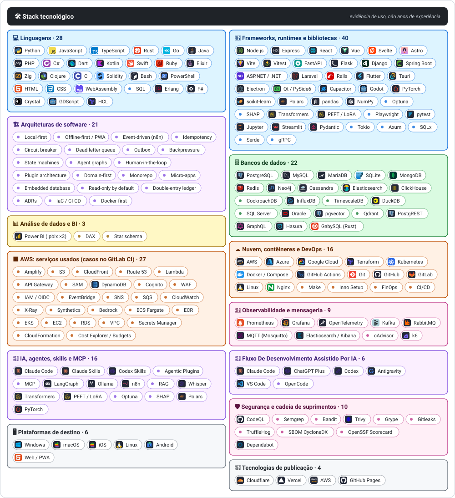
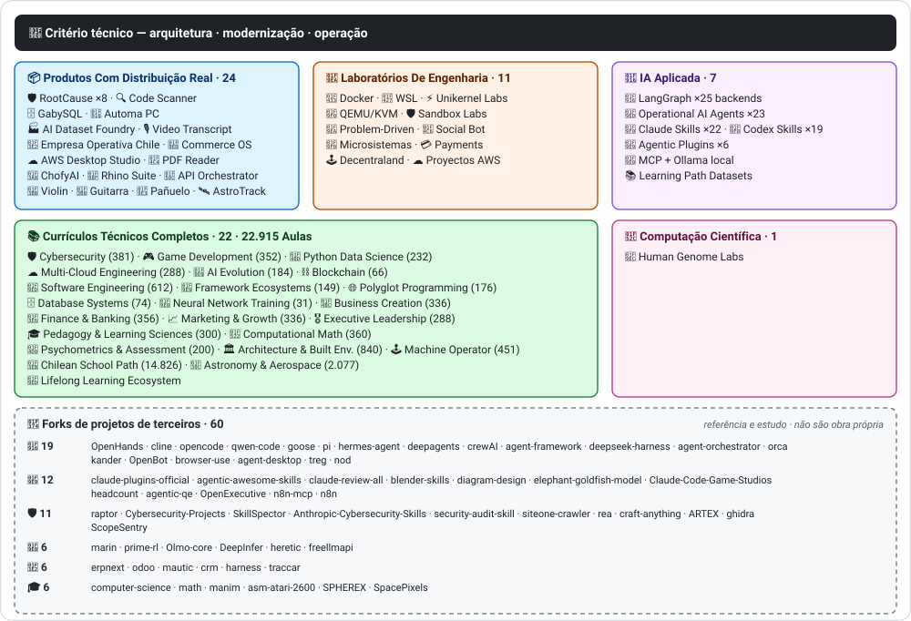

# 👋 Vladimir Acuña

## **Engenheiro de IA · Arquiteto de Soluções · Senior Full-Stack · Transformação Digital · Gestão e Operações**

**Engenheiro em Informática e Computação e Administrador de Empresas, com mais de 16 anos construindo e operando software em ambientes reais. Conecto negócios, pessoas, processos e tecnologia para desenhar, avaliar, entregar e sustentar soluções — com evidência verificável neste GitHub.**

<!-- STATS:START -->

<!-- STATS:END -->

[🧭 Por onde começar](docs/START_HERE.pt.md) ·
[🌐 Portfólio (22 idiomas)](https://vladimiracunadev-create.github.io/) ·
[🧩 Ecossistema](#-ecossistema-em-uma-visão) ·
[🛠️ Stack tecnológico](#-stack-tecnológico) ·
[⚡ Avalie-me em 10 minutos](docs/guides/TECH_LEAD.pt.md) ·
[✅ Escopo profissional](#-escopo-profissional) ·
[🧭 Gestão sem programação](#-gestão-administração-e-oportunidades-profissionais-sem-programação) ·
[📋 Matriz de cargos](PROFESIONAL_ROLES.pt.md) ·
[📬 Contato](#-contato)

**🌐 Versões completas:** [Español](README.md) · [English](README.en.md) · [Português](README.pt.md) · [Italiano](README.it.md) · [Français](README.fr.md) · [简体中文](README.zh.md) · [繁體中文](README.zh-TW.md) · [日本語](README.ja.md) · [한국어](README.ko.md) · [Türkçe](README.tr.md) · [Русский](README.ru.md) · [Tiếng Việt](README.vi.md) · [ไทย](README.th.md) · [Deutsch](README.de.md) · [Українська](README.uk.md) · [Polski](README.pl.md) · [العربية](README.ar.md) · [فارسی](README.fa.md) · [Bahasa Indonesia](README.id.md) · [Nederlands](README.nl.md) · [हिन्दी](README.hi.md) · [Ελληνικά](README.el.md)

**Núcleo técnico:**
PHP 8 · Python · Rust · Go · Node/TS · Java 21 · .NET 8 · Dart/Flutter · WASM
· AWS · Terraform · Kubernetes · Docker · n8n · LangGraph/MCP · CI/CD · FinOps · Observabilidade

**Ponte negócio–tecnologia:** análise de processos e requisitos · avaliação de soluções · coordenação de entrega · operações e continuidade · riscos · produto e serviço · formação técnica

---

> [!NOTE]
> Este perfil não transforma possibilidades em experiência. Experiência comprovada, competências transferíveis, possibilidades de candidatura e objetivos futuros são diferenciados explicitamente.

## 🧭 Por onde começar

Escolha o seu caso e vá direto ao que precisa:

🧑‍💼 [Recrutamento](docs/guides/RECRUITER.pt.md) · 💼 [Cliente ou freelance](docs/guides/FREELANCE.pt.md) · 🛠️ [Avaliação técnica](docs/guides/TECH_LEAD.pt.md) · 🏢 [Negócios e gestão](docs/guides/BUSINESS.pt.md) · 🤝 [Colaboração e segurança](docs/guides/COLLABORATOR.pt.md) · 🎓 [Aprender ou ensinar](docs/guides/LEARNER.pt.md)

## 🎯 O Que Você Vai Encontrar Aqui

Não é “um repo”: é um ecossistema com padrões comuns.

- 🔁 **Demos reproduzíveis** — clonar, executar, validar.
- 🧰 **Tooling padronizado** — Makefiles, Hub CLI, `doctor` e `smoke` por repositório.
- 🛡️ **Defesa em profundidade** — secret scanning, políticas e práticas proibidas explicitamente.
- 📈 **Observabilidade** — `/health`, `/ready`, `/metrics`, dashboards e rastreabilidade.
- 📚 **Documentação por audiência** — recrutador, iniciante, DevOps ou segurança, conforme o repositório.
- 📦 **Distribuição como produto** — releases baixáveis, checksums e evidência de build; assinaturas comerciais/de loja declaradas como pendentes quando aplicável.
- 🌍 **Internacionalização** — este perfil é publicado em 22 idiomas e o portfólio oferece 154 PDFs públicos (7 famílias × 22 idiomas) (ES · EN · PT · IT · FR · ZH · ZH-TW · JA · KO · TR · RU · VI · TH · DE · UK · PL · AR · FA · ID · NL · HI · EL).
- 🧭 **Honestidade técnica** — cada caso marcado como `OPERACIONAL`, `DOCUMENTADO/SCAFFOLD` ou `PLANEJADO`.

## ✅ Estado Verificável

| Superfície | Evidência concreta |
|---|---|
| 🧪 **Cobertura de testes** | GabySQL **850 testes** + fuzz de **503,8 M queries** (0 panics) · Empresa Operativa Chile **230 testes** · Automa **150 pytest** · CI multi-OS |
| 🤖 **Agentes em produção** | LangGraph RealWorld **25/25 backends operacionais** (casos 01–25, cobertura 100 %) · Operational AI Agents **23 agentes** com **69 evals determinísticos** |
| 🔗 **Integração políglota** | **20 casos** emissor→n8n→receptor —**19 operacionais**, auditados um a um com Docker— · **18+ motores de BD** · **20+ contêineres** · 11 padrões |
| 📦 **Distribuição** | **166 releases** publicadas em um ecossistema de **68 repositórios públicos próprios** · instaladores e artefatos `.exe` · `.msi` · `.dmg` · `.apk` com checksums e evidência de build; assinaturas comerciais/de loja em andamento quando aplicável |
| 🛡️ **Cadeia de suprimentos** | CodeQL · Semgrep · Bandit · Trivy · Grype · Gitleaks · TruffleHog · SBOM CycloneDX · Scorecard |
| 📚 **Currículos** | **22.915 aulas** verificáveis em 22 programas, contadas por [um workflow](.github/workflows/stats.yml) sobre estrutura real ou fonte verificável declarada no repositório —não escritas à mão— · cada programa declara seu estado editorial e seus limites |
| 🌐 **Portfólio** | PWA instalável · **22 idiomas** · **154 PDFs** por pipeline · CV Data API · Capacitor Android · Lighthouse 100 |
| 🔒 **Telemetria** | Zero nos produtos forenses e em Empresa Operativa Chile — verificada em cada build (sem permissão `INTERNET` no Android) |
| 🌐 **Sites publicados** | **57 sites** no GitHub Pages —56 landings, uma por produto, programa ou navegador do ecossistema, mais o portfólio— todos implantados a partir do próprio repositório · os 57 verificados com resposta `200` |

## 🛠️ Stack tecnológico

Tecnologias detectadas nos repositórios públicos (manifestos, dependências, contêineres e código), agrupadas por área. Aparecer em um repositório —incluindo laboratórios e currículos— é evidência de uso, não uma afirmação de anos de experiência em produção.

👉 **[De onde sai o Stack tecnológico](docs/STACK_SOURCES.pt.md)**

**Arquiteturas de software**

Local-first → [empresa-operativa-chile](https://github.com/vladimiracunadev-create/empresa-operativa-chile), [ai-dataset-foundry](https://github.com/vladimiracunadev-create/ai-dataset-foundry) · Event-driven → [social-bot-scheduler](https://github.com/vladimiracunadev-create/social-bot-scheduler) · Resilience → [problem-driven-systems-lab](https://github.com/vladimiracunadev-create/problem-driven-systems-lab) · Ledger → [universal-payments-engineering-lab](https://github.com/vladimiracunadev-create/universal-payments-engineering-lab) · Plugins → [agentic-plugins-toolkit](https://github.com/vladimiracunadev-create/agentic-plugins-toolkit) · Agents → [langgraph-realworld](https://github.com/vladimiracunadev-create/langgraph-realworld), [operational-ai-agents](https://github.com/vladimiracunadev-create/operational-ai-agents) · Domain-first → [rhino-suite](https://github.com/vladimiracunadev-create/rhino-suite) · Micro-apps → [microsistemas](https://github.com/vladimiracunadev-create/microsistemas) · Embedded DB → [gabysql](https://github.com/vladimiracunadev-create/gabysql) · IaC → [proyectos-aws](https://github.com/vladimiracunadev-create/proyectos-aws)

**Análise de dados e BI**

Power BI (.pbix ×3) · DAX · Star schema → [social-bot-scheduler](https://github.com/vladimiracunadev-create/social-bot-scheduler)

**AWS: serviços usados (casos no GitLab CI)**

Casos A–P → [proyectos-aws-gitlab](https://gitlab.com/vladimir.acuna.dev-group/proyectos-aws-gitlab) (GitLab CI → AWS; os 16 declarados concluídos; o caso M, apenas a fase 1) · [proyectos-aws](https://github.com/vladimiracunadev-create/proyectos-aws) (GitHub Actions) · EC2, RDS, VPC, Secrets Manager, CloudFormation, Cost Explorer → [aws-desktop-studio](https://github.com/vladimiracunadev-create/aws-desktop-studio) (consulta real de inventário; EC2 com início, parada e reinício sob duplo controle)

**Fluxo De Desenvolvimento Assistido Por IA**

| Ferramenta | Uso principal |
|---|---|
| **Claude Code** | Revisão arquitetônica, implementação e documentação técnica |
| **ChatGPT Plus** | Análise, arquitetura e iteração (desde 2023) |
| **Codex** | Geração e refatoração de código |
| **Antigravity** | Aceleração de fluxos de desenvolvimento e automação |
| **VS Code / OpenCode** | Ambientes com assistência IA integrada |

> Combino critério técnico próprio, validação humana e direção arquitetônica. A IA amplia capacidade, velocidade e alcance — não substitui experiência.

**Tecnologias de publicação**

Cloudflare (trabalho pessoal) · Vercel (hackathon NASA Space Apps) · AWS (sites operacionais, associados ao GitLab) · GitHub Pages

## 🗺️ Ecossistema Em Uma Visão

## 🗂️ Ecossistema: produtos, laboratórios, IA aplicada, currículos e computação científica

O trabalho prático do perfil vive em um documento próprio: software que se baixa e instala, laboratórios de engenharia, IA aplicada, currículos técnicos completos e computação científica, além da descrição de cada fork de projetos de terceiros presente na conta.

- 📦 [**Produtos Com Distribuição Real**](docs/ECOSYSTEM.pt.md#products) (24)
- 🧪 [**Laboratórios De Engenharia**](docs/ECOSYSTEM.pt.md#labs) (11)
- 🤖 [**IA Aplicada**](docs/ECOSYSTEM.pt.md#ai) (7)
- 📚 [**Currículos Técnicos Completos**](docs/ECOSYSTEM.pt.md#curricula) (22)
- 🔬 [**Computação Científica**](docs/ECOSYSTEM.pt.md#science) (1)
- 🍴 [**Forks de projetos de terceiros**](docs/ECOSYSTEM.pt.md#forks) (60)

👉 **[Ver o ecossistema completo](docs/ECOSYSTEM.pt.md)** · [🍴 Forks de projetos de terceiros](docs/ECOSYSTEM.pt.md#forks)

## 🛰️ Hackathon NASA Space Apps 2026

Participei do **NASA Space Apps Challenge 2026** (Santiago, 14 e 15 de novembro), no desafio *Planet X and SPHEREx*, numa equipe de 6 pessoas. O produto é o **AstroTrack · SPHEREx**: um visualizador web em que se digitam coordenadas do céu e essa região aparece como uma sequência de imagens do SPHEREx ao longo do tempo, com dados da NASA/IPAC IRSA.

- **Minha parte:** acesso a dados (consultas ao IRSA com cache e pré-cálculo dos campos da demo), empacotamento (PWA, instaladores de desktop com Tauri e APK Android com Capacitor), a tela «Downloads» e uma auditoria de coerência entre documentação e código.
- **Entrega verificável:** [spherex-releases](https://github.com/vladimiracunadev-create/spherex-releases) reúne 7 releases (v0.1.0 a v0.4.2) com somas SHA-256 · [aplicação web](https://spherex-planet-x-tau.vercel.app/) · [repositório da equipe](https://github.com/mauriciovalenzuela742/SPHEREX).
- **Limites declarados:** o visualizador, o design e o restante do backend são trabalho de outras pessoas da equipe; os instaladores não são assinados nem foram testados em equipamentos reais; usei IA (Claude Code) como assistente, o que está declarado no repositório. Isto descreve a minha contribuição, não um resultado do hackathon.

## 🧠 Padrões Que Aplico Em Todos Os Repositórios

- **DX primeiro** — se não roda fácil, não serve como demo nem como base de equipe.
- **Observabilidade desde o dia 1** — métricas e rastreabilidade, não como remendo posterior.
- **Segurança como pipeline** — secret scanning, SBOM por release, práticas proibidas declaradas.
- **Resiliência real** — idempotência, circuit breaker e degradação controlada.
- **Poliglota por desenho** — linguagem e motor escolhidos pelo caso de uso, nunca por moda.
- **Honestidade sobre o estado** — um repo foi renomeado (`Multisimulador` → `machine-operator-program`) para não prometer software que ainda não existe.
- **Badges são sinais, não evidência** — cada repo também declara **o que NÃO faz**.
- **Do modelo para fora** — o domínio é desenhado primeiro; a interface é uma projeção.
- **O que é externo é declarado** — os [60 forks](docs/ECOSYSTEM.pt.md#forks) de projetos de terceiros são descritos um a um e ficam fora de todos os números de obra própria deste perfil.

## ✅ Escopo Profissional

Minha formação dupla —**Engenharia em Informática e Computação + Administração de Empresas**— permite traduzir objetivos de negócio em decisões técnicas e restrições técnicas em opções claras para operações, produto, clientes e direção.

### 🎯 Identidade Principal

| Papel | Respaldo |
|---|---|
| **Arquiteto de Soluções** | Desenho de sistemas modulares, escaláveis e com critério evolutivo |
| **Arquiteto de Modernização de Legado** | Evolução real de legado (PHP 5.x→8.x, refatoração incremental sem interromper operação) |
| **Senior Full-Stack / Tech Lead** | Arquitetura, execução e padrões em plataformas reais (+16 anos) |
| **Arquiteto de Automação com IA** | Sistemas agentic com LangGraph/MCP e fluxos n8n com guardrails |

### ↗ Expansão Natural

**Assessor Técnico (tecnologia, dados e IA)** · **AI Orchestration Engineer** · **Systems / Rust Engineer** · **Mobile Engineer (Flutter)** · **Solutions Engineer** · **Technical Product Builder** · **Technical Trainer** · **Consultor de Transformação Digital** · **Business / Functional Analyst** · **Product Operations Técnico** · **AI Engineer (LLM / ML)** · **Data Engineer** · **DevSecOps / AppSec Engineer** · **QA Automation / Test Engineer** · **Technical Writer** · **Docente / Relator / Instrutor de tecnologia** · **Instructional Designer (EdTech)** · **Technical Mentor**

### ⚙️ Escopo Complementar

Platform Engineer / IDP · DevOps / CI-CD · Cloud / AWS Engineer · SRE de aplicações · Automation Engineer · Consultor técnico-comercial · Backend / API Engineer · Fintech / Payments Engineer · Developer Advocate / DevRel

## 🧭 Gestão, Administração e Oportunidades Profissionais sem Programação

Cargos de gestão, administração e negócios em que a informática e a administração contribuem sem que programar seja a tarefa central, classificados com honestidade (competência transferível, possibilidade de candidatura ou objetivo futuro) e com a lacuna de cada um. Áreas cobertas:

Direção tecnológica · Projetos · Administração · Estratégia · Análise empresarial · Produto e serviço · GRC e continuidade · Comercial · Finanças e controle · Qualidade · Educação · Logística · Dados e IA · Setor público

👉 **[Ver a matriz completa de oportunidades](docs/MANAGEMENT.pt.md)**

## 📌 Disponibilidade

**Aberto a:** Senior Full-Stack · Arquitetura · Modernização de legado · Platform/IDP · SRE · DevOps · Automação · AI Automation · análise de negócio/funcional · coordenação de projetos TI · Product Operations · transformação digital · pré-vendas/soluções · educação tecnológica · qualidade · adoção e governança de IA

**Avaliado conforme o escopo:** Product Owner/Manager técnico · Service Delivery · Operações TI · GRC/risco · administração/operações · controle de gestão · modernização pública. Gerência e direção são objetivos futuros, não experiência declarada.

**Modalidade:** remoto ou híbrido, conforme o projeto.

## 📬 Contato

---

[🤝 Contribuir](CONTRIBUTING.pt.md) ·
[🛡️ Segurança](SECURITY.pt.md) ·
[⚖️ Código de conduta](CODE_OF_CONDUCT.pt.md)

README sincronizado com o estado verificável dos repositórios públicos —números e mudanças lidos por API— · última verificação: <!-- VERIFIED:START -->2026-11-24<!-- VERIFIED:END -->.

