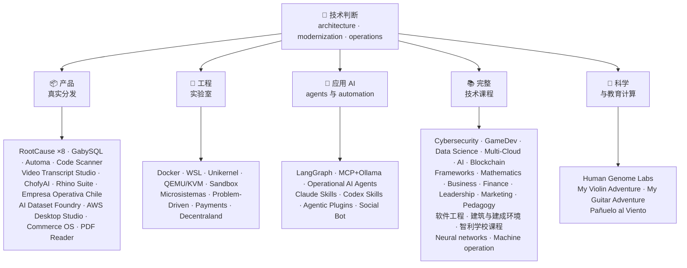

<div align="center">

# 👋 Vladimir Acuña

## **解决方案架构师 · Senior Full-Stack · 数字化转型 · 管理与运营**

**拥有信息与计算机工程和企业管理双重教育背景，以及 16 年以上真实软件建设与运维经验。我连接业务、人员、流程与技术，以设计、评估、交付并持续运营解决方案 — 相关证据均可在此 GitHub 验证。**

[](https://vladimiracunadev-create.github.io/)
[](https://www.linkedin.com/in/vladimir-acu%C3%B1a-valdebenito-11924a29/)
[](mailto:vladimir.acuna.dev@gmail.com)

[](#-专业范围)
[](#-真实分发的产品)
[](#-完整技术课程)

<!-- STATS:START -->
[](https://github.com/vladimiracunadev-create?tab=repositories)
[](https://github.com/vladimiracunadev-create?tab=repositories)
[](#-生态系统概览)
[](#-完整技术课程)
[](https://github.com/vladimiracunadev-create?tab=repositories)
<!-- STATS:END -->

[](https://github.com/vladimiracunadev-create?tab=repositories)
[](https://github.com/vladimiracunadev-create?tab=followers)

[🌐 作品集（6 种语言）](https://vladimiracunadev-create.github.io/) ·
[🧩 生态系统](#-生态系统概览) ·
[⚡ 10 分钟评估我](#-如果你有-10-分钟评估我) ·
[✅ 专业范围](#-专业范围) ·
[🧭 无需编程的管理机会](#-管理行政与无需编程的职业机会) ·
[📋 职位矩阵](PROFESIONAL_ROLES.md) ·
[📬 联系方式](#-联系方式)

**语言：** [ES](README.md) · [EN](README.en.md) · [PT](README.pt.md) · [IT](README.it.md) · [FR](README.fr.md) · [ZH](README.zh.md)

**技术核心：**
PHP 8 · Python · Rust · Go · Node/TS · Java 21 · .NET 8 · Dart/Flutter · WASM
· AWS · Terraform · Kubernetes · Docker · n8n · LangGraph/MCP · CI/CD · FinOps · Observability

**业务–技术桥梁：**流程与需求分析 · 解决方案评估 · 交付协调 · 运营与连续性 · 风险管理 · 产品与服务 · 技术培训

</div>

---

> [!NOTE]
> 本档案不会把职业可能性写成已任职经验。经验证的技术经验、可迁移能力、可申请机会与未来发展目标均明确区分。

## 🎯 这里有什么

这不是“一个 repo”，而是一个有共同标准的生态系统。

- 🔁 **可复现 Demo** — clone、运行、验证。
- 🧰 **标准化工具链** — 每个仓库都有 Makefile、Hub CLI、`doctor` 和 `smoke`。
- 🛡️ **纵深防御** — secret scanning、策略和明确禁止的实践。
- 📈 **可观测性** — `/health`、`/ready`、`/metrics`、dashboard 和可追踪性。
- 📚 **面向不同读者的文档** — 招聘方、初学者、DevOps 或安全人员，按仓库定位。
- 📦 **产品级分发** — 可下载 release、checksum、build 证据；商业签名/商店发布在适用时标注为进行中。
- 🌍 **国际化** — 作品集支持 6 种语言（ES · EN · PT · IT · FR · ZH）。
- 🧭 **技术诚实** — 每个案例标注为 `OPERATIONAL`、`DOCUMENTED/SCAFFOLD` 或 `PLANNED`。

## ✅ 可验证状态

| 范围 | 具体证据 |
|---|---|
| 🧪 **测试覆盖** | GabySQL **828 tests** + **503.8M queries** fuzz（0 panics）· Empresa Operativa Chile **158 tests** · Automa **150 pytest** · multi-OS CI |
| 🤖 **生产级 Agent** | LangGraph RealWorld **25/25 operational backends**（cases 01–25，100% 覆盖）· Operational AI Agents **13 agents** 和 **39 deterministic evals** |
| 🔗 **多语言集成** | **20 cases** sender→n8n→receiver —**19 operational**，逐一用 Docker 审计— · **18+ DB engines** · **20+ containers** · 11 patterns |
| 📦 **分发** | 在 **64 个自有公共仓库**生态中发布 **148 releases** · `.exe` · `.msi` · `.dmg` · `.apk` 安装器和制品，带 checksum 与 build 证据；适用时商业/商店签名标注为进行中 |
| 🛡️ **供应链** | CodeQL · Semgrep · Bandit · Trivy · Grype · Gitleaks · TruffleHog · CycloneDX SBOM · Scorecard |
| 📚 **课程** | **14,500 classes**，覆盖 21 个项目，由 [workflow](.github/workflows/stats.yml) 从真实仓库结构或仓库内声明的可验证来源统计 —不是手写数字— · 每个项目都声明其编辑状态和限制 |
| 🌐 **作品集** | 可安装 PWA · **6 种语言** · pipeline 生成 **36 PDFs** · CV Data API · Capacitor Android · Lighthouse 100 |
| 🔒 **遥测** | 取证产品和 Empresa Operativa Chile 中为零 — 每次 build 验证（Android 无 `INTERNET` 权限） |
| 🌐 **已发布站点** | **56 个 GitHub Pages 站点** —55 个产品、项目或生态导航 landing 加主作品集— 每个都从自己的仓库部署 · 56 个均验证 HTTP `200` |

## 🗺️ 生态系统概览



## 📦 真实分发的产品

这些软件可以下载、安装、使用 — 不只是 clone 代码。

| 产品 | 说明 | Stack | 交付 |
|---|---|---|---|
| [🔍 **RootCause Windows**](https://github.com/vladimiracunadev-create/rootcause-windows-inspector) | 网络安全取证：任何异常资源失真都可能是威胁的最早信号。先诊断，再干预 | Rust 🦀 · ETW/WPR | **v0.19.0** · **16 releases** · **5 editions**: GUI · Portable · CLI · PowerShell · VS Code · [landing](https://vladimiracunadev-create.github.io/rootcause-windows-inspector/) |
| [📱 **RootCause Mobile**](https://github.com/vladimiracunadev-create/rootcause-mobile-inspector) | 移动端取证传感器：将每个 app 与自身基线比较，识别 stalkerware，并区分已授予权限和仅请求权限 | Flutter · Kotlin · Swift | **v0.8.0** · 可验证 Android APK · 5 languages · **zero telemetry** · [landing](https://vladimiracunadev-create.github.io/rootcause-mobile-inspector/) |
| [🍎 **RootCause macOS**](https://github.com/vladimiracunadev-create/rootcause-macos-inspector) | macOS 版本：`launchd` 持久化、Gatekeeper、SIP、FileVault、XProtect、TCC 权限、签名进程和网络邻居 — 每个面都与已知良好状态对比 | Rust 🦀 · macOS 13+ | **v0.1.0** · first published release · Apache-2.0 · [landing](https://vladimiracunadev-create.github.io/rootcause-macos-inspector/) |
| [🖥️ **RootCause Server**](https://github.com/vladimiracunadev-create/rootcause-server) | 服务器版本：把暴露面、访问尝试突增、同地址会话、关键文件完整性和传感器沉默关联成一句可执行结论 | Rust 🦀 · Windows · Linux · macOS | **v0.2.0** · **18 rules** with evidence and runbook · never executes actions on its own · local console · **no published release yet** · [landing](https://vladimiracunadev-create.github.io/rootcause-server/) |
| [🌐 **RootCause Web**](https://github.com/vladimiracunadev-create/rootcause-web-inspector) | 浏览器取证传感器：cookies、邮件会话、扩展、下载、权限，以及伪装真实窗口的网页 | JavaScript · MV3 extension | **v0.2.0** · no published release yet · panel on `127.0.0.1` · zero dependencies · zero telemetry verified in CI · [landing](https://vladimiracunadev-create.github.io/rootcause-web-inspector/) |
| [₿ **RootCause Bitcoin Defense**](https://github.com/vladimiracunadev-create/rootcause-bitcoin-defense) | Bitcoin custody 的 watch-only 防御：盘点每把钥匙来源，与公开警告交叉检查，并用证据解释 root cause | JavaScript · Windows app · local panel | **v0.3.0** · **2 releases** · zero dependencies · never asks for seeds · verified in CI · [landing](https://vladimiracunadev-create.github.io/rootcause-bitcoin-defense/) |
| [⛓️ **RootCause Blockchain Security**](https://github.com/vladimiracunadev-create/rootcause-blockchain-security) | 多链 watch-only 控制台：盘点 contracts、proxies、oracles、bridges、governance 和 dependencies，并生成 root-cause runbooks | JavaScript · Windows app · local panel | **v0.3.0** in repo · published release: `v0.1.0` · zero dependencies · never asks for private keys · verified in CI · [landing](https://vladimiracunadev-create.github.io/rootcause-blockchain-security/) |
| [📷 **RootCause QR Inspector**](https://github.com/vladimiracunadev-create/rootcause-qr-inspector) | 本地 Android app，用于行动前检查 QR：解释 26 个信号，区分事实和假设，导出脱敏证据 | Flutter · Dart | **v0.1.4** · **5 releases** · **107 tests** · Android APK published · verifiable SHA-256 · technical APK package signature; commercial/store signatures in progress · zero telemetry · [landing](https://vladimiracunadev-create.github.io/rootcause-qr-inspector/) |
| [🏢 **Empresa Operativa Chile**](https://github.com/vladimiracunadev-create/empresa-operativa-chile) | 陪伴 Chile SpA 从成立前到每月结账：带证据的设立、VAT carry-forward、F29 draft、immutable close 和 audit log。每条规则都有官方来源 | JavaScript · Rust · PWA | **v1.5.0** · Android · Windows · browser · **158 tests** · **0 production dependencies** · zero telemetry · [landing](https://vladimiracunadev-create.github.io/empresa-operativa-chile/) |
| [🔍 **Universal Code Scanner**](https://github.com/vladimiracunadev-create/universal-code-scanner) | QR 和条码读取器，**先解释再行动**：16 个本地 URL 风险信号和明确确认 | Flutter · Dart | **v1.1.0** · Android · iOS · macOS · PWA · encrypted history **AES-256-GCM** · [landing](https://vladimiracunadev-create.github.io/universal-code-scanner/) |
| [🗄️ **GabySQL**](https://github.com/vladimiracunadev-create/gabysql) | 嵌入式数据库：单个 `.db` 文件、WAL、cost-based optimizer、HTTP/JSON API | Rust 🦀 | Windows · macOS · Linux · [landing](https://vladimiracunadev-create.github.io/gabysql/) |
| [🤖 **Automa PC**](https://github.com/vladimiracunadev-create/automa-pc) | 本地编排器：JSON flows 打开真实窗口、与 DOM 交互并留下证据 | Python · Playwright · pywebview | **v0.3.0** · **27 flows** · published and verifiable installer · [landing](https://vladimiracunadev-create.github.io/automa-pc/) |
| [🏭 **AI Dataset Foundry**](https://github.com/vladimiracunadev-create/ai-dataset-foundry) | Local-first 数据集工厂：将 PDF、Word、web、Git、JSON、CSV 转成可审计数据集，用于 pretraining、fine-tuning、RAG 和 evaluation | Python | **v0.2.0** · Windows + offline Android · first published release · [landing](https://vladimiracunadev-create.github.io/ai-dataset-foundry/) |
| [☁️ **AWS Desktop Studio**](https://github.com/vladimiracunadev-create/aws-desktop-studio) | Local-first app，提供 15 个 AWS 资产集成、20 个教程、CLI/SSO 和默认只读；仍在开发中，并非通用访问 | JavaScript · Windows | **v0.1.1** · first published release · [landing](https://vladimiracunadev-create.github.io/aws-desktop-studio/) |
| [🧭 **Commerce OS**](https://github.com/vladimiracunadev-create/commerce-operating-system) | 商业运营概念演示：catalog、stock、CRM、orders、mock payments 和 traceability | JavaScript · Web · Windows · Android | **v0.3.0** · **2 releases** · no real money or real SII · [landing](https://vladimiracunadev-create.github.io/commerce-operating-system/) |
| [📄 **PDF Reader**](https://github.com/vladimiracunadev-create/pdf-reader-windows-android) | Android-first 本地只读阅读器：无裁剪缩放、可重开历史、分享到 WhatsApp、可设默认阅读器 | HTML · Web · Android · Windows | **v0.3.3** · signed APK · no accounts, sensitive permissions, or telemetry · [landing](https://vladimiracunadev-create.github.io/pdf-reader-windows-android/) |
| [🎙️ **Video Transcript Studio**](https://github.com/vladimiracunadev-create/video-transcript-studio) | 一个视频、播放列表或**整个 YouTube 频道**转带时间戳文本。不依赖原字幕：Whisper 在**你的电脑**识别音频，无 API、账户或密钥 | Python · PySide6 · FastAPI · faster-whisper | **v0.2.0** · Windows desktop + local panel `127.0.0.1` + CLI, **same queue** · MD · PDF · TXT · SRT · VTT · JSON · MP3 · OGG · **89 tests** · FFmpeg included · zero telemetry · [landing](https://vladimiracunadev-create.github.io/video-transcript-studio/) |
| [🎨 **ChofyAI Studio**](https://github.com/vladimiracunadev-create/chofyai-studio) | 本地创意 AI launcher：编排 Qwen3-TTS、whisper.cpp、FaceFusion、AceForge 和 ComfyUI | Tauri 2 · Rust · React | v0.5.1 · **5/5 tools with real inference** · macOS Apple Silicon · experimental Windows · **no published release yet** · [site](https://vladimiracunadev-create.github.io/chofyai-studio/) |
| [🦏 **Rhino Suite**](https://github.com/vladimiracunadev-create/rhino-suite) | 从零构建的办公套件：文档规则不依赖 DOM — HTML 只是投影 | Rust/WASM · Go · React 19 | Evolutionary monorepo by phases · [landing](https://vladimiracunadev-create.github.io/rhino-suite/) |
| [🎻 **My Violin Adventure**](https://github.com/vladimiracunadev-create/violin-adventure) | 儿童教育 app：chromatic tuner、基于音频时钟的精准 metronome、真实小提琴歌曲 | Tauri 2 · React · TS | **v1.3.0** · Windows · Android · Linux · macOS · PWA · [landing](https://vladimiracunadev-create.github.io/violin-adventure/) |
| [🎸 **My Guitar Adventure**](https://github.com/vladimiracunadev-create/guitarra-adventure) | 吉他兄弟项目：6 个世界 24 节课、6 弦调音器、无漂移 metronome、11 个真实吉他音符 | Tauri 2 · React · TS | **v1.0.0** · Windows · Android · Linux · macOS · iOS · PWA · no accounts, ads, or online dependency · [landing](https://vladimiracunadev-create.github.io/guitarra-adventure/) |
| [🧣 **Pañuelo al Viento**](https://github.com/vladimiracunadev-create/panuelo-al-viento-cueca-app) | 面向 10 岁以上的 cueca 学习：8 个级别 24 节课、72 个活动、六拍实验室（3+3 与 2+2+2）和可访问地面图。声明**补充而不是替代**教师和文化传承者 | Flutter · Dart | **v0.2.0** · Android 7+ · Windows 10/11 · APK · EXE · MSI · portable · **29 tests + 2 validators** · no camera, microphone, account, ads, or internet · [landing](https://vladimiracunadev-create.github.io/panuelo-al-viento-cueca-app/) |

## 🧪 工程实验室

| Repo | 展示内容 |
|---|---|
| [🐳 **Problem-Driven Systems Lab**](https://github.com/vladimiracunadev-create/problem-driven-systems-lab) | **20 个真实问题**（load latency、N+1、retry storms、leaks、monolith、cache stampede、backpressure、zero-downtime migration、forgotten DLQ）以高保真故障注入，在 **7 个 stack** 中解决：PHP 8 · Python · Node.js · Java 21 · .NET 8 · **Go 1.23** · **Rust 1.83** · [landing](https://vladimiracunadev-create.github.io/problem-driven-systems-lab/) |
| [📆 **Social Bot Scheduler**](https://github.com/vladimiracunadev-create/social-bot-scheduler) | **v4.10.0** · **20 cases** source→n8n→receiver，覆盖 **18+ DB engines** —**19 operational**，逐一用 Docker 审计— **8-layer** audit、idempotency guardrails、circuit breaker、DLQ · [landing](https://vladimiracunadev-create.github.io/social-bot-scheduler/) |
| [🧰 **Microsistemas**](https://github.com/vladimiracunadev-create/microsistemas) | **12 个 PHP 诊断与现代化 microapps** · local read-only MCP server · 3-phase hardening · [landing](https://vladimiracunadev-create.github.io/microsistemas/) |
| [🧪 **Docker Labs**](https://github.com/vladimiracunadev-create/docker-labs) | **13 labs** on 4-service platform + automated `.exe` installer with launcher · [landing](https://vladimiracunadev-create.github.io/docker-labs/) |
| [🐳 **WSL Labs**](https://github.com/vladimiracunadev-create/wsl-labs) | **12 cases** on `wslc`, native WSL container engine — **without Docker Desktop** · [landing](https://vladimiracunadev-create.github.io/wsl-labs/) |
| [⚡ **Unikernel Labs**](https://github.com/vladimiracunadev-create/unikernel-labs) | “Docker Desktop for unikernels”：Windows control over Unikraft with WSL2 backend, `kraft` + QEMU/KVM · [landing](https://vladimiracunadev-create.github.io/unikernel-labs/) |
| [🧰 **QEMU/KVM Labs**](https://github.com/vladimiracunadev-create/qemu-kvm-labs) | **12 labs** real virtualization with QEMU, KVM, libvirt, cloud-init and `vm-manager` on Linux and WSL2 · [landing](https://vladimiracunadev-create.github.io/qemu-kvm-labs/) |
| [🛡️ **Sandbox Labs**](https://github.com/vladimiracunadev-create/sandbox-labs) | Linux isolation：在声明策略下运行第三方代码、文件和 business models，并**输出签名证据说明实际应用的控制** · **36 cases** in two families —15 technical and 21 capital-markets— · experimental and educational, *not a security product* · [landing](https://vladimiracunadev-create.github.io/sandbox-labs/) |
| [💳 **Universal Payments Engineering Lab**](https://github.com/vladimiracunadev-create/universal-payments-engineering-lab) | **28 payment families** in local self-explaining demo：states、ledger、reconciliation、security、implementation guides · [landing](https://vladimiracunadev-create.github.io/universal-payments-engineering-lab/) |
| [🕹️ **Decentraland Social Arcade**](https://github.com/vladimiracunadev-create/decentraland-social-arcade) | Native Decentraland social 3D experience：MVP + multi-game architecture with SDK7, ECS and TypeScript · Spanish docs · no payments or telemetry |
| [☁️ **AWS Projects**](https://github.com/vladimiracunadev-create/proyectos-aws) | Progressive cases，每个 case 增加一个 AWS service **以及**一个新的 GitHub Actions capability · SAA-C03 · DVA-C02 · SOA-C02 coverage |

## 🤖 应用 AI

| Repo | 展示内容 |
|---|---|
| [🤖 **LangGraph RealWorld**](https://github.com/vladimiracunadev-create/langgraph-realworld) | **25/25 operational backends** — typed state、conditional routes、NDJSON streaming、DEMO/LIVE mode、8 security layers、SHA-256 chain of custody |
| [🧭 **Operational AI Agents**](https://github.com/vladimiracunadev-create/operational-ai-agents) | **13 operational agents** for Claude Code and compatible runtimes：repo evolution、legacy modernization、curriculum design、portfolio publishing、security remediation、incident analysis · **39 deterministic evals** · 34 tests · zero-deps · Linux · macOS · Windows · [site](https://vladimiracunadev-create.github.io/operational-ai-agents/) |
| [🧠 **MCP + Ollama Local**](https://github.com/vladimiracunadev-create/mcp-ollama-local) | Local-first AI with MCP tools in sandbox · bind `127.0.0.1` · multilayer trust profile · honest about limits |
| [🧩 **Agentic Plugins Toolkit**](https://github.com/vladimiracunadev-create/agentic-plugins-toolkit) | **6 agentic plugins** installable in Claude Code, OpenAI/Codex, Copilot, Gemini and MCP from one source · **69 generated views without drift** · zero-deps · Linux · macOS · Windows · [site](https://vladimiracunadev-create.github.io/agentic-plugins-toolkit/) |
| [🧰 **Claude Skills Toolkit**](https://github.com/vladimiracunadev-create/claude-skills-toolkit) | **15 agentic skills** for Claude Code · security audits、Bitcoin custody、repo gates、coherence、Docker、docs · zero-deps · cross-platform |
| [🧰 **Codex Skills Toolkit**](https://github.com/vladimiracunadev-create/codex-skills-toolkit) | **19 agentic skills** for Codex：security and supply chain、preflight、functional flows、resilience and state、release evidence、Python/YAML/Markdown gates、versioning、dependencies、Docker、documents · Python-first · `pnpm` · Linux · macOS · Windows · [site](https://vladimiracunadev-create.github.io/codex-skills-toolkit/) |

## 📚 完整技术课程

这些是西班牙语顺序课程，每个仓库都明确声明状态和范围。21 个项目共 **14,500 classes**，由 [workflow](.github/workflows/stats.yml) 从真实仓库结构或仓库内声明的可验证来源统计；徽章每周刷新，不是手写数字。

🧭 [**Lifelong Learning Ecosystem**](https://github.com/vladimiracunadev-create/lifelong-learning-ecosystem) 是一个联邦式学习导航器，通过可视化地图和[可访问的离线门户](https://vladimiracunadev-create.github.io/lifelong-learning-ecosystem/)连接 6 个领域的 30 条真实路径；它不计为额外课程项目。

| 项目 | 课程数 | 范围 |
|---|---:|---|
| [🔢 **Computational Mathematics**](https://github.com/vladimiracunadev-create/computational-mathematics-program) | 360 | From counting on fingers to reproducing a paper · **360 deterministic demonstrations verified in CI** · 1,080 notebooks · 489-term glossary · [site](https://vladimiracunadev-create.github.io/computational-mathematics-program/) |
| [🏦 **Finance and Banking**](https://github.com/vladimiracunadev-create/finance-and-banking-evolution-program) | 356 | 534 h · financial mathematics and IFRS → credit, risk, Basel III, open finance, DLT, stablecoins, MiCA · **27 个案例** · **298 项测试** · [site](https://vladimiracunadev-create.github.io/finance-and-banking-evolution-program/) |
| [🎮 **GameDev**](https://github.com/vladimiracunadev-create/modern-gamedev-program) | 352 | Math and C#/C++/GDScript → shaders、AI、multiplayer、VR/AR · Godot · Unity · Unreal · **10 Godot labs verified in CI** · [site](https://vladimiracunadev-create.github.io/modern-gamedev-program/) |
| [🛡️ **Cybersecurity**](https://github.com/vladimiracunadev-create/modern-cybersecurity-program) | 360 | **v1.3.0** · 20 parts · foundations → Red Team、DFIR、cloud security、exploit dev、CTF、game security · mapped to **7 certifications** · offline Android/web app · [site](https://vladimiracunadev-create.github.io/modern-cybersecurity-program/) |
| [📈 **Marketing, Sales and Growth**](https://github.com/vladimiracunadev-create/marketing-sales-growth-evolution-program) | 336 | 24 parts with operational definitions、measurement sheets、verifiable bibliography and Chilean regulatory context · **v1.6.0** · 1.29M words · 17 role paths · [site](https://vladimiracunadev-create.github.io/marketing-sales-growth-evolution-program/) |
| [🏢 **Business Creation**](https://github.com/vladimiracunadev-create/modern-business-creation-program) | 336 | Create and operate a real company in Chile：idea、incorporation、SII、operations、crisis、exit · 360 diagrams · 1,251-term glossary · 1,548-page manual · [site](https://vladimiracunadev-create.github.io/modern-business-creation-program/) |
| [🏛️ **Architecture and Built Environment**](https://github.com/vladimiracunadev-create/architecture-built-environment-learning-program) | 800 | 80 parts · 60 场综合课程 · 33 paths · 可追溯来源 · Markdown、offline reader、GitHub Pages · [site](https://vladimiracunadev-create.github.io/architecture-built-environment-learning-program/) |
| [🇨🇱 **智利学校课程路径**](https://github.com/vladimiracunadev-create/chilean-school-learning-path) | 8,841 | 覆盖小学一年级至高中四年级 · **4,156 项跨学科整合活动** · **2,823 个学习目标** · MINEDUC 来源 · 无待处理提案，仍需专业人工复核 · [site](https://vladimiracunadev-create.github.io/chilean-school-learning-path/) |
| [🧭 **现代软件工程**](https://github.com/vladimiracunadev-create/modern-software-engineering-program) | 480 | 40 部分、8 个阶段 · 基础 → 产品、架构、安全、DevOps、SRE、SPEC、AI 与多智能体系统 · 编辑状态由仓库明确声明 · [site](https://vladimiracunadev-create.github.io/modern-software-engineering-program/) |
| [🎓 **Pedagogy and Learning Sciences**](https://github.com/vladimiracunadev-create/education-pedagogy-learning-sciences-program) | 300 | From how a person learns to how teachers are trained · 25 parts · **each class declares evidence state and limits** · literacy、methods、special needs、coexistence、cultural diversity · **v2.1.0** · [site](https://vladimiracunadev-create.github.io/education-pedagogy-learning-sciences-program/) |
| [☁️ **Multi-Cloud**](https://github.com/vladimiracunadev-create/multi-cloud-engineering-program) | 288 | AWS · Azure · GCP · Kubernetes · Terraform · SRE · FinOps · **1,288 hours** · 288 labs with JSON evidence · 1,032 sources · 2,884-page PDF manual · [site](https://vladimiracunadev-create.github.io/multi-cloud-engineering-program/) |
| [🎖️ **Executive Leadership**](https://github.com/vladimiracunadev-create/executive-leadership-founder-program) | 288 | From owning first outcome to leading a company and founding one：teams、KPI/OKR、finance、product、risk、board、M&A · [site](https://vladimiracunadev-create.github.io/executive-leadership-founder-program/) |
| [🐍 **Python Data Science**](https://github.com/vladimiracunadev-create/python-data-science-program) | 232 | Polars、ML+Optuna/SHAP、PyTorch/LLMs/LoRA、MLOps · native Windows app + Android APK · [site](https://vladimiracunadev-create.github.io/python-data-science-program/) |
| [🧠 **AI Evolution**](https://github.com/vladimiracunadev-create/artificial-intelligence-evolution-program) | 184 | Symbolic → probabilistic → deep learning → LLMs、RAG、agents、safety、frontier · **v0.17.0** · **708 notebooks** · 148 foundational papers · offline Windows、Android、PWA apps · [site](https://vladimiracunadev-create.github.io/artificial-intelligence-evolution-program/) |
| [🌐 **Comparative Programming**](https://github.com/vladimiracunadev-create/polyglot-programming-labs) | 176 | One concept, **10 languages** verified in CI — **1,360 implementations** — plus **1,632 programs** in living legacy languages and atlas of **60 cards in 15 families** · [site](https://vladimiracunadev-create.github.io/polyglot-programming-labs/) |
| [🧩 **Frameworks Compared**](https://github.com/vladimiracunadev-create/framework-ecosystems-labs) | 149 | One executable contract against Express、FastAPI、Spring Boot、ASP.NET、Django、Rails、Laravel、React、Vue、Svelte and more · **70 节已构建课程** · **397 个 CI 验证案例** · **210 个 ISBN/DOI 来源** · [site](https://vladimiracunadev-create.github.io/framework-ecosystems-labs/) |
| [🗄️ **Databases**](https://github.com/vladimiracunadev-create/database-systems-labs) | 74 | **v3.0.0** · database engineering in 15 parts · 230 hours · 120 sources with ISBN/DOI/standard · same case solved in 27 engines · 150 pytest · [site](https://vladimiracunadev-create.github.io/database-systems-labs/) |
| [📐 **Psychometrics and Assessment**](https://github.com/vladimiracunadev-create/psychometrics-and-assessment-program) | 40 | How measurement instruments are built, scored, validated and audited · 8 parts · executable engine with **5 instruments and 344 items, 276 public-domain** |
| [⛓️ **Blockchain**](https://github.com/vladimiracunadev-create/blockchain-learning-path) | 66 | **v0.14.0** · from zero to programmable financial infrastructure and on-chain analytics · **91 practices** and **356 tests** · Foundry and Slither in CI · [site](https://vladimiracunadev-create.github.io/blockchain-learning-path/) |
| [🧠 **Neural Network Training Labs**](https://github.com/vladimiracunadev-create/neural-network-training-labs) | 31 | 7 modules · ≈214 hours · **93 notebooks** —31 classes, 31 student versions, 31 solutions— · PyTorch · [study site](https://vladimiracunadev-create.github.io/neural-network-training-labs/) |
| [🕹️ **Machine Operator**](https://github.com/vladimiracunadev-create/machine-operator-program) | 451 | **41 training modules**, one per machine · **502 h 15 min** · systems、controls、physics、safety、simulation design with sources per class · *no executable simulator yet, and that is declared* |

## 🔬 科学计算

| Repo | 展示内容 |
|---|---|
| [🧬 **Human Genome Labs**](https://github.com/vladimiracunadev-create/human-genome-labs) | 可复现基因组平台：typed `ScientificResult<T>` contracts、FASTA/GFF3/VCF、modules with **explicit maturity and evidence**。极端诚实：*不进行临床诊断* · [site](https://vladimiracunadev-create.github.io/human-genome-labs/) |

## ⚡ 如果你有 10 分钟评估我

重点不只是看代码，而是看**我如何思考**、如何写文档、如何让一切可运行。

**路线 A — 真实可观测性与编排** *(我最推荐)*

```bash
git clone https://github.com/vladimiracunadev-create/social-bot-scheduler.git
```

你会看到 workflows、metrics、dashboards 和 guardrails，覆盖 19 cases 与 18+ DB engines。

**路线 B — 几分钟内复现基础设施**

```bash
git clone https://github.com/vladimiracunadev-create/docker-labs.git
```

**路线 C — 带 typed state 的 agents**

```bash
git clone https://github.com/vladimiracunadev-create/langgraph-realworld.git
```

**路线 D — Rust 取证产品，无需 clone**

从 [RootCause releases](https://github.com/vladimiracunadev-create/rootcause-windows-inspector/releases) 下载 installer 或 CLI binary，并验证 `SHA256SUMS`。

## 🧠 我在所有仓库中应用的标准

- **DX first** — 如果不容易运行，就不能作为 demo 或团队基础。
- **Day 1 observability** — metrics 和 traceability 不是后补。
- **Security as pipeline** — secret scanning、每个 release 的 SBOM、明确禁止的实践。
- **Real resilience** — idempotency、circuit breaker、controlled degradation。
- **Polyglot by design** — 根据用例选择语言和引擎，而不是追逐流行。
- **Honesty about status** — 一个 repo 从 `Multisimulador` 改名为 `machine-operator-program`，避免承诺尚不存在的软件。
- **Badges are signals, not evidence** — 每个 repo 也声明**它不做什么**。
- **Model outward** — 先设计 domain，interface 只是 projection。
- **外部作品会明确标注** — 账号的 70 个公共仓库中，64 个是自有作品。其余六个 —[`agentic-qe`](https://github.com/vladimiracunadev-create/agentic-qe)、[`Anthropic-Cybersecurity-Skills`](https://github.com/vladimiracunadev-create/Anthropic-Cybersecurity-Skills)、[`erpnext`](https://github.com/vladimiracunadev-create/erpnext)、[`OpenExecutive`](https://github.com/vladimiracunadev-create/OpenExecutive)、[`raptor`](https://github.com/vladimiracunadev-create/raptor)、[`security-audit-skill`](https://github.com/vladimiracunadev-create/security-audit-skill)— 均为 forks，不计入自有作品指标。

## ✅ 专业范围

我的双重教育背景 —**信息与计算机工程 + 企业管理**— 使我能够把业务目标转化为技术决策，并把技术约束转化为面向运营、产品、客户和管理层的清晰选项。

### 🎯 核心身份

| 角色 | 支撑 |
|---|---|
| **Solution Architect** | 模块化、可扩展、具备演进判断的系统设计 |
| **Legacy Modernization Architect** | 真实 legacy 演进（PHP 5.x→8.x，无中断渐进重构） |
| **Senior Full-Stack / Tech Lead** | 在真实平台上的架构、交付与标准（+16 年） |
| **AI Automation Architect** | LangGraph/MCP agentic systems 与带 guardrails 的 n8n flows |

### ↗ 自然扩展

**AI Orchestration Engineer** · **Systems / Rust Engineer** · **Mobile Engineer (Flutter)** · **Solutions Engineer** · **Technical Product Builder** · **Technical Trainer** · **Digital Transformation Consultant** · **Business / Functional Analyst** · **Technical Product Operations**

### ⚙️ 补充范围

Platform Engineer / IDP · DevOps / CI-CD · Cloud / AWS Engineer · Application SRE · Automation Engineer · 技术-商业顾问

## 🧭 管理、行政与无需编程的职业机会

此扩展不声称我已担任所有这些职位。它优先展示能够结合信息技术、企业管理和公开证据创造价值，同时不以编程为核心工作的岗位。

| 职业家族 | 常见职位名称 | 诚实分类 | 编程 | 证据与条件 |
|---|---|---|---|---|
| **技术管理** | Head of IT · IT Operations Manager · Digital Transformation Manager · CIO | **可申请 / 未来目标** | 无/偶尔 | 技术基础强；人员、预算、供应商和高管责任需另行证明 |
| **项目管理** | IT Project Coordinator/Manager · PMO · Scrum Master · Agile Delivery | **可迁移 / 可申请** | 无/偶尔 | 有交付与 release 证据；正式团队、预算与 sponsor 责任仍是缺口 |
| **企业行政** | Business Administrator · Administration/Operations Manager · Contract Administrator | **可申请** | 无 | 有学历与运营制品；真实资源、人员和供应商责任需证明 |
| **战略与变革** | Strategy Consultant · Change Manager · Planning · Innovation/Transformation | **可迁移 / 可申请** | 无 | 有现代化和解决方案评估；组织采用成果需证明 |
| **业务分析** | Business/Functional Analyst · Requirements · BPM · Continuous Improvement | **可迁移 / 可申请** | 无/偶尔 | 有领域建模和文档；外部 stakeholder 案例会加强可信度 |
| **产品与服务** | Product Owner/Manager · Product Operations · Service Delivery · Customer Success | **可迁移 / 可申请** | 无/偶尔 | 有 roadmap 和生命周期；P&L、客户组合和 SLA 视职位而定 |
| **GRC 与连续性** | GRC · IT Auditor · Technology Risk · Security/Continuity | **可申请** | 无/偶尔 | 有控制和 RootCause 证据；未声称组织审计与相关认证 |
| **商业与销售** | Technology Presales · Solutions Consultant · Technical KAM · Business Development | **可迁移 / 可申请** | 无 | 能翻译解决方案价值；未声称 quota、客户组合和合同谈判 |
| **财务与管理控制** | Budget/Cost · Project Evaluation · FP&A · Management Control | **可申请** | 无 | 有财务/FinOps 制品；需真实预算、财报和企业 KPI |
| **质量** | Quality/Process Analyst · Auditor · Continuous Improvement | **可迁移 / 可申请** | 无/偶尔 | 有 gates、测试和指标；缺少正式质量体系责任 |
| **教育** | Technical Trainer · Facilitator · Academic Coordinator · EdTech/Instructional Designer | **可迁移 / 可申请** | 无/偶尔 | 21 个项目、14,500 节课；正式教学与学习成果需单独证明 |
| **物流与供应商** | Procurement · Supply/Operations Coordinator · Vendor/Contract Manager | **可申请** | 无 | 有流程基础；真实采购、库存和供应商绩效仍是缺口 |
| **数据与 AI 治理** | Data Steward · Data Governance · AI Adoption/Governance | **可迁移 / 可申请** | 无/偶尔 | 有可审计数据集和人工 gates；组织政策与委员会仍是缺口 |
| **公共部门** | Institutional Modernization · ICT Coordinator · Digital Projects · Public Planning | **可申请** | 无 | 有智利场景和可追溯性；未声称公共采购和政府部门经验 |

[完整西班牙语职位矩阵](PROFESIONAL_ROLES.md)详细列出 14 个职业家族的目标、职责、市场经验、补充知识、证据、匹配度与差距。

## 🤖 AI 辅助开发流程

| 工具 | 主要用途 |
|---|---|
| **Claude Code** | 架构审查、实现与技术文档 |
| **ChatGPT Plus** | 分析、架构和迭代（自 2023） |
| **Codex** | 代码生成与重构 |
| **Antigravity** | 加速开发与自动化流程 |
| **VS Code / OpenCode** | 带集成 AI 辅助的环境 |

> 我结合自身技术判断、人工验证和架构方向。AI 放大能力、速度和覆盖范围 — 但不替代经验。

## 📌 可合作方向

**开放方向：** Senior Full-Stack · Architecture · Legacy modernization · Platform/IDP · SRE · DevOps · Automation · AI Automation · business/functional analysis · IT 项目协调 · Product Operations · 数字化转型 · 解决方案咨询/售前 · 技术教育 · 质量与持续改进 · AI 采用与治理

**根据职位范围评估：**技术 Product Owner/Manager · Service Delivery · IT Operations · GRC/technology risk · 行政与运营 · management control · 公共部门现代化。高管与综合管理职位属于未来发展目标，并非已声明经验。

**模式：** remote 或 hybrid，按项目而定。

## 📬 联系方式

[](https://vladimiracunadev-create.github.io/)
[](https://www.linkedin.com/in/vladimir-acu%C3%B1a-valdebenito-11924a29/)
[](https://gitlab.com/vladimir.acuna.dev-group/vladimir.acuna.dev-group)
[](mailto:vladimir.acuna.dev@gmail.com)

---

<div align="center">

[🤝 贡献](CONTRIBUTING.zh.md) ·
[🛡️ 安全](SECURITY.zh.md) ·
[⚖️ 行为准则](CODE_OF_CONDUCT.zh.md)

<sub>README 已与公共仓库的可验证状态同步 — 指标和变更来自 API — 最后验证：2026 年 10 月 9 日。</sub>

</div>
